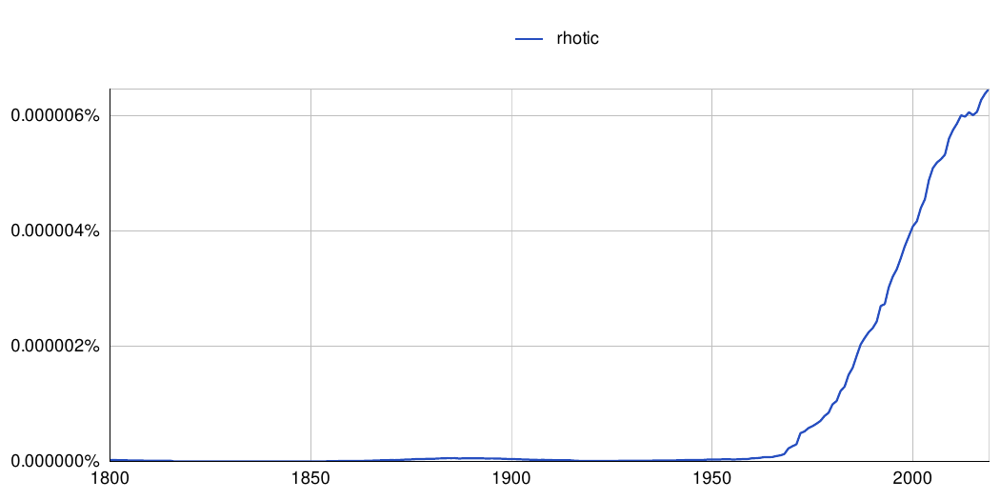
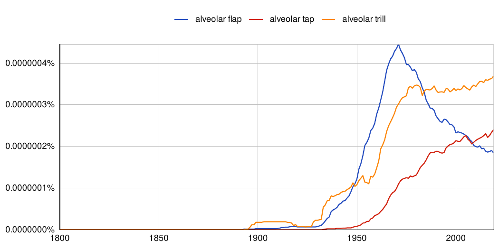

```{r setup, include=FALSE}

#remotes::install_version("ngramr","1.7.5")

`%>%` <- magrittr::`%>%`

library(ngramr)
library(knitr)

# Figure and Table caption adapted from https://stackoverflow.com/questions/37116632/rmarkdown-html-number-figures: 
outputFormat = opts_knit$get("rmarkdown.pandoc.to"); # determine the output format of the document
if( is.null(outputFormat) ) outputFormat = ""; # probably not run within knittr
capTabNo = 1; capFigNo = 1; # figure and table caption numbering, for HTML do it manually
#Function to add the Table Number
capTab = function(x){
  if(outputFormat == 'html'){
    x = paste0("***Table ",capTabNo,".*** _",x,"_")
    capTabNo <<- capTabNo + 1
  }; x
}
#Function to add the Figure Number
capFig = function(x){
  if(outputFormat == 'html'){
    x = paste0("***Figure ",capFigNo,".*** _",x,"_")
    capFigNo <<- capFigNo + 1
  }; x
}
```

# Chapitre 1

## 1.1 Représentation et caractérisation des rhotiques et des sons « simil-*r* »

Problème avec le Package *ngramr*. Dernière utilisation en juillet 2022 (avec vraisemblablement `ngramr v.1.7.5`), mais depuis plusieurs mise à jours (`ngramr v.1.8` et `ngramr v.1.9`) ont été faites par le créateur du package qui utilisé `R 4.0`. Les essais de (re)travailler avec des versions antérieures ont échoués.

```{r fig.cap=capFig("Fréquence de l’expression « rhotic » à partir des données de Google Books en utilisant le package ngramr sur RStudio (R Core Team 2020), à partir du jeu de données de Google 2019.")}

#A décommenter pour utilisation :
#ngramr::ggram(c('rhotic'),
#             ignore_case=TRUE,
#              google_theme=TRUE,
#              smoothing = 10)


```

## 1.2.2.1 Terminologie et historique du tap/flap

```{r fig.cap=capFig("Fréquence des expressions « alveolar trill », « alveolar tap », « alveolar flap » à partir des données de Google Books en utilisant le paackage ngramr sur RStudio (R Core Team 2020), à partir du jeu de données de Google 2019.")}

#ngramr::ggram(c('alveolar trill','alveolar flap', 'alveolar tap'),
#              ignore_case=TRUE,
#              google_theme=TRUE,
#              smoothing = 10)


```

# Références

## Packages utilisés
```{r}
ins.pack <- installed.packages()[names(sessionInfo()$otherPkgs), "Version"] %>% 
  as.data.frame() %>% tibble::rownames_to_column()
names(ins.pack)[1] <- "Packages"
names(ins.pack)[2] <- "Version"

ins.pack %>% knitr::kable()
```

## Version de RStudio
```{r}
rstudioapi::versionInfo()
```