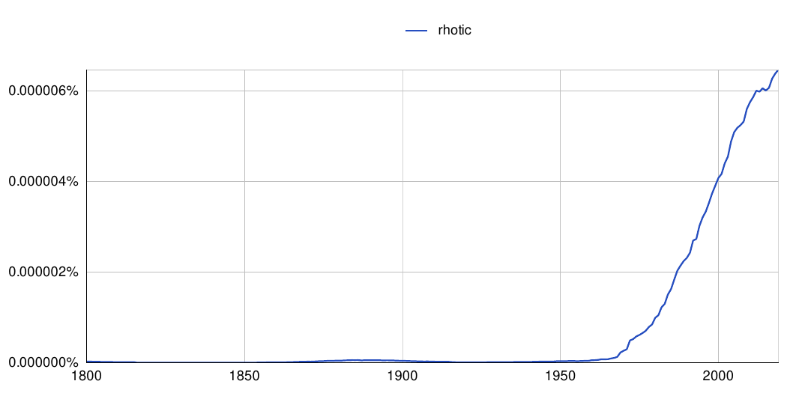
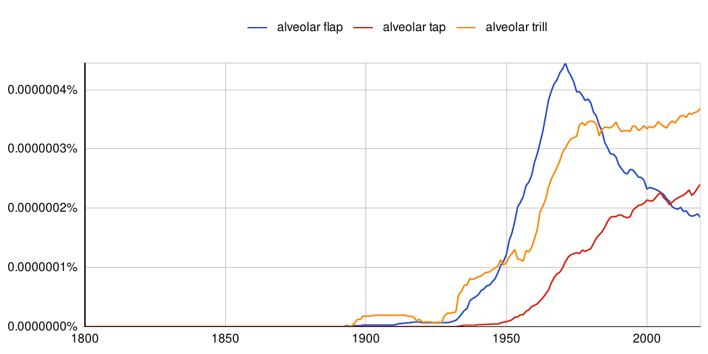

Ressources complémentaires - Chapitre 1
================
Rémi Anselme
2022-12-01 15:59:01

  - [Chapitre 1](#chapitre-1)
      - [1.1 Représentation et caractérisation des rhotiques et des sons
        « simil-*r*
        »](#11-représentation-et-caractérisation-des-rhotiques-et-des-sons--simil-r-)
      - [1.2.2.1 Terminologie et historique du
        tap/flap](#1221-terminologie-et-historique-du-tapflap)
  - [Références](#références)
      - [Packages utilisés](#packages-utilisés)
      - [Version de RStudio](#version-de-rstudio)

# Chapitre 1

## 1.1 Représentation et caractérisation des rhotiques et des sons « simil-*r* »

Problème avec le Package *ngramr*. Dernière utilisation en juillet 2022
(avec vraisemblablement `ngramr v.1.7.5`), mais depuis plusieurs mise à
jours (`ngramr v.1.8` et `ngramr v.1.9`) ont été faites par le créateur
du package qui utilisé `R 4.0`. Les essais de (re)travailler avec des
versions antérieures ont échoués.

``` r
#A décommenter pour utilisation :
#ngramr::ggram(c('rhotic'),
#             ignore_case=TRUE,
#              google_theme=TRUE,
#              smoothing = 10)


```

<div class="figure">


<p class="caption">

Fréquence de l’expression « rhotic » à partir des données de Google
Books en utilisant le package ngramr sur RStudio (R Core Team 2020), à
partir du jeu de données de Google 2019.

</p>

</div>

## 1.2.2.1 Terminologie et historique du tap/flap

``` r
#ngramr::ggram(c('alveolar trill','alveolar flap', 'alveolar tap'),
#              ignore_case=TRUE,
#              google_theme=TRUE,
#              smoothing = 10)


```

<div class="figure">


<p class="caption">

Fréquence des expressions « alveolar trill », « alveolar tap », «
alveolar flap » à partir des données de Google Books en utilisant le
paackage ngramr sur RStudio (R Core Team 2020), à partir du jeu de
données de Google 2019.

</p>

</div>

# Références

## Packages utilisés

``` r
ins.pack <- installed.packages()[names(sessionInfo()$otherPkgs), "Version"] %>% 
  as.data.frame() %>% tibble::rownames_to_column()
names(ins.pack)[1] <- "Packages"
names(ins.pack)[2] <- "Version"

ins.pack %>% knitr::kable()
```

| Packages | Version |
| :------- | :------ |
| knitr    | 1.41    |
| ngramr   | 1.7.5   |

## Version de RStudio

``` r
rstudioapi::versionInfo()
```

    ## $citation
    ## 
    ## To cite RStudio in publications use:
    ## 
    ##   RStudio Team (2020). RStudio: Integrated Development Environment for
    ##   R. RStudio, PBC, Boston, MA URL http://www.rstudio.com/.
    ## 
    ## A BibTeX entry for LaTeX users is
    ## 
    ##   @Manual{,
    ##     title = {RStudio: Integrated Development Environment for R},
    ##     author = {{RStudio Team}},
    ##     organization = {RStudio, PBC},
    ##     address = {Boston, MA},
    ##     year = {2020},
    ##     url = {http://www.rstudio.com/},
    ##   }
    ## 
    ## 
    ## $mode
    ## [1] "desktop"
    ## 
    ## $version
    ## [1] '1.3.1073'
    ## 
    ## $release_name
    ## [1] "Giant Goldenrod"
