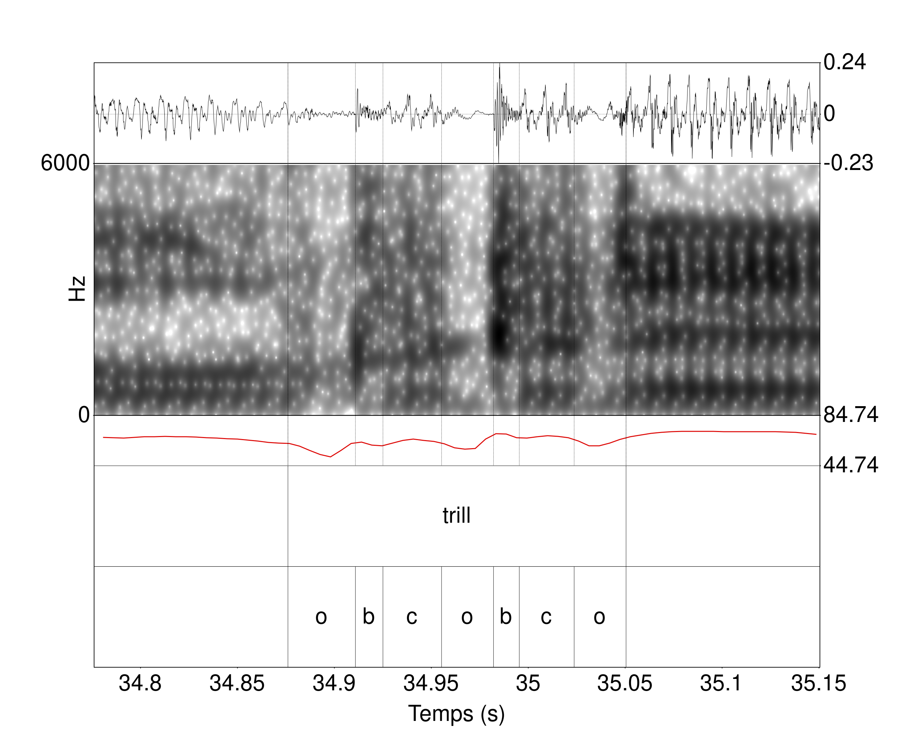
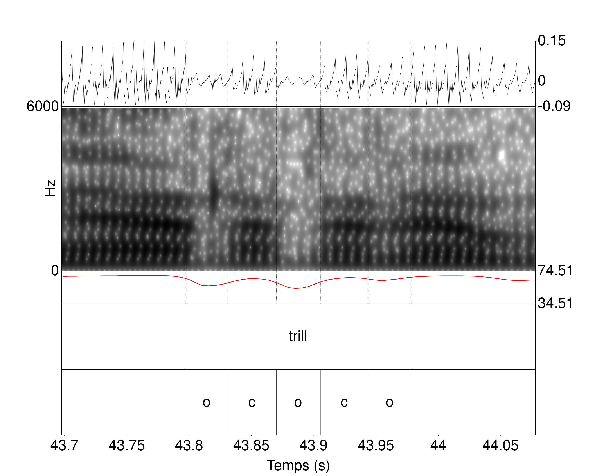

```{r setup, include=FALSE}
`%>%` <- magrittr::`%>%`

library(knitr)
library(phonfieldwork)
library(rstatix)

# Figure and Table caption adapted from https://stackoverflow.com/questions/37116632/rmarkdown-html-number-figures: 
outputFormat = opts_knit$get("rmarkdown.pandoc.to"); # determine the output format of the document
if( is.null(outputFormat) ) outputFormat = ""; # probably not run within knittr
capTabNo = 1; capFigNo = 1; # figure and table caption numbering, for HTML do it manually
#Function to add the Table Number
capTab = function(x){
  if(outputFormat == 'github_document'){
    x = paste0("***Table ",capTabNo,".*** _",x,"_")
    capTabNo <<- capTabNo + 1
  }; x
}
#Function to add the Figure Number
capFig = function(x){
  if(outputFormat == 'github_document'){
    x = paste0("***Figure ",capFigNo,".*** _",x,"_")
    capFigNo <<- capFigNo + 1
  }; x
}
```

# Chapitre 3

On importe les différentes données relatives aux illustrations (il s'agit du même tableau qui est disponible dans les Ressources Supplémentaires de l'article dont est issue le chapitre 2). Les glottocodes nous permettrons de suivre les enregistrements dans les différentes analyses.

```{r}
table_map <- readr::read_csv("systematic_review_IPA.csv") %>% 
    dplyr::filter(Year >= 1990) %>% 
  #Nous avons filtré le tableau pour les dates ultérieures à 1990 car nous savions que nous n'aurions pas d'enregistrements antérieurs à cette date.
  dplyr::select(Title,latitude,longitude,glottocode) %>% 
  dplyr::rename(Language = Title)
```

## 3.2 Première étude : classification des trills et taps dans des macro-classes

A partir du package `phonfieldwork` et de la fonction `textgrid_to_df` nous avons transformé les différents TextGrids en un tableau. Nous avons calculé la durée des différents intervalles. Le glottocode est directement obtenu à partir des noms des fichiers.

```{r}
dataFiles <- lapply(Sys.glob("textgrids/*.TextGrid"), phonfieldwork::textgrid_to_df)
```


```{r}
data_table <- NULL
for(i in 1:length(dataFiles)){
  data_table <- dplyr::bind_rows(data_table,dataFiles[i])
}

df_1 <- data_table %>%
  dplyr::group_by(source) %>% 
  dplyr::mutate(total_time = max(time_end)) %>% 
  dplyr::ungroup() %>% 
  dplyr::filter(content != "") %>%
  dplyr::mutate(durat = time_end - time_start) %>%
  dplyr::group_by(source) %>% 
  tidyr::spread(tier,content) %>% 
  dplyr::ungroup() %>% 
  dplyr::mutate(glottocode = stringr::str_extract(source,"[:alpha:]{4}[:digit:]{4}")) %>% 
  dplyr::filter(is.na(`3`)) %>% dplyr::select(-`3`)
```

Nous avons segmenté `r  length(unique(df_1$glottocode))` langues pour un total de `r length(unique(df_1$source))` enregistrements.
Nous avons une colonne qui reprend les labels descriptifs utilisés par les auteurs, et une colonne qui reprend nos annotations.

```{r}
df_segALab <- df_1 %>% 
  dplyr::filter(tier_name == "label") %>% dplyr::select(-`1`,-tier_name) %>% 
  dplyr::rename(label = `2`)

df_segElm <- df_1 %>% 
  dplyr::filter(tier_name == "rhotic") %>% dplyr::select(-`2`,-tier_name) %>% 
  dplyr::rename(element = `1`)

df_segFull <- dplyr::left_join(df_segALab,df_segElm) %>% 
  dplyr::mutate(id_elements = dplyr::row_number())
```

On donne un échantillon aléatoire de 10 lignes du tableau à partir duquel nous avons travaillé.

```{r tab.cap=capTab("Échantillon de dix lignes du tableau utilisé pour la première analyse.")}

knitr::kable(df_segFull %>% 
               dplyr::sample_n(10),
             caption = "Échantillon de dix lignes du tableau utilisé pour la première analyse.")
```

Dans notre chapitre, nous n'avons pas pris en compte tous les labels descriptifs ni toutes les catégories.

```{r}
df_segFull %>% 
dplyr::filter((label %in% c("trill","tap","trill_tap","trill_flap","tap_flap","flap"))) %>% 
  dplyr::filter(element %in% c("t1","t2","t3","t4")) -> new_df_segFull 
```

Au total, on a un échantillon de `r  length(unique(new_df_segFull$glottocode))` langues, ce qui correspond à `r length(unique(new_df_segFull$source))` fichiers Textgrids.

```{r}
gte_fam <- new_df_segFull$glottocode %>% unique()

#Nous avons travaillé avec les données de PHOIBLE (au dim. 31 juil. 2022) à partir des données issues de https://phoible.org/
load("phoible.RData")

#Nous avons aussi travaillé avec les données de Languoid (au ven. 28 juin 2019) à partir des données issues de https://glottolog.org/meta/downloads (Version 4.0)
languoid <- readr::read_csv("languoid.csv") %>% 
            dplyr::select(id,family_id,
                          parent_id,name,
                          level,latitude,
                          longitude,
                          iso639P3code)

languoid <- languoid %>% 
               dplyr::rename(Glottocode = id)

phoible <- phoible %>% 
               dplyr::full_join(languoid,
                                by="Glottocode")

fam_ling <- phoible %>% dplyr::filter(Glottocode %in% gte_fam) %>% 
  dplyr::select(family_id,Glottocode) %>% dplyr::distinct() %>% 
  dplyr::mutate(family_id = ifelse(Glottocode=="basq1248","basq1248",
                                   ifelse(Glottocode=="kuna1268","kuna1268",family_id)))%>% dplyr::select(family_id) 
```

Nous donnons les différentes familles suivantes (au nombre de `r nrow(unique(fam_ling))`) :

```{r tab.cap=capTab("Familles de langues incluses dans la première étude acoustique, ainsi que le nombre de langues incluses par famille.")}

knitr::kable(table(fam_ling),
             caption = "Familles de langues incluses dans la première étude acoustique, ainsi que le nombre de langues incluses par famille.")
```

### 3.2.1 Quatre catégories différentes

On a crée une fonction qui nous permet de générer automatiquement les spectrogrammes grâce au package `speakr` et la fonction `praat_plot`.
On a modifié le script Praat (`plot.praat`) originellement présent dans le package que nous mettons partageons (les modifications par rapport à la version initiale sont explicitées dans le script). POur l'utiliser dans le package, il suffit de remplacer le fichier dans le package `speakr/extdata` par celui que nous proposons.
Nous ne diffusons pas les audios qui sont disponibles sur la page : https://richardbeare.github.io/marijatabain/ipa_illustrations_all.html. Nous avons systématiquement renommer les enregistrements sonores des narratives avec les glottocodes. Il est important pour la génération des spectrogrammes que les TextGrids et les enregistrements soient dans le même dossier.

```{r}
draw_plot_praat <- function(table=df_segFull,ID_ELEMENTS,F0=TRUE,time=0.05,path_out="spectro/"){
  #Cette fonction est optimisée pour travailler avec le tableau que nous avons précédemment créé.
  #Cette fonction ne fonctionne pas sans les audios qu'il faudra télécharger, et les placer dans textgrids/
  path_in <- "full_audio/"
  FILE <- paste0(path_out,table[table$id_elements==ID_ELEMENTS,]$glottocode,
                 "_",ID_ELEMENTS,"_",table[table$id_elements==ID_ELEMENTS,]$id,".png")
  WAV <- paste0(path_in,table[table$id_elements==ID_ELEMENTS,]$glottocode,".wav")
  START <- table[table$id_elements==ID_ELEMENTS,]$time_start
  END <- table[table$id_elements==ID_ELEMENTS,]$time_end
    
  speakr::praat_plot(file=FILE,wav=WAV,start=START-time,end=END+time,spec_max = 6000,f0=F0)
    
}
```

Nous avons diminué la qualité des différents spectrogrammes obtenus.

```{r fig.cap=capFig("Illustration de la catégorie « t1 » dans le contexte [wɘtɘ raːnaː] en hausa (Glotto : haus1257). De haut en bas, nous avons l’oscillogramme, le spectrogramme, la courbe d’intensité, un palier intervallique avec la catégorie segmentée, et un palier intervallique comprenant le label descriptif du segment d’intérêt.")}
#draw_plot_praat(ID_ELEMENTS = 768) 
knitr::include_graphics("spectro/haus1257_768_4.png")
```

```{r fig.cap=capFig("Illustration de la catégorie « t2 » dans le contexte [ˈkesær ˈombtebas] en nen (Glotto : nenn1238). De haut en bas, nous avons l’oscillogramme, le spectrogramme, la courbe d’intensité, un palier intervallique avec la catégorie segmentée, et un palier intervallique comprenant le label descriptif du segment d’intérêt.")}
#draw_plot_praat(ID_ELEMENTS = 1312) 
knitr::include_graphics("spectro/nenn1238_1312_56.png")
```

```{r fig.cap=capFig("Illustration de la catégorie « t3 » dans le contexte [ˈjet ˈruzi] en farsi (Glotto : fars1255). De haut en bas, nous avons l’oscillogramme, le spectrogramme, la courbe d’intensité, un palier intervallique avec la catégorie segmentée, et un palier intervallique comprenant le label descriptif du segment d’intérêt.")}
#draw_plot_praat(ID_ELEMENTS = 449) 
knitr::include_graphics("spectro/fars1255_449_2.png")
```

```{r fig.cap=capFig("Illustration de la catégorie « t4 » dans le contexte /tɕendɤre/ en japhug (Glotto : japh1234). De haut en bas, nous avons l’oscillogramme, le spectrogramme, la courbe d’intensité, un palier intervallique avec la catégorie segmentée, et un palier intervallique comprenant le label descriptif du segment d’intérêt.")}
#draw_plot_praat(ID_ELEMENTS = 944) 
knitr::include_graphics("spectro/japh1234_944_70.png")
```

```{r fig.cap=capFig("Illustration de la catégorie « t5 » dans le contexte [haˈɾuwa] en tausug. De haut en bas pour chacune des illustrations, nous avons l’oscillogramme, le spectrogramme, la courbe d’intensité, un palier intervallique avec la catégorie segmentée, et un palier intervallique comprenant le label descriptif du segment d’intérêt.")}
#draw_plot_praat(ID_ELEMENTS = 1657) 
knitr::include_graphics("spectro/taus1251_1657_10.png")
```

```{r fig.cap=capFig("Illustration de la catégorie « t6 » dans le contexte [ə́ rːjìgú] <Œrrrœ yigu> en mono. De haut en bas pour chacune des illustrations, nous avons l’oscillogramme, le spectrogramme, la courbe d’intensité, un palier intervallique avec la catégorie segmentée, et un palier intervallique comprenant le label descriptif du segment d’intérêt.")}
#draw_plot_praat(ID_ELEMENTS = 1188) 
knitr::include_graphics("spectro/mono1270_1188_12.png")
```

### 3.2.2 Résultats de la segmentation en catégories

```{r}
df_segFull$label %>% table %>% as.data.frame() %>% 
  dplyr::arrange(desc(Freq)) %>% 
    dplyr::mutate(descriptive_label = stringr::str_length(`.`)) %>% 
  knitr::kable(caption = "Tableau des comptes des différents labels descriptifs.")
```

Nous avons `r length(df_segFull$label)` segments qui ont été segmentés et annotés pour `r length(unique(df_segFull$label))` labels descriptifs.
Dans notre échantillon final, nous avons `r  length(unique(new_df_segFull$glottocode))` langues, pour `r length(unique(new_df_segFull$source))` locuteurs/rices, et `r length(unique(new_df_segFull$id_elements))`

```{r}
new_df_segFull$label %>% table %>% as.data.frame() %>% 
  dplyr::arrange(desc(Freq)) %>% 
  dplyr::mutate(n_tot = sum(Freq),
                Freq_pc = Freq/n_tot) -> table2labelfreq
```

Les trills représentent `r paste0(round(table2labelfreq[table2labelfreq$.=="trill",]$Freq_pc,2)*100,"%")` de toutes les rhotiques segmentées.
Les taps représentent `r paste0(round(table2labelfreq[table2labelfreq$.=="tap",]$Freq_pc,2)*100,"%")` de toutes les rhotiques segmentées.
Les trills/taps, trills/flaps, taps/flaps et flaps représentent `r paste0(round(table2labelfreq[table2labelfreq$.=="trill_tap",]$Freq_pc + table2labelfreq[table2labelfreq$.=="trill_flap",]$Freq_pc + table2labelfreq[table2labelfreq$.=="tap_flap",]$Freq_pc + table2labelfreq[table2labelfreq$.=="flap",]$Freq_pc,2)*100,"%")` de toutes les rhotiques segmentées.


```{r fig.cap=capFig("Fréquences relatives des différentes catégories en fonction des labels descriptifs. Les fréquences sont calculées par ligne. Plus une case est jaune, plus la catégorie associée à un label descriptif est fréquente. Plus une case est violette, moins la catégorie associée à un label descriptif est fréquente."), fig.width=8, fig.height=7}

new_df_segFull %>% 
  dplyr::select(label,element) %>% table() %>% 
  dplyr::as_tibble() %>% 
  dplyr::group_by(label) %>% 
  dplyr::mutate(freq = n/sum(n)) %>% 
  dplyr::ungroup() %>% 
  ggplot2::ggplot(ggplot2::aes(y=label,x=element,fill=freq)) +
  ggplot2::geom_tile() +
  ggplot2::theme_bw(base_size=20) +
  ggplot2::labs(y  = "Labels descriptifs", x = "Catégories" ) +
  ggplot2::scale_fill_viridis_c(name = "Fréquence")

```

Fréquences relatives des différentes catégories en fonction des labels descriptifs. Les fréquences sont calculées par ligne. Plus une case est jaune, plus la catégorie associée à un label descriptif est fréquente. Plus une case est violette, moins la catégorie associée à un label descriptif est fréquente.

```{r fig.cap=capFig("Fréquences absolues des différentes catégories en fonction des labels descriptifs. Les fréquences sont calculées par ligne. Plus une case est jaune, plus la catégorie associée à un label descriptif est fréquente. Plus une case est violette, moins la catégorie associée à un label descriptif est fréquente."), fig.width=8, fig.height=7}

new_df_segFull %>% 
  dplyr::select(label,element) %>% table() %>% 
  dplyr::as_tibble() %>% 
  dplyr::group_by(label) %>% 
  dplyr::mutate(freq = n) %>% 
  dplyr::ungroup() %>% 
  ggplot2::ggplot(ggplot2::aes(y=label,x=element,fill=freq)) +
  ggplot2::geom_tile() +
  ggplot2::theme_bw(base_size=20) +
  ggplot2::labs(y  = "Labels descriptifs", x = "Catégories" ) +
  ggplot2::scale_fill_viridis_c(name = "Fréquence")

```

Fréquences absolues des différentes catégories en fonction des labels descriptifs. Les fréquences sont calculées par ligne. Plus une case est jaune, plus la catégorie associée à un label descriptif est fréquente. Plus une case est violette, moins la catégorie associée à un label descriptif est fréquente.

```{r fig.cap=capFig("Fréquences relatives des différentes catégories illustrant la variation pour les segments ayant été catégorisés par les auteurs des illustrations comme des « trill ». Les fréquences sont calculées par ligne. Une case jaune est associée à une haute fréquence, cela veut dire que le/la locuteur/trice tend à produire une seule catégorie. Une case violette est associée à une catégorie non produite par le/la locuteur/trice."), fig.width=8, fig.height=14}

new_df_segFull %>%
  dplyr::mutate(source = stringr::str_extract(source,".*(?=\\.TextGrid)")) %>% 
  dplyr::filter(label == "trill") %>% 
  dplyr::select(source,element) %>% 
  table() %>% as.data.frame() %>% 
  dplyr::group_by(source) %>% 
  dplyr::mutate(n_tot = sum(Freq),
                Freq_pc = Freq/n_tot) %>% 
  dplyr::ungroup() %>% 
  ggplot2::ggplot(ggplot2::aes(y=source,x=element,fill=Freq_pc)) +
  ggplot2::geom_tile() +
  ggplot2::theme_bw(base_size=20) +
  ggplot2::labs(y  = "Locuteurs/trices", x = "Catégories" ) +
  ggplot2::scale_fill_viridis_c(name = "Fréquence")
```

Fréquences relatives des différentes catégories illustrant la variation pour les segments ayant été catégorisés par les auteurs des illustrations comme des « trill ». Les fréquences sont calculées par ligne. Une case jaune est associée à une haute fréquence, cela veut dire que le/la locuteur/trice tend à produire une seule catégorie. Une case violette est associée à une catégorie non produite par le/la locuteur/trice.

```{r fig.cap=capFig("Fréquences absolues des différentes catégories illustrant la variation pour les segments ayant été catégorisés par les auteurs des illustrations comme des « trill ». Les fréquences sont calculées par ligne. Une case jaune est associée à une haute fréquence, cela veut dire que le/la locuteur/trice tend à produire une seule catégorie. Une case violette est associée à une catégorie non produite par le/la locuteur/trice."), fig.width=8, fig.height=14}

new_df_segFull %>%
  dplyr::mutate(source = stringr::str_extract(source,".*(?=\\.TextGrid)")) %>% 
  dplyr::filter(label == "trill") %>% 
  dplyr::select(source,element) %>% 
  table() %>% as.data.frame() %>% 
  dplyr::group_by(source) %>% 
  dplyr::mutate(n_tot = sum(Freq),
                Freq_pc = Freq) %>% 
  dplyr::ungroup() %>% 
  ggplot2::ggplot(ggplot2::aes(y=source,x=element,fill=Freq_pc)) +
  ggplot2::geom_tile() +
  ggplot2::theme_bw(base_size=20) +
  ggplot2::labs(y  = "Locuteurs/trices", x = "Catégories" ) +
  ggplot2::scale_fill_viridis_c(name = "Fréquence")
```

Fréquences absolues des différentes catégories illustrant la variation pour les segments ayant été catégorisés par les auteurs des illustrations comme des « trill ». Les fréquences sont calculées par ligne. Une case jaune est associée à une haute fréquence, cela veut dire que le/la locuteur/trice tend à produire une seule catégorie. Une case violette est associée à une catégorie non produite par le/la locuteur/trice.

```{r fig.cap=capFig("Illustrations avec oscillogrammes et spectrogrammes d'un « t2 » du galicien (Glotto : gali1258) (1 occurrence sur 1 de t2 soit 100% des trills).")}
#draw_plot_praat(ID_ELEMENTS = 718) 
knitr::include_graphics("spectro/gali1258_718_48.png")
```

```{r fig.cap=capFig("Illustrations avec oscillogrammes et spectrogrammes d'un « t2 » de l’espagnol castillan (Glotto : cast1244) (2 occurrences sur 2 de t2 soit 100% des trills).")}
#draw_plot_praat(ID_ELEMENTS = 354) 

```

```{r fig.cap=capFig("Illustrations avec oscillogrammes et spectrogrammes d'un « t2 » du tamambo (Glotto : malo1243) (15 occurrences sur 19 de t2 soit 78,9% des trills).")}
#draw_plot_praat(ID_ELEMENTS = 1132) 
knitr::include_graphics("spectro/malo1243_1132_28.png")
```

```{r fig.cap=capFig("Illustrations avec oscillogrammes et spectrogrammes d'un « t2 » de l’espagnol argentin (Glotto : amer1254) (2 occurrences sur 3 de t2 soit 66,7% des trills).")}
#draw_plot_praat(ID_ELEMENTS = 67) 
knitr::include_graphics("spectro/amer1254_67_62.png")
```

```{r fig.cap=capFig("Illustrations avec oscillogrammes et spectrogrammes d'un « t2 » du madurais (Glotto : nucl1460) (6 occurrences sur 8 de t2 soit 75% des trills)")}
#draw_plot_praat(ID_ELEMENTS = 1338) 

```

```{r fig.cap=capFig("Illustrations avec oscillogrammes et spectrogrammes d'un « t2 » du tswana (Glotto : tswa1253) (3 occurrences sur 7 de t2 soit 42,9% des trills).")}
#draw_plot_praat(ID_ELEMENTS = 1703) 
knitr::include_graphics("spectro/tswa1253_1703_6.png")
```


```{r fig.cap=capFig("Fréquences relatives des différentes catégories illustrant la variation pour les segments ayant été catégorisés par les auteurs des illustrations comme des « taps, flaps et taps/flaps ». Les fréquences sont calculées par ligne. Une case jaune est associée à une haute fréquence, cela veut dire que le/la locuteur/trice tend à produire une seule catégorie. Une case violette est associé à une catégorie non produite par le/la locuteur/trice."), fig.width=4, fig.height=5}

new_df_segFull %>%
  dplyr::mutate(source = stringr::str_extract(source,".*(?=\\.TextGrid)")) %>% 
  dplyr::filter(label %in% c("tap","flap","tap_flap")) %>% 
  dplyr::select(source,element) %>% 
  table() %>% as.data.frame() %>% 
  dplyr::group_by(source) %>% 
  dplyr::mutate(n_tot = sum(Freq),
                Freq_pc = Freq/n_tot) %>% 
  dplyr::ungroup() %>% 
  ggplot2::ggplot(ggplot2::aes(y=source,x=element,fill=Freq_pc)) +
  ggplot2::geom_tile() +
  ggplot2::labs(y  = "Locuteurs/trices", x = "Catégories" ) +
  ggplot2::scale_fill_viridis_c(name = "Fréquence")
```

Fréquences relatives des différentes catégories illustrant la variation pour les segments ayant été catégorisés par les auteurs des illustrations comme des « taps, flaps et taps/flaps ». Les fréquences sont calculées par ligne. Une case jaune est associée à une haute fréquence, cela veut dire que le/la locuteur/trice tend à produire une seule catégorie. Une case violette est associé à une catégorie non produite par le/la locuteur/trice.

```{r fig.cap=capFig("Fréquences absolues des différentes catégories illustrant la variation pour les segments ayant été catégorisés par les auteurs des illustrations comme des « taps, flaps et taps/flaps ». Les fréquences sont calculées par ligne. Une case jaune est associée à une haute fréquence, cela veut dire que le/la locuteur/trice tend à produire une seule catégorie. Une case violette est associé à une catégorie non produite par le/la locuteur/trice."), fig.width=4, fig.height=5}

new_df_segFull %>%
  dplyr::mutate(source = stringr::str_extract(source,".*(?=\\.TextGrid)")) %>% 
  dplyr::filter(label %in% c("tap","flap","tap_flap")) %>% 
  dplyr::select(source,element) %>% 
  table() %>% as.data.frame() %>% 
  dplyr::group_by(source) %>% 
  dplyr::mutate(n_tot = sum(Freq),
                Freq_pc = Freq) %>% 
  dplyr::ungroup() %>% 
  ggplot2::ggplot(ggplot2::aes(y=source,x=element,fill=Freq_pc)) +
  ggplot2::geom_tile() +
  ggplot2::labs(y  = "Locuteurs/trices", x = "Catégories" ) +
  ggplot2::scale_fill_viridis_c(name = "Fréquence")
```

Fréquences absolues des différentes catégories illustrant la variation pour les segments ayant été catégorisés par les auteurs des illustrations comme des « taps, flaps et taps/flaps ». Les fréquences sont calculées par ligne. Une case jaune est associée à une haute fréquence, cela veut dire que le/la locuteur/trice tend à produire une seule catégorie. Une case violette est associé à une catégorie non produite par le/la locuteur/trice.

```{r fig.cap=capFig("Illustrations avec oscillogrammes et spectrogrammes d'un « t2 » du pashai du sud est (Glotto : pash1270) (2 occurrences sur 22 de t2 soit 9,1% des trills).")}
#draw_plot_praat(ID_ELEMENTS = 1400) 
knitr::include_graphics("spectro/pash1270_1400_28.png")
```

```{r fig.cap=capFig("Illustrations avec oscillogrammes et spectrogrammes d'un « t2 » du trique de San Martín Itunyoso (Glotto : sanm1298) (2 occurrences sur 10 de t2 soit 100% des trills).")}
#draw_plot_praat(ID_ELEMENTS = 1558) 

```

```{r fig.cap=capFig("Fréquences relatives des différentes catégories illustrant la variation pour les segments ayant été catégorisés par les auteurs des illustrations comme des « trills/taps et trills/flaps ». Les fréquences sont calculées par ligne. Une case jaune est associée à une haute fréquence, cela veut dire que le/la locuteur/trice tend à produire une seule catégorie. Une case violette est associée à une catégorie non produite par le/la locuteur/trice."), fig.width=5, fig.height=2}

new_df_segFull %>%
  dplyr::mutate(source = stringr::str_extract(source,".*(?=\\.TextGrid)")) %>% 
  dplyr::filter(label %in% c("trill_tap","trill_flap")) %>% 
  dplyr::select(source,element) %>% 
  table() %>% as.data.frame() %>% 
  dplyr::group_by(source) %>% 
  dplyr::mutate(n_tot = sum(Freq),
                Freq_pc = Freq/n_tot) %>% 
  dplyr::ungroup() %>% 
  ggplot2::ggplot(ggplot2::aes(y=source,x=element,fill=Freq_pc)) +
  ggplot2::geom_tile() +
  ggplot2::labs(y  = "Locuteurs/trices", x = "Catégories" ) +
  ggplot2::scale_fill_viridis_c(name = "Fréquence")

```

```{r fig.cap=capFig("Fréquences absolues des différentes catégories illustrant la variation pour les segments ayant été catégorisés par les auteurs des illustrations comme des « trills/taps et trills/flaps ». Les fréquences sont calculées par ligne. Une case jaune est associée à une haute fréquence, cela veut dire que le/la locuteur/trice tend à produire une seule catégorie. Une case violette est associée à une catégorie non produite par le/la locuteur/trice."), fig.width=5, fig.height=2}

new_df_segFull %>%
  dplyr::mutate(source = stringr::str_extract(source,".*(?=\\.TextGrid)")) %>% 
  dplyr::filter(label %in% c("trill_tap","trill_flap")) %>% 
  dplyr::select(source,element) %>% 
  table() %>% as.data.frame() %>% 
  dplyr::group_by(source) %>% 
  dplyr::mutate(n_tot = sum(Freq),
                Freq_pc = Freq) %>% 
  dplyr::ungroup() %>% 
  ggplot2::ggplot(ggplot2::aes(y=source,x=element,fill=Freq_pc)) +
  ggplot2::geom_tile() +
  ggplot2::labs(y  = "Locuteurs/trices", x = "Catégories" ) +
  ggplot2::scale_fill_viridis_c(name = "Fréquence")

```

```{r fig.cap=capFig("Illustrations avec oscillogrammes et spectrogrammes d'un « t2 » de l’indonésien (Glotto : indo1316) (7 occurrences sur 31 de t2 soit 22,6% des trills).")}
#draw_plot_praat(ID_ELEMENTS = 858) 

```

```{r fig.cap=capFig("Illustrations avec oscillogrammes et spectrogrammes d'un « t2 » du malgache central (Glotto : plat1254) (5 occurrences sur 28 de t2 soit 17,9% des trills).")}
#draw_plot_praat(ID_ELEMENTS = 1457) 

```

## 3.3 Deuxième étude : étude des composants des trills et taps

Dans la deuxième étude, nous travaillons sur moins d'enregistrements.

```{r}
dataFiles <- lapply(Sys.glob("textgrids_2etude/*.TextGrid"), phonfieldwork::textgrid_to_df)
```

Ces enregistrements sont au nombre de `r length(dataFiles)`.

```{r}
data_table_burst <- NULL
for(i in 1:length(dataFiles)){
  data_table_burst <- dplyr::bind_rows(data_table_burst,dataFiles[i])
}

df_b <- data_table_burst %>%
  dplyr::group_by(source) %>% 
  dplyr::mutate(total_time = max(time_end)) %>% 
  dplyr::ungroup() %>% 
  dplyr::filter(content != "") %>%
  dplyr::mutate(durat = time_end - time_start) %>%
  dplyr::group_by(source) %>% 
  tidyr::spread(tier,content) %>% 
  dplyr::ungroup() %>% 
  dplyr::mutate(glottocode = stringr::str_extract(source,"[:alpha:]{4}[:digit:]{4}")) %>% 
  dplyr::mutate(id_elements = ifelse(!is.na(`1`),dplyr::row_number(),NA)) %>% 
  tidyr::fill(id_elements,.direction = "down") 


df_b <- df_b %>% 
  dplyr::filter(is.na(`1`)) %>% 
  dplyr::select(glottocode,`2`,id_elements) %>% 
  dplyr::group_by(id_elements) %>%
  dplyr::mutate(elements_full = paste0(`2`, collapse="")) %>% 
  dplyr::ungroup() %>% 
  dplyr::select(-`2`) %>%  dplyr::distinct() %>% 
  dplyr::right_join(df_b)

```

```{r}
df_segALab_b <- df_b %>% 
  dplyr::filter(tier_name == "label") %>% dplyr::select(-`2`,-tier_name) %>% 
  dplyr::rename(label = `1`) %>% 
  dplyr::group_by(glottocode) %>% 
  dplyr::mutate(id_sound = dplyr::row_number()) %>% 
  dplyr::ungroup()

df_segElm_b <- df_b %>% 
  dplyr::filter(tier_name == "blecua") %>% dplyr::select(-`1`,-tier_name) %>% 
  dplyr::rename(element = `2`) %>% 
  dplyr::group_by(id_elements) %>% 
  dplyr::mutate(id_in_element = dplyr::row_number(),
                id_lenght = stringr::str_count(elements_full,".")) %>% 
  dplyr::ungroup() %>% 
  dplyr::rename(id_full_elements = id_elements) %>% 
  dplyr::mutate(id_elements = dplyr::row_number())
```

Nous avons ajouter au tableau des informations sur les mots contenants les rhotiques. Pour cela nous avions dans un tableau pris en compte ces différents mots, et les motifs qu'ils contiennent. Il s'agit cependant d'une ancienne analyse en composants où ne prenions pas encore en compte le « b ».

```{r}
table_acoustics_blecua <- readr::read_csv("table_acoustics_blecua.csv") %>% 
  dplyr::rename(elements_old = element) %>% 
  dplyr::group_by(glottocode) %>% 
  dplyr::select(-word_id) %>% 
  dplyr::mutate(id_sound = dplyr::row_number()) 
```

```{r}
vowels <- c("ə","æ","ø","e","a","o","i","j","u","ɨ","ɛ","ɪ","ɐ","ʊ","ɔ","ɯ","ɑ","y","ʏ","ṵ")
consonants <- c("d","v","k","f","b","t","ɦ","l","s","ð","n","ʂ","p","m","g","q","ʔ","ʲ","ʋ","β","ɣ","ɡ","ʒ")
boundaries <- c("$")
```


Nous avons établi des listes des différentes segments qui pouvaient précéder et suivre les rhotiques à partir de nos données.

```{r}
df_lab_b <- df_segALab_b %>% 
  dplyr::group_by(glottocode) %>% 
  dplyr::mutate(word_id = paste0(glottocode,"_",dplyr::row_number())) %>% 
  dplyr::left_join(table_acoustics_blecua) %>%
  dplyr::mutate(word_2 = stringr::str_replace_all(word,"(\\d|\\W|ˈ|ˌ|ː|ˑ|̃|̴|̊|̆|̈|̽|̚|̋|́|̄|̀|̏|̌|̂|̥|̤|̪|̬|̰|̺|̼|̻|̹|̜|̟|̠|̝|̩|̞|̯|̘)","")) %>% 
  dplyr::mutate(con_left = stringr::str_extract(word_2,".{1}(?=r|ɾ|ɽ| 
                                                ɻ|ɹ|R)"),
               con_right = stringr::str_extract(word_2,"(?<=r|ɾ|ɽ|
                                                 ɻ|ɹ|R).{1}")) %>% 
  dplyr::mutate(con_left = ifelse(is.na(con_left),"$",con_left),
                con_right = ifelse(is.na(con_right),"$",con_right)) %>% 
  dplyr::mutate(conCV_left = dplyr::case_when(con_left %in% consonants ~ "C",
                                              con_left %in% vowels ~ "V",
                                              con_left %in% boundaries ~ "B"),
                conCV_right = dplyr::case_when(con_right %in% consonants ~ "C",
                                              con_right %in% vowels ~ "V",
                                              con_right %in% boundaries ~ "B")) %>% 
  dplyr::mutate(Left = paste0(conCV_left,stringr::str_extract(elements_full,"^.")),
                Right = paste0(stringr::str_extract(elements_full,".$"),conCV_right))

```


```{r}
table_burst <- dplyr::left_join(df_lab_b,table_acoustics_blecua) %>% 
  dplyr::ungroup() %>% 
  dplyr::mutate(context = paste0(conCV_left,'r',conCV_right)) %>% 
  dplyr::mutate(context_full = paste0(con_left,'r',con_right)) 
```

On donne un échantillon aléatoire de 10 lignes du tableau à partir duquel nous avons travaillé.

```{r tab.cap=capTab("Échantillon de dix lignes du tableau utilisé pour la deuxième analyse.")}

knitr::kable(table_burst %>% 
               dplyr::sample_n(10),
             caption = "Échantillon de dix lignes du tableau utilisé pour la deuxième analyse.")
```

Et nous avons adapté notre fonction pour l'obtention de spectrogramme sur la base du nouveau tableau.

```{r}
draw_plot_praat <- function(table=table_burst,ID_ELEMENTS,F0=TRUE,time=0.05,path_out="spectro/"){
  
  path_in <- "full_audio_2etude/" #Cette fonction ne fonctionne pas sans les audios qu'il faudra télécharger, et les placer dans textgrids_2etude/
  FILE <- paste0(path_out,table[table$id_elements==ID_ELEMENTS,]$glottocode,
                 "_",ID_ELEMENTS,"_",table[table$id_elements==ID_ELEMENTS,]$context_full,".png")
  WAV <- paste0(path_in,table[table$id_elements==ID_ELEMENTS,]$glottocode,".wav")
  START <- table[table$id_elements==ID_ELEMENTS,]$time_start
  END <- table[table$id_elements==ID_ELEMENTS,]$time_end
    
  speakr::praat_plot(file=FILE,wav=WAV,start=START-time,end=END+time,spec_max = 6000,f0=F0)
    
}

```

### 3.3.1 Le « o » : élément d’occlusion

```{r fig.cap=capFig("Illustration de l’élément « o » dans le contexte [ɛɾə] en arrernte central. De haut en bas, nous avons l’oscillogramme, le spectrogramme, la courbe d’intensité, un palier intervallique avec la catégorie segmentée, et un palier intervallique comprenant le label descriptif du segment d’intérêt.")}
#draw_plot_praat(ID_ELEMENTS = 584) 
knitr::include_graphics("spectro/east2379_584_ɛrə.png")
```

```{r}
dplyr::filter(df_segElm_b,element=="o") %>%
  dplyr::summarise(moy = mean(durat),
                   med = median(durat),
                   min = min(durat),
                   max = max(durat),
                   IQR = IQR(durat)) -> stats_o


```

La durée moyenne tous contextes confondus de l’élément « o » est de `r paste0(round(stats_o$moy*1000,2),"ms")`, sa médiane de `r paste0(round(stats_o$med*1000,2),"ms")` (minimum de `r paste0(round(stats_o$min*1000,2),"ms")`, maximum de `r paste0(round(stats_o$max*1000,2),"ms")`, IQR [écart interquartile] de `r paste0(round(stats_o$IQR*1000,2),"ms")`).


### 3.3.2 Le « b » : élément de relâchement (burst)

```{r fig.cap=capFig("Illustration de l’élément « b » dans le contexte [ɯɾi] en indonésien des Bajau (Lombok de l’est). De haut en bas, nous avons l’oscillogramme, le spectrogramme, la courbe d’intensité, un palier intervallique avec la catégorie segmentée, et un palier intervallique comprenant le label descriptif du segment d’intérêt.")}
#draw_plot_praat(ID_ELEMENTS = 695)
knitr::include_graphics("spectro/indo1317_695_ari.png")
```

```{r}
dplyr::filter(df_segElm_b,element=="b") %>%
  dplyr::summarise(moy = mean(durat),
                   med = median(durat),
                   min = min(durat),
                   max = max(durat),
                   IQR = IQR(durat)) -> stats_b


```

La durée moyenne tous contextes confondus de l’élément « b » est de `r paste0(round(stats_b$moy*1000,2),"ms")`, sa médiane de `r paste0(round(stats_b$med*1000,2),"ms")` (minimum de `r paste0(round(stats_b$min*1000,2),"ms")`, maximum de `r paste0(round(stats_b$max*1000,2),"ms")`, IQR [écart interquartile] de `r paste0(round(stats_b$IQR*1000,2),"ms")`).

### 3.3.3 Le « a » : élément de constriction sans occlusion complète (approximante)

```{r fig.cap=capFig("Illustration de l’élément « a » dans le contexte [ɛrɛ] en ukrainien. De haut en bas, nous avons l’oscillogramme, le spectrogramme, la courbe d’intensité, un palier intervallique avec la catégorie segmentée, et un palier intervallique comprenant le label descriptif du segment d’intérêt.")}
#draw_plot_praat(ID_ELEMENTS = 1312)
knitr::include_graphics("spectro/sout2604_1312_ɛrɛ.png")
```

```{r}
dplyr::filter(df_segElm_b,element=="a") %>%
  dplyr::summarise(moy = mean(durat),
                   med = median(durat),
                   min = min(durat),
                   max = max(durat),
                   IQR = IQR(durat)) -> stats_a

```

La durée moyenne tous contextes confondus de l’élément « a » est de `r paste0(round(stats_a$moy*1000,2),"ms")`, sa médiane de `r paste0(round(stats_a$med*1000,2),"ms")` (minimum de `r paste0(round(stats_a$min*1000,2),"ms")`, maximum de `r paste0(round(stats_a$max*1000,2),"ms")`, IQR [écart interquartile] de `r paste0(round(stats_a$IQR*1000,2),"ms")`).

### 3.3.4 Le « c » : élément épenthétique vocalique (élément « svarabhaktique »)


```{r fig.cap=capFig("Illustration de l’élément « c » dans le contexte [ˈkras] en gayo. De haut en bas, nous avons l’oscillogramme, le spectrogramme, la courbe d’intensité, un palier intervallique avec la catégorie segmentée, et un palier intervallique comprenant le label descriptif du segment d’intérêt.")}
#draw_plot_praat(ID_ELEMENTS = 650)
knitr::include_graphics("spectro/gayo1244_650_kra.png")
```

```{r}
dplyr::filter(df_segElm_b,element=="c") %>%
  dplyr::summarise(moy = mean(durat),
                   med = median(durat),
                   min = min(durat),
                   max = max(durat),
                   IQR = IQR(durat)) -> stats_c
```

La durée moyenne tous contextes confondus de l’élément « c » est de `r paste0(round(stats_c$moy*1000,2),"ms")`, sa médiane de `r paste0(round(stats_c$med*1000,2),"ms")` (minimum de `r paste0(round(stats_c$min*1000,2),"ms")`, maximum de `r paste0(round(stats_c$max*1000,2),"ms")`, IQR [écart interquartile] de `r paste0(round(stats_c$IQR*1000,2),"ms")`).

## 3.4 Présentation des 18 langues segmentées et annotées

```{r}
readr::read_csv("systematic_review_IPA.csv") %>% 
  dplyr::filter(glottocode %in% unique(dplyr::select(df_segElm_b,glottocode))$glottocode) %>% 
  dplyr::select(Title,glottocode,Country,Sexe) %>% 
  knitr::kable(caption = "Description des 18 langues. Le seenku ne provient pas de l’échantillon des 73 langues car la rhotique n’est pas considérée comme phonémique dans la langue, la langue a été incluse grâce à la présence d’un [r] dans la transcription étroite fournie (McPherson 2019, p. 18). Les âges ont été directement été collectés manuellement à partir des Illustrations.")
```


```{r}
table_burst %>%
  dplyr::group_by(label) %>% 
  dplyr::select(label) %>% table() %>% as.data.frame() %>% 
  knitr::kable(caption = "Fréquence des différents labels descriptifs dans l'échantillon de 18 langues.")
```

```{r}
table_burst %>%
  dplyr::group_by(elements_full) %>% 
  dplyr::select(elements_full) %>% table() %>% as.data.frame() %>% 
  dplyr::mutate(NbElements = stringr::str_count(`.`,".")) %>% 
  knitr::kable(caption = "Fréquence des différents motifs segmentés et de leur longueur en éléments.")
```

### 3.4.1 Descriptions des différents motifs (combinaisons d’éléments) obtenus

Nous avons annoté `r length(unique(table_burst$elements_full))` motifs avec les différents « éléments » que nous avions étudiés.

```{r fig.cap=capFig("Compte des segments en fonction du nombre d’éléments."), fig.width=7, fig.height=7}

table_burst %>% 
  dplyr::mutate(element_length = stringr::str_length(elements_full)) -> table_element

table_element %>% 
  ggplot2::ggplot(ggplot2::aes(x=element_length)) +
  ggplot2::geom_bar(fill="#440154") +
  ggplot2::theme_bw(base_size=20) +
  ggplot2::labs(y  = "Compte des segments", x = "Nombre d'éléments" )
```

Compte des segments en fonction du nombre d’éléments.


De tous les motifs annotés, nous n’avons qu’`r nrow(dplyr::filter(table_element,element_length==7))` occurrence de motif à sept élément alors que nous avons `r nrow(dplyr::filter(table_element,element_length==1))` occurrences de motifs à un élément.

L’élément « b » apparaît dans `r nrow(dplyr::filter(table_element,stringr::str_detect(elements_full,"b")))/nrow(table_burst)*100`% des cas.

```{r fig.cap=capFig("Illustration du motif « obcobco » en basque (Glotto : basq1248) dans la séquence [ʔau̯ réna] orthographié ’aurrena’. Il s’agit du seul mot dans la fable écrit avec un <rr>. De haut en bas, nous avons l’oscillogramme, le spectrogramme, la courbe d’intensité, un palier intervallique avec la catégorie segmentée, et un palier intervallique comprenant le label descriptif du segment d’intérêt.")}
#draw_plot_praat(ID_ELEMENTS = 275)

```

Dans les motifs à trois occlusions, on retrouve aussi le motif « ococo » (n=`r nrow(dplyr::filter(table_element,elements_full=="ococo"))`) ainsi que le motif « obobob » (n=`r nrow(dplyr::filter(table_element,elements_full=="obobob"))`).

```{r fig.cap=capFig("Illustration du motif « ococo » dans le contexte [areβu’xaβa] <arrebujaba> en espagnol castillan (Glotto : cast1244). Nous avons choisi d’annoter le dernier élément « o » et pas « a » à cause de la diminution de l’intensité qui n’est pas aussi marquée que pour les autres éléments « o ». De haut en bas, nous avons l’oscillogramme, le spectrogramme, la courbe d’intensité, un palier intervallique avec la catégorie segmentée, et un palier intervallique comprenant le label descriptif du segment d’intérêt.")}
#draw_plot_praat(ID_ELEMENTS = 444)

```

```{r fig.cap=capFig("Illustration du motif « obobo » dans le contexte [arə] <arrebujaba> en trique d’Intunyoso (Glotto : sanm1298). De haut en bas, nous avons l’oscillogramme, le spectrogramme, la courbe d’intensité, un palier intervallique avec la catégorie segmentée, et un palier intervallique comprenant le label descriptif du segment d’intérêt.")}
#draw_plot_praat(ID_ELEMENTS = 1242)
knitr::include_graphics("spectro/sanm1298_1242_arə.png")
```

Sur les `r nrow(table_burst)` motifs obtenus, `r nrow(dplyr::filter(table_element,stringr::str_count(elements_full,"o") > 1))` (`r nrow(dplyr::filter(table_element,stringr::str_count(elements_full,"o") > 1))/nrow(table_burst)*100`%) possèdent au minimum deux éléments « o ».
En considérant la possibilité d’avoir aussi des éléments « a », `r nrow(dplyr::filter(table_element,stringr::str_count(elements_full,"o|a") > 1))` motifs sur `r nrow(table_burst)` (`r nrow(dplyr::filter(table_element,stringr::str_count(elements_full,"o|a") > 1))/nrow(table_burst)*100`%) possèdent au moins deux éléments qui sont des « a » et/ou « o ».
Si on considère uniquement les segments ayant un label descriptif « trill », ce chiffre est de `r nrow(dplyr::filter(table_element,stringr::str_count(elements_full,"o|a") > 1 & label =="trill"))` (soit `r round(nrow(dplyr::filter(table_element,stringr::str_count(elements_full,"o|a") > 1 & label =="trill"))/nrow(dplyr::filter(table_element,label =="trill"))*100,2)`% des `r nrow(dplyr::filter(table_element,label =="trill"))` trills).
Pour les « taps », il existe `r nrow(dplyr::filter(table_element,stringr::str_count(elements_full,"o|a") > 1 & label =="tap"))` motifs sur `r nrow(dplyr::filter(table_element,label =="tap"))` (`r round(nrow(dplyr::filter(table_element,stringr::str_count(elements_full,"o|a") > 1 & label =="tap"))/nrow(dplyr::filter(table_element,label =="tap"))*100,2)`%) avec au moins deux éléments qui sont des « a » et/ou « o ».

### 3.4.2 Les durées des motifs

```{r fig.cap=capFig("La durée des différents motifs."), fig.width=12, fig.height=7}
table_burst %>% 
  ggplot2::ggplot(ggplot2::aes(x=reorder(elements_full,durat),y=durat))+
  ggplot2::geom_boxplot() +
  ggplot2::theme_minimal(base_size=20) +
  ggplot2::theme(axis.text.x = ggplot2::element_text(angle = 45, hjust=1))  +
  ggplot2::labs(y  = "Durée", x = "Motifs" ) 
```
La durée des différents motifs.

Toutes rhotiques confondues, la durée moyenne était de `r round(mean(table_burst$durat)*1000,2)`ms, la durée médiane était de `r round(median(table_burst$durat)*1000,2)`ms. Le minimum, `r round(min(table_burst$durat)*1000,2)`ms, a été obtenu pour le motif « a » et le maximum, `r round(max(table_burst$durat)*1000,2)`ms, a été obtenu pour le motif « cocaca ».

```{r fig.cap=capFig("Illustration du motif « a » en amarasi dans le contexte [nɛkmɛsɛɾɛʔ]. De haut en bas pour chaque illustration, nous avons l’oscillogramme, le spectrogramme, la courbe d’intensité, un palier intervallique avec la catégorie segmentée, et un palier intervallique comprenant le label descriptif du segment d’intérêt.")}
#draw_plot_praat(ID_ELEMENTS = 872)
knitr::include_graphics("spectro/koto1251_872_ɛrɛ.png")
```

```{r fig.cap=capFig("Illustration du motif « cocaca » en gayo dans le contexte [|| rəˈɲəl̪]. De haut en bas pour chaque illustration, nous avons l’oscillogramme, le spectrogramme, la courbe d’intensité, un palier intervallique avec la catégorie segmentée, et un palier intervallique comprenant le label descriptif du segment d’intérêt.")}
#draw_plot_praat(ID_ELEMENTS = 672)
knitr::include_graphics("spectro/gayo1244_672_ə.png")
```


L’écart-inter-quartile est de `r round(IQR(table_burst$durat)*1000,2)`ms. Un test de Kruskal–Wallis permet de mettre en évidence que les différents motifs ont des durées différentes (H(`r rstatix::kruskal_test(table_burst, durat ~ elements_full)[[4]]`)=`r rstatix::kruskal_test(table_burst, durat ~ elements_full)[[3]]`, p=`r rstatix::kruskal_test(table_burst, durat ~ elements_full)[[5]]`). Un test post-hoc de Dunn montre cependant que les différences de durée entre les différents paires ne sont pas toutes significatives.


```{r}
test_kruskal_duree <- table_burst %>% 
  rstatix::kruskal_test(durat ~ elements_full)

test_dunn_duree <- table_burst %>% 
  rstatix::dunn_test(durat ~ elements_full) %>% 
  dplyr::as.tbl()
```

Nous nous intéressons à présent au dix motifs les plus fréquents.
Le motif « o » a une durée moyenne de 25,53ms et une médiane de 24,82ms (maximum à 42,3ms, minimum à 15,03ms et IQR de 7,1ms).
Sa durée moyenne est inférieure à celle de tous les autres motifs (p<0.001 dans les neuf cas).
Le motif « a » a une durée moyenne de 44,88ms et une médiane de 34,94ms (maximum à 123,70ms, minimum à 12,41ms et IQR de 24,82ms).
Le motif « a » n’est significativement différent que de « o », « oca » et « ococ » (p<0.05 dans les trois cas).
De plus, le test montre que « cob » et « obc », « obc » et « oco », et « oca » et « oco » ne sont pas significativement différents.
« ob » reste différent de « obc » (p<0.001) mais pas de « oc ».

Dans la suite, nous allons uniquement nous intéresser aux éléments « o » dans les neuf motifs les plus fréquents.

Un test de Kruskal–Wallis permet de mettre en évidence que les éléments « o » ont une durée différente en fonction du motif dans lequel ils sont inclus (H(8)=57.81661, p<0.001).
Le test post-hoc de Dunn montre que toutes les différences de durée entre un élément « o » dans un motif « o » et dans un autre motif (comme, par exemple, « oco » ou « obc ») sont significatives (p<0.05) à l’exception de « oca » et de « co ».
Autrement dit, les durées des « o » dans les motifs avec plus d’un élément ne sont pas significativement différentes (sauf pour « oca » et « co »).

### 3.4.3 Les différents contextes possibles

