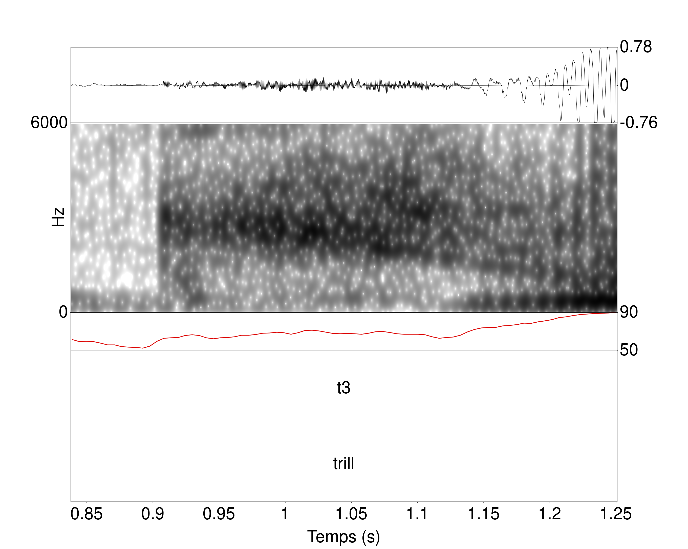
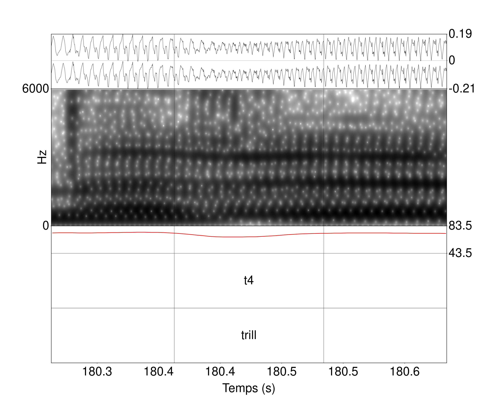
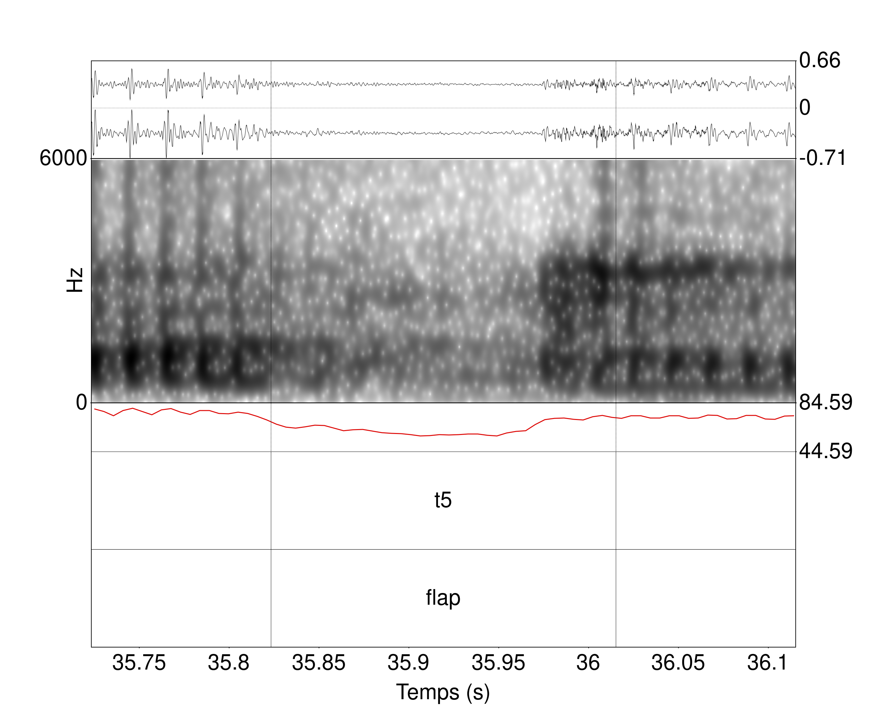
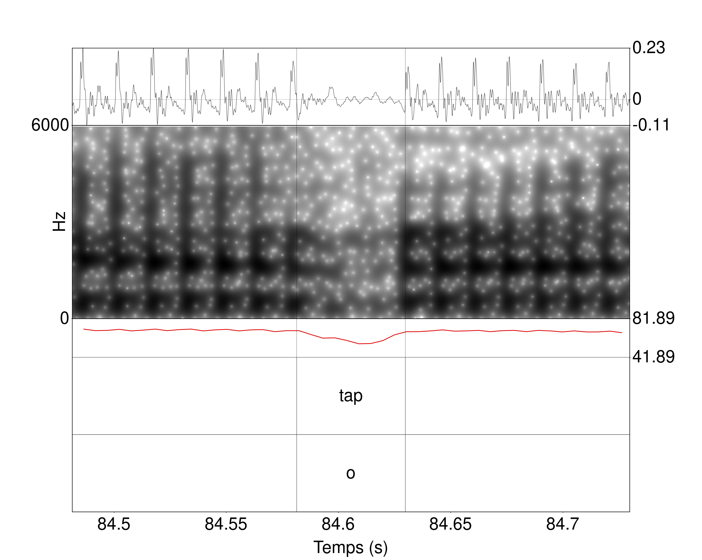
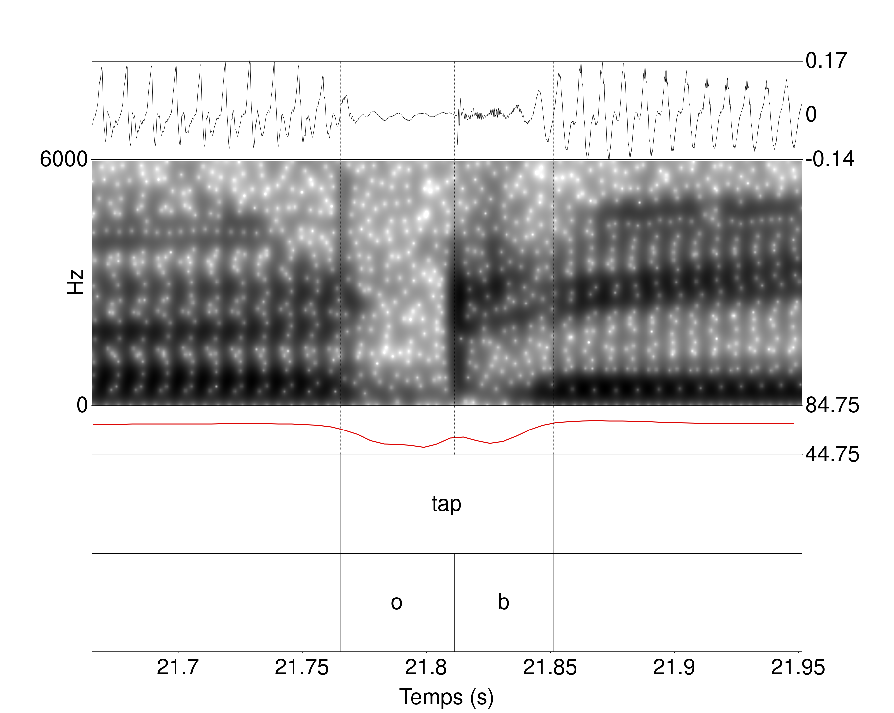

Ressources complémentaires - Chapitre 3
================
Rémi Anselme
2022-12-02 18:17:46

  - [Chapitre 3](#chapitre-3)
      - [3.2 Première étude : classification des trills et taps dans des
        macro-classes](#32-première-étude--classification-des-trills-et-taps-dans-des-macro-classes)
          - [3.2.1 Quatre catégories
            différentes](#321-quatre-catégories-différentes)
          - [3.2.2 Résultats de la segmentation en
            catégories](#322-résultats-de-la-segmentation-en-catégories)
      - [3.3 Deuxième étude : étude des composants des trills et
        taps](#33-deuxième-étude--étude-des-composants-des-trills-et-taps)
          - [3.3.1 Le « o » : élément
            d’occlusion](#331-le--o---élément-docclusion)
          - [3.3.2 Le « b » : élément de relâchement
            (burst)](#332-le--b---élément-de-relâchement-burst)
          - [3.3.3 Le « a » : élément de constriction sans occlusion
            complète
            (approximante)](#333-le--a---élément-de-constriction-sans-occlusion-complète-approximante)
          - [3.3.4 Le « c » : élément épenthétique vocalique (élément «
            svarabhaktique
            »)](#334-le--c---élément-épenthétique-vocalique-élément--svarabhaktique-)
      - [3.4 Présentation des 18 langues segmentées et
        annotées](#34-présentation-des-18-langues-segmentées-et-annotées)
          - [3.4.1 Descriptions des différents motifs (combinaisons
            d’éléments)
            obtenus](#341-descriptions-des-différents-motifs-combinaisons-déléments-obtenus)
          - [3.4.2 Les durées des motifs](#342-les-durées-des-motifs)
          - [3.4.3 Les différents contextes
            possibles](#343-les-différents-contextes-possibles)
  - [Références](#références)
      - [Packages utilisés](#packages-utilisés)
      - [Version de RStudio](#version-de-rstudio)

# Chapitre 3

On importe les différentes données relatives aux illustrations (il
s’agit du même tableau qui est disponible dans les Ressources
Supplémentaires de l’article dont est issue le chapitre 2). Les
glottocodes nous permettrons de suivre les enregistrements dans les
différentes analyses.

``` r
table_map <- readr::read_csv("systematic_review_IPA.csv") %>% 
    dplyr::filter(Year >= 1990) %>% 
  #Nous avons filtré le tableau pour les dates ultérieures à 1990 car nous savions que nous n'aurions pas d'enregistrements antérieurs à cette date.
  dplyr::select(Title,latitude,longitude,glottocode) %>% 
  dplyr::rename(Language = Title)
```

    ## Rows: 213 Columns: 22
    ## ── Column specification ────────────────────────────────────────────────────────
    ## Delimiter: ","
    ## chr (18): Version, Title, glottocode, ISO_6393, Macroarea, Country, region_s...
    ## dbl  (2): Year, nb_speakers
    ## 
    ## ℹ Use `spec()` to retrieve the full column specification for this data.
    ## ℹ Specify the column types or set `show_col_types = FALSE` to quiet this message.

## 3.2 Première étude : classification des trills et taps dans des macro-classes

A partir du package `phonfieldwork` et de la fonction `textgrid_to_df`
nous avons transformé les différents TextGrids en un tableau. Nous avons
calculé la durée des différents intervalles. Le glottocode est
directement obtenu à partir des noms des fichiers.

``` r
dataFiles <- lapply(Sys.glob("textgrids/*.TextGrid"), phonfieldwork::textgrid_to_df)
```

``` r
data_table <- NULL
for(i in 1:length(dataFiles)){
  data_table <- dplyr::bind_rows(data_table,dataFiles[i])
}

df_1 <- data_table %>%
  dplyr::group_by(source) %>% 
  dplyr::mutate(total_time = max(time_end)) %>% 
  dplyr::ungroup() %>% 
  dplyr::filter(content != "") %>%
  dplyr::mutate(durat = time_end - time_start) %>%
  dplyr::group_by(source) %>% 
  tidyr::spread(tier,content) %>% 
  dplyr::ungroup() %>% 
  dplyr::mutate(glottocode = stringr::str_extract(source,"[:alpha:]{4}[:digit:]{4}")) %>% 
  dplyr::filter(is.na(`3`)) %>% dplyr::select(-`3`)
```

Nous avons segmenté 75 langues pour un total de 81 enregistrements. Nous
avons une colonne qui reprend les labels descriptifs utilisés par les
auteurs, et une colonne qui reprend nos annotations.

``` r
df_segALab <- df_1 %>% 
  dplyr::filter(tier_name == "label") %>% dplyr::select(-`1`,-tier_name) %>% 
  dplyr::rename(label = `2`)

df_segElm <- df_1 %>% 
  dplyr::filter(tier_name == "rhotic") %>% dplyr::select(-`2`,-tier_name) %>% 
  dplyr::rename(element = `1`)

df_segFull <- dplyr::left_join(df_segALab,df_segElm) %>% 
  dplyr::mutate(id_elements = dplyr::row_number())
```

    ## Joining, by = c("id", "time_start", "time_end", "source", "total_time",
    ## "durat", "glottocode")

On donne un échantillon aléatoire de 10 lignes du tableau à partir
duquel nous avons travaillé.

``` r
knitr::kable(df_segFull %>% 
               dplyr::sample_n(10),
             caption = "Échantillon de dix lignes du tableau utilisé pour la première analyse.")
```

| id | time\_start | time\_end | source            | total\_time |     durat | label       | glottocode | element | id\_elements |
| -: | ----------: | --------: | :---------------- | ----------: | --------: | :---------- | :--------- | :------ | -----------: |
| 24 |    22.23434 |  22.27298 | basq1248.TextGrid |    50.93000 | 0.0386353 | tap         | basq1248   | t4      |          241 |
| 64 |    84.97235 |  85.05987 | japh1234.TextGrid |   134.78893 | 0.0875142 | trill       | japh1234   | t4      |          941 |
| 28 |    16.23145 |  16.26857 | meri1242.TextGrid |    43.14825 | 0.0371254 | trill       | meri1242   | t1      |         1160 |
| 42 |    67.23241 |  67.26954 | west2452.TextGrid |    68.62918 | 0.0371254 | trill       | west2452   | t1      |         1783 |
| 22 |    20.73912 |  20.79793 | lamu1254.TextGrid |    29.49537 | 0.0588115 | trill       | lamu1254   | t4      |         1058 |
| 38 |    44.22139 |  44.30935 | malo1243.TextGrid |    45.59855 | 0.0879586 | trill       | malo1243   | t2      |         1137 |
| 40 |    83.91988 |  83.97479 | bear1240.TextGrid |    86.58383 | 0.0549147 | tap         | bear1240   | t4      |          277 |
| 42 |    30.75342 |  30.79226 | plat1254.TextGrid |    52.06488 | 0.0388388 | trill\_flap | plat1254   | t1      |         1461 |
| 22 |    16.57036 |  16.63265 | ital1282.TextGrid |    45.00000 | 0.0622872 | trill       | ital1282   | t1      |          894 |
| 56 |    33.58004 |  33.62793 | amer1254.TextGrid |    39.96016 | 0.0478894 | tap         | amer1254   | t1      |           64 |

Échantillon de dix lignes du tableau utilisé pour la première analyse.

Dans notre chapitre, nous n’avons pas pris en compte tous les labels
descriptifs ni toutes les catégories.

``` r
df_segFull %>% 
dplyr::filter((label %in% c("trill","tap","trill_tap","trill_flap","tap_flap","flap"))) %>% 
  dplyr::filter(element %in% c("t1","t2","t3","t4")) -> new_df_segFull 
```

Au total, on a un échantillon de 73 langues, ce qui correspond à 79
fichiers Textgrids.

``` r
gte_fam <- new_df_segFull$glottocode %>% unique()

#Nous avons travaillé avec les données de PHOIBLE (au dim. 31 juil. 2022) à partir des données issues de https://phoible.org/
load("phoible.RData")

#Nous avons aussi travaillé avec les données de Languoid (au ven. 28 juin 2019) à partir des données issues de https://glottolog.org/meta/downloads (Version 4.0)
languoid <- readr::read_csv("languoid.csv") %>% 
            dplyr::select(id,family_id,
                          parent_id,name,
                          level,latitude,
                          longitude,
                          iso639P3code)
```

    ## Rows: 24438 Columns: 15
    ## ── Column specification ────────────────────────────────────────────────────────
    ## Delimiter: ","
    ## chr (7): id, family_id, parent_id, name, level, iso639P3code, country_ids
    ## dbl (5): latitude, longitude, child_family_count, child_language_count, chil...
    ## lgl (3): bookkeeping, description, markup_description
    ## 
    ## ℹ Use `spec()` to retrieve the full column specification for this data.
    ## ℹ Specify the column types or set `show_col_types = FALSE` to quiet this message.

``` r
languoid <- languoid %>% 
               dplyr::rename(Glottocode = id)

phoible <- phoible %>% 
               dplyr::full_join(languoid,
                                by="Glottocode")

fam_ling <- phoible %>% dplyr::filter(Glottocode %in% gte_fam) %>% 
  dplyr::select(family_id,Glottocode) %>% dplyr::distinct() %>% 
  dplyr::mutate(family_id = ifelse(Glottocode=="basq1248","basq1248",
                                   ifelse(Glottocode=="kuna1268","kuna1268",family_id)))%>% dplyr::select(family_id) 
```

Nous donnons les différentes familles suivantes (au nombre de 16) :

``` r
knitr::kable(table(fam_ling),
             caption = "Familles de langues incluses dans la première étude acoustique, ainsi que le nombre de langues incluses par famille.")
```

| fam\_ling | Freq |
| :-------- | ---: |
| afro1255  |   10 |
| atla1278  |    4 |
| aust1307  |   13 |
| basq1248  |    1 |
| coch1271  |    1 |
| drav1251  |    1 |
| indo1319  |   28 |
| kuna1268  |    1 |
| more1255  |    1 |
| otom1299  |    2 |
| pama1250  |    4 |
| sino1245  |    2 |
| taik1256  |    1 |
| timo1261  |    1 |
| turk1311  |    1 |
| ural1272  |    2 |

Familles de langues incluses dans la première étude acoustique, ainsi
que le nombre de langues incluses par famille.

### 3.2.1 Quatre catégories différentes

On a crée une fonction qui nous permet de générer automatiquement les
spectrogrammes grâce au package `speakr` et la fonction `praat_plot`. On
a modifié le script Praat (`plot.praat`) originellement présent dans le
package que nous mettons partageons (les modifications par rapport à la
version initiale sont explicitées dans le script). POur l’utiliser dans
le package, il suffit de remplacer le fichier dans le package
`speakr/extdata` par celui que nous proposons. Nous ne diffusons pas les
audios qui sont disponibles sur la page :
<https://richardbeare.github.io/marijatabain/ipa_illustrations_all.html>.
Nous avons systématiquement renommer les enregistrements sonores des
narratives avec les glottocodes. Il est important pour la génération des
spectrogrammes que les TextGrids et les enregistrements soient dans le
même dossier.

``` r
draw_plot_praat <- function(table=df_segFull,ID_ELEMENTS,F0=TRUE,time=0.05,path_out="spectro/"){
  #Cette fonction est optimisée pour travailler avec le tableau que nous avons précédemment créé.
  #Cette fonction ne fonctionne pas sans les audios qu'il faudra télécharger, et les placer dans textgrids/
  path_in <- "full_audio/"
  FILE <- paste0(path_out,table[table$id_elements==ID_ELEMENTS,]$glottocode,
                 "_",ID_ELEMENTS,"_",table[table$id_elements==ID_ELEMENTS,]$id,".png")
  WAV <- paste0(path_in,table[table$id_elements==ID_ELEMENTS,]$glottocode,".wav")
  START <- table[table$id_elements==ID_ELEMENTS,]$time_start
  END <- table[table$id_elements==ID_ELEMENTS,]$time_end
    
  speakr::praat_plot(file=FILE,wav=WAV,start=START-time,end=END+time,spec_max = 6000,f0=F0)
    
}
```

Nous avons diminué la qualité des différents spectrogrammes obtenus.

``` r
#draw_plot_praat(ID_ELEMENTS = 768) 
knitr::include_graphics("spectro/haus1257_768_4.png")
```

<div class="figure">


<p class="caption">

Illustration de la catégorie « t1 » dans le contexte \[wɘtɘ raːnaː\] en
hausa (Glotto : haus1257). De haut en bas, nous avons l’oscillogramme,
le spectrogramme, la courbe d’intensité, un palier intervallique avec la
catégorie segmentée, et un palier intervallique comprenant le label
descriptif du segment d’intérêt.

</p>

</div>

``` r
#draw_plot_praat(ID_ELEMENTS = 1312) 
knitr::include_graphics("spectro/nenn1238_1312_56.png")
```

<div class="figure">


<p class="caption">

Illustration de la catégorie « t2 » dans le contexte \[ˈkesær
ˈombtebas\] en nen (Glotto : nenn1238). De haut en bas, nous avons
l’oscillogramme, le spectrogramme, la courbe d’intensité, un palier
intervallique avec la catégorie segmentée, et un palier intervallique
comprenant le label descriptif du segment d’intérêt.

</p>

</div>

``` r
#draw_plot_praat(ID_ELEMENTS = 449) 

```

<div class="figure">


<p class="caption">

Illustration de la catégorie « t3 » dans le contexte \[ˈjet ˈruzi\] en
farsi (Glotto : fars1255). De haut en bas, nous avons l’oscillogramme,
le spectrogramme, la courbe d’intensité, un palier intervallique avec la
catégorie segmentée, et un palier intervallique comprenant le label
descriptif du segment d’intérêt.

</p>

</div>

``` r
#draw_plot_praat(ID_ELEMENTS = 944) 

```

<div class="figure">


<p class="caption">

Illustration de la catégorie « t4 » dans le contexte /tɕendɤre/ en
japhug (Glotto : japh1234). De haut en bas, nous avons l’oscillogramme,
le spectrogramme, la courbe d’intensité, un palier intervallique avec la
catégorie segmentée, et un palier intervallique comprenant le label
descriptif du segment d’intérêt.

</p>

</div>

``` r
#draw_plot_praat(ID_ELEMENTS = 1657) 

```

<div class="figure">


<p class="caption">

Illustration de la catégorie « t5 » dans le contexte \[haˈɾuwa\] en
tausug. De haut en bas pour chacune des illustrations, nous avons
l’oscillogramme, le spectrogramme, la courbe d’intensité, un palier
intervallique avec la catégorie segmentée, et un palier intervallique
comprenant le label descriptif du segment d’intérêt.

</p>

</div>

``` r
#draw_plot_praat(ID_ELEMENTS = 1188) 
knitr::include_graphics("spectro/mono1270_1188_12.png")
```

<div class="figure">


<p class="caption">

Illustration de la catégorie « t6 » dans le contexte \[ə́ rːjìgú\]
<Œrrrœ yigu> en mono. De haut en bas pour chacune des illustrations,
nous avons l’oscillogramme, le spectrogramme, la courbe d’intensité, un
palier intervallique avec la catégorie segmentée, et un palier
intervallique comprenant le label descriptif du segment d’intérêt.

</p>

</div>

### 3.2.2 Résultats de la segmentation en catégories

``` r
df_segFull$label %>% table %>% as.data.frame() %>% 
  dplyr::arrange(desc(Freq)) %>% 
    dplyr::mutate(descriptive_label = stringr::str_length(`.`)) %>% 
  knitr::kable(caption = "Tableau des comptes des différents labels descriptifs.")
```

| .                | Freq | descriptive\_label |
| :--------------- | ---: | -----------------: |
| trill            | 1117 |                  5 |
| tap              |  434 |                  3 |
| trill\_tap       |   54 |                  9 |
| trill\_flap      |   28 |                 10 |
| stop             |   22 |                  4 |
| tap\_flap        |   22 |                  8 |
| flap             |   20 |                  4 |
| app\_retro       |   19 |                  9 |
| trill\_pal       |   13 |                  9 |
| stop\_vl         |    8 |                  7 |
| tap\_flap\_retro |    8 |                 14 |
| trill\_trill     |    8 |                 11 |
| r\_tap           |    6 |                  5 |
| uvu\_trill       |    6 |                  9 |
| trill\_vl        |    4 |                  8 |
| tap\_vl          |    3 |                  6 |
| trill\_fric      |    3 |                 10 |
| trill\_retro     |    2 |                 11 |
| trill\_syll      |    2 |                 10 |
| app              |    1 |                  3 |
| lat\_liq         |    1 |                  7 |
| trill\_glo       |    1 |                  9 |
| trilltrill       |    1 |                 10 |

Tableau des comptes des différents labels descriptifs.

Nous avons 1783 segments qui ont été segmentés et annotés pour 23 labels
descriptifs. Dans notre échantillon final, nous avons 73 langues, pour
79 locuteurs/rices, et 1672

``` r
new_df_segFull$label %>% table %>% as.data.frame() %>% 
  dplyr::arrange(desc(Freq)) %>% 
  dplyr::mutate(n_tot = sum(Freq),
                Freq_pc = Freq/n_tot) -> table2labelfreq
```

Les trills représentent 67% de toutes les rhotiques segmentées. Les taps
représentent 26% de toutes les rhotiques segmentées. Les trills/taps,
trills/flaps, taps/flaps et flaps représentent 7% de toutes les
rhotiques segmentées.

``` r
new_df_segFull %>% 
  dplyr::select(label,element) %>% table() %>% 
  dplyr::as_tibble() %>% 
  dplyr::group_by(label) %>% 
  dplyr::mutate(freq = n/sum(n)) %>% 
  dplyr::ungroup() %>% 
  ggplot2::ggplot(ggplot2::aes(y=label,x=element,fill=freq)) +
  ggplot2::geom_tile() +
  ggplot2::theme_bw(base_size=20) +
  ggplot2::labs(y  = "Labels descriptifs", x = "Catégories" ) +
  ggplot2::scale_fill_viridis_c(name = "Fréquence")
```


Fréquences relatives des différentes catégories en fonction des labels
descriptifs. Les fréquences sont calculées par ligne. Plus une case est
jaune, plus la catégorie associée à un label descriptif est fréquente.
Plus une case est violette, moins la catégorie associée à un label
descriptif est fréquente.

``` r
new_df_segFull %>% 
  dplyr::select(label,element) %>% table() %>% 
  dplyr::as_tibble() %>% 
  dplyr::group_by(label) %>% 
  dplyr::mutate(freq = n) %>% 
  dplyr::ungroup() %>% 
  ggplot2::ggplot(ggplot2::aes(y=label,x=element,fill=freq)) +
  ggplot2::geom_tile() +
  ggplot2::theme_bw(base_size=20) +
  ggplot2::labs(y  = "Labels descriptifs", x = "Catégories" ) +
  ggplot2::scale_fill_viridis_c(name = "Fréquence")
```


Fréquences absolues des différentes catégories en fonction des labels
descriptifs. Les fréquences sont calculées par ligne. Plus une case est
jaune, plus la catégorie associée à un label descriptif est fréquente.
Plus une case est violette, moins la catégorie associée à un label
descriptif est fréquente.

``` r
new_df_segFull %>%
  dplyr::mutate(source = stringr::str_extract(source,".*(?=\\.TextGrid)")) %>% 
  dplyr::filter(label == "trill") %>% 
  dplyr::select(source,element) %>% 
  table() %>% as.data.frame() %>% 
  dplyr::group_by(source) %>% 
  dplyr::mutate(n_tot = sum(Freq),
                Freq_pc = Freq/n_tot) %>% 
  dplyr::ungroup() %>% 
  ggplot2::ggplot(ggplot2::aes(y=source,x=element,fill=Freq_pc)) +
  ggplot2::geom_tile() +
  ggplot2::theme_bw(base_size=20) +
  ggplot2::labs(y  = "Locuteurs/trices", x = "Catégories" ) +
  ggplot2::scale_fill_viridis_c(name = "Fréquence")
```


Fréquences relatives des différentes catégories illustrant la variation
pour les segments ayant été catégorisés par les auteurs des
illustrations comme des « trill ». Les fréquences sont calculées par
ligne. Une case jaune est associée à une haute fréquence, cela veut dire
que le/la locuteur/trice tend à produire une seule catégorie. Une case
violette est associée à une catégorie non produite par le/la
locuteur/trice.

``` r
new_df_segFull %>%
  dplyr::mutate(source = stringr::str_extract(source,".*(?=\\.TextGrid)")) %>% 
  dplyr::filter(label == "trill") %>% 
  dplyr::select(source,element) %>% 
  table() %>% as.data.frame() %>% 
  dplyr::group_by(source) %>% 
  dplyr::mutate(n_tot = sum(Freq),
                Freq_pc = Freq) %>% 
  dplyr::ungroup() %>% 
  ggplot2::ggplot(ggplot2::aes(y=source,x=element,fill=Freq_pc)) +
  ggplot2::geom_tile() +
  ggplot2::theme_bw(base_size=20) +
  ggplot2::labs(y  = "Locuteurs/trices", x = "Catégories" ) +
  ggplot2::scale_fill_viridis_c(name = "Fréquence")
```


Fréquences absolues des différentes catégories illustrant la variation
pour les segments ayant été catégorisés par les auteurs des
illustrations comme des « trill ». Les fréquences sont calculées par
ligne. Une case jaune est associée à une haute fréquence, cela veut dire
que le/la locuteur/trice tend à produire une seule catégorie. Une case
violette est associée à une catégorie non produite par le/la
locuteur/trice.

``` r
#draw_plot_praat(ID_ELEMENTS = 718) 
knitr::include_graphics("spectro/gali1258_718_48.png")
```

<div class="figure">


<p class="caption">

Illustrations avec oscillogrammes et spectrogrammes d’un « t2 » du
galicien (Glotto : gali1258) (1 occurrence sur 1 de t2 soit 100% des
trills).

</p>

</div>

``` r
#draw_plot_praat(ID_ELEMENTS = 354) 
knitr::include_graphics("spectro/cast1244_354_66.png")
```

<div class="figure">


<p class="caption">

Illustrations avec oscillogrammes et spectrogrammes d’un « t2 » de
l’espagnol castillan (Glotto : cast1244) (2 occurrences sur 2 de t2
soit 100% des trills).

</p>

</div>

``` r
#draw_plot_praat(ID_ELEMENTS = 1132) 
knitr::include_graphics("spectro/malo1243_1132_28.png")
```

<div class="figure">


<p class="caption">

Illustrations avec oscillogrammes et spectrogrammes d’un « t2 » du
tamambo (Glotto : malo1243) (15 occurrences sur 19 de t2 soit 78,9% des
trills).

</p>

</div>

``` r
#draw_plot_praat(ID_ELEMENTS = 67) 
knitr::include_graphics("spectro/amer1254_67_62.png")
```

<div class="figure">


<p class="caption">

Illustrations avec oscillogrammes et spectrogrammes d’un « t2 » de
l’espagnol argentin (Glotto : amer1254) (2 occurrences sur 3 de t2
soit 66,7% des trills).

</p>

</div>

``` r
#draw_plot_praat(ID_ELEMENTS = 1338) 
knitr::include_graphics("spectro/nucl1460_1338_16.png")
```

<div class="figure">


<p class="caption">

Illustrations avec oscillogrammes et spectrogrammes d’un « t2 » du
madurais (Glotto : nucl1460) (6 occurrences sur 8 de t2 soit 75% des
trills)

</p>

</div>

``` r
#draw_plot_praat(ID_ELEMENTS = 1703) 
knitr::include_graphics("spectro/tswa1253_1703_6.png")
```

<div class="figure">


<p class="caption">

Illustrations avec oscillogrammes et spectrogrammes d’un « t2 » du
tswana (Glotto : tswa1253) (3 occurrences sur 7 de t2 soit 42,9% des
trills).

</p>

</div>

``` r
new_df_segFull %>%
  dplyr::mutate(source = stringr::str_extract(source,".*(?=\\.TextGrid)")) %>% 
  dplyr::filter(label %in% c("tap","flap","tap_flap")) %>% 
  dplyr::select(source,element) %>% 
  table() %>% as.data.frame() %>% 
  dplyr::group_by(source) %>% 
  dplyr::mutate(n_tot = sum(Freq),
                Freq_pc = Freq/n_tot) %>% 
  dplyr::ungroup() %>% 
  ggplot2::ggplot(ggplot2::aes(y=source,x=element,fill=Freq_pc)) +
  ggplot2::geom_tile() +
  ggplot2::labs(y  = "Locuteurs/trices", x = "Catégories" ) +
  ggplot2::scale_fill_viridis_c(name = "Fréquence")
```


Fréquences relatives des différentes catégories illustrant la variation
pour les segments ayant été catégorisés par les auteurs des
illustrations comme des « taps, flaps et taps/flaps ». Les fréquences
sont calculées par ligne. Une case jaune est associée à une haute
fréquence, cela veut dire que le/la locuteur/trice tend à produire une
seule catégorie. Une case violette est associé à une catégorie non
produite par le/la locuteur/trice.

``` r
new_df_segFull %>%
  dplyr::mutate(source = stringr::str_extract(source,".*(?=\\.TextGrid)")) %>% 
  dplyr::filter(label %in% c("tap","flap","tap_flap")) %>% 
  dplyr::select(source,element) %>% 
  table() %>% as.data.frame() %>% 
  dplyr::group_by(source) %>% 
  dplyr::mutate(n_tot = sum(Freq),
                Freq_pc = Freq) %>% 
  dplyr::ungroup() %>% 
  ggplot2::ggplot(ggplot2::aes(y=source,x=element,fill=Freq_pc)) +
  ggplot2::geom_tile() +
  ggplot2::labs(y  = "Locuteurs/trices", x = "Catégories" ) +
  ggplot2::scale_fill_viridis_c(name = "Fréquence")
```


Fréquences absolues des différentes catégories illustrant la variation
pour les segments ayant été catégorisés par les auteurs des
illustrations comme des « taps, flaps et taps/flaps ». Les fréquences
sont calculées par ligne. Une case jaune est associée à une haute
fréquence, cela veut dire que le/la locuteur/trice tend à produire une
seule catégorie. Une case violette est associé à une catégorie non
produite par le/la locuteur/trice.

``` r
#draw_plot_praat(ID_ELEMENTS = 1400) 
knitr::include_graphics("spectro/pash1270_1400_28.png")
```

<div class="figure">


<p class="caption">

Illustrations avec oscillogrammes et spectrogrammes d’un « t2 » du
pashai du sud est (Glotto : pash1270) (2 occurrences sur 22 de t2 soit
9,1% des trills).

</p>

</div>

``` r
#draw_plot_praat(ID_ELEMENTS = 1558) 
knitr::include_graphics("spectro/sanm1298_1558_6.png")
```

<div class="figure">


<p class="caption">

Illustrations avec oscillogrammes et spectrogrammes d’un « t2 » du
trique de San Martín Itunyoso (Glotto : sanm1298) (2 occurrences sur 10
de t2 soit 100% des trills).

</p>

</div>

``` r
new_df_segFull %>%
  dplyr::mutate(source = stringr::str_extract(source,".*(?=\\.TextGrid)")) %>% 
  dplyr::filter(label %in% c("trill_tap","trill_flap")) %>% 
  dplyr::select(source,element) %>% 
  table() %>% as.data.frame() %>% 
  dplyr::group_by(source) %>% 
  dplyr::mutate(n_tot = sum(Freq),
                Freq_pc = Freq/n_tot) %>% 
  dplyr::ungroup() %>% 
  ggplot2::ggplot(ggplot2::aes(y=source,x=element,fill=Freq_pc)) +
  ggplot2::geom_tile() +
  ggplot2::labs(y  = "Locuteurs/trices", x = "Catégories" ) +
  ggplot2::scale_fill_viridis_c(name = "Fréquence")
```


``` r
new_df_segFull %>%
  dplyr::mutate(source = stringr::str_extract(source,".*(?=\\.TextGrid)")) %>% 
  dplyr::filter(label %in% c("trill_tap","trill_flap")) %>% 
  dplyr::select(source,element) %>% 
  table() %>% as.data.frame() %>% 
  dplyr::group_by(source) %>% 
  dplyr::mutate(n_tot = sum(Freq),
                Freq_pc = Freq) %>% 
  dplyr::ungroup() %>% 
  ggplot2::ggplot(ggplot2::aes(y=source,x=element,fill=Freq_pc)) +
  ggplot2::geom_tile() +
  ggplot2::labs(y  = "Locuteurs/trices", x = "Catégories" ) +
  ggplot2::scale_fill_viridis_c(name = "Fréquence")
```


``` r
#draw_plot_praat(ID_ELEMENTS = 858) 
knitr::include_graphics("spectro/indo1316_858_34.png")
```

<div class="figure">


<p class="caption">

Illustrations avec oscillogrammes et spectrogrammes d’un « t2 » de
l’indonésien (Glotto : indo1316) (7 occurrences sur 31 de t2 soit
22,6% des trills).

</p>

</div>

``` r
#draw_plot_praat(ID_ELEMENTS = 1457) 
knitr::include_graphics("spectro/plat1254_1457_34.png")
```

<div class="figure">


<p class="caption">

Illustrations avec oscillogrammes et spectrogrammes d’un « t2 » du
malgache central (Glotto : plat1254) (5 occurrences sur 28 de t2 soit
17,9% des trills).

</p>

</div>

## 3.3 Deuxième étude : étude des composants des trills et taps

Dans la deuxième étude, nous travaillons sur moins d’enregistrements.

``` r
dataFiles <- lapply(Sys.glob("textgrids_2etude/*.TextGrid"), phonfieldwork::textgrid_to_df)
```

Ces enregistrements sont au nombre de 18.

``` r
data_table_burst <- NULL
for(i in 1:length(dataFiles)){
  data_table_burst <- dplyr::bind_rows(data_table_burst,dataFiles[i])
}

df_b <- data_table_burst %>%
  dplyr::group_by(source) %>% 
  dplyr::mutate(total_time = max(time_end)) %>% 
  dplyr::ungroup() %>% 
  dplyr::filter(content != "") %>%
  dplyr::mutate(durat = time_end - time_start) %>%
  dplyr::group_by(source) %>% 
  tidyr::spread(tier,content) %>% 
  dplyr::ungroup() %>% 
  dplyr::mutate(glottocode = stringr::str_extract(source,"[:alpha:]{4}[:digit:]{4}")) %>% 
  dplyr::mutate(id_elements = ifelse(!is.na(`1`),dplyr::row_number(),NA)) %>% 
  tidyr::fill(id_elements,.direction = "down") 


df_b <- df_b %>% 
  dplyr::filter(is.na(`1`)) %>% 
  dplyr::select(glottocode,`2`,id_elements) %>% 
  dplyr::group_by(id_elements) %>%
  dplyr::mutate(elements_full = paste0(`2`, collapse="")) %>% 
  dplyr::ungroup() %>% 
  dplyr::select(-`2`) %>%  dplyr::distinct() %>% 
  dplyr::right_join(df_b)
```

    ## Joining, by = c("glottocode", "id_elements")

``` r
df_segALab_b <- df_b %>% 
  dplyr::filter(tier_name == "label") %>% dplyr::select(-`2`,-tier_name) %>% 
  dplyr::rename(label = `1`) %>% 
  dplyr::group_by(glottocode) %>% 
  dplyr::mutate(id_sound = dplyr::row_number()) %>% 
  dplyr::ungroup()

df_segElm_b <- df_b %>% 
  dplyr::filter(tier_name == "blecua") %>% dplyr::select(-`1`,-tier_name) %>% 
  dplyr::rename(element = `2`) %>% 
  dplyr::group_by(id_elements) %>% 
  dplyr::mutate(id_in_element = dplyr::row_number(),
                id_lenght = stringr::str_count(elements_full,".")) %>% 
  dplyr::ungroup() %>% 
  dplyr::rename(id_full_elements = id_elements) %>% 
  dplyr::mutate(id_elements = dplyr::row_number())
```

Nous avons ajouter au tableau des informations sur les mots contenants
les rhotiques. Pour cela nous avions dans un tableau pris en compte ces
différents mots, et les motifs qu’ils contiennent. Il s’agit cependant
d’une ancienne analyse en composants où ne prenions pas encore en
compte le « b ».

``` r
table_acoustics_blecua <- readr::read_csv("table_acoustics_blecua.csv") %>% 
  dplyr::rename(elements_old = element) %>% 
  dplyr::group_by(glottocode) %>% 
  dplyr::select(-word_id) %>% 
  dplyr::mutate(id_sound = dplyr::row_number()) 
```

    ## Rows: 400 Columns: 4
    ## ── Column specification ────────────────────────────────────────────────────────
    ## Delimiter: ","
    ## chr (3): word, element, glottocode
    ## lgl (1): word_id
    ## 
    ## ℹ Use `spec()` to retrieve the full column specification for this data.
    ## ℹ Specify the column types or set `show_col_types = FALSE` to quiet this message.

``` r
vowels <- c("ə","æ","ø","e","a","o","i","j","u","ɨ","ɛ","ɪ","ɐ","ʊ","ɔ","ɯ","ɑ","y","ʏ","ṵ")
consonants <- c("d","v","k","f","b","t","ɦ","l","s","ð","n","ʂ","p","m","g","q","ʔ","ʲ","ʋ","β","ɣ","ɡ","ʒ")
boundaries <- c("$")
```

Nous avons établi des listes des différentes segments qui pouvaient
précéder et suivre les rhotiques à partir de nos données.

``` r
df_lab_b <- df_segALab_b %>% 
  dplyr::group_by(glottocode) %>% 
  dplyr::mutate(word_id = paste0(glottocode,"_",dplyr::row_number())) %>% 
  dplyr::left_join(table_acoustics_blecua) %>%
  dplyr::mutate(word_2 = stringr::str_replace_all(word,"(\\d|\\W|ˈ|ˌ|ː|ˑ|̃|̴|̊|̆|̈|̽|̚|̋|́|̄|̀|̏|̌|̂|̥|̤|̪|̬|̰|̺|̼|̻|̹|̜|̟|̠|̝|̩|̞|̯|̘)","")) %>% 
  dplyr::mutate(con_left = stringr::str_extract(word_2,".{1}(?=r|ɾ|ɽ| 
                                                ɻ|ɹ|R)"),
               con_right = stringr::str_extract(word_2,"(?<=r|ɾ|ɽ|
                                                 ɻ|ɹ|R).{1}")) %>% 
  dplyr::mutate(con_left = ifelse(is.na(con_left),"$",con_left),
                con_right = ifelse(is.na(con_right),"$",con_right)) %>% 
  dplyr::mutate(conCV_left = dplyr::case_when(con_left %in% consonants ~ "C",
                                              con_left %in% vowels ~ "V",
                                              con_left %in% boundaries ~ "B"),
                conCV_right = dplyr::case_when(con_right %in% consonants ~ "C",
                                              con_right %in% vowels ~ "V",
                                              con_right %in% boundaries ~ "B")) %>% 
  dplyr::mutate(Left = paste0(conCV_left,stringr::str_extract(elements_full,"^.")),
                Right = paste0(stringr::str_extract(elements_full,".$"),conCV_right))
```

    ## Joining, by = c("glottocode", "id_sound")

``` r
table_burst <- dplyr::left_join(df_lab_b,table_acoustics_blecua) %>% 
  dplyr::ungroup() %>% 
  dplyr::mutate(context = paste0(conCV_left,'r',conCV_right)) %>% 
  dplyr::mutate(context_full = paste0(con_left,'r',con_right)) 
```

    ## Joining, by = c("glottocode", "id_sound", "word", "elements_old")

On donne un échantillon aléatoire de 10 lignes du tableau à partir
duquel nous avons travaillé.

``` r
knitr::kable(table_burst %>% 
               dplyr::sample_n(10),
             caption = "Échantillon de dix lignes du tableau utilisé pour la deuxième analyse.")
```

| glottocode | id\_elements | elements\_full | id | time\_start | time\_end | source            | total\_time |     durat | label      | id\_sound | word\_id     | word         | elements\_old | word\_2    | con\_left | con\_right | conCV\_left | conCV\_right | Left | Right | context | context\_full |
| :--------- | -----------: | :------------- | -: | ----------: | --------: | :---------------- | ----------: | --------: | :--------- | --------: | :----------- | :----------- | :------------ | :--------- | :-------- | :--------- | :---------- | :----------- | :--- | :---- | :------ | :------------ |
| mafe1237   |          955 | oco            | 36 |    41.93303 |  41.99743 | mafe1237.TextGrid |    76.14404 | 0.0643961 | trill      |        18 | mafe1237\_18 | o ro         | oco           | oro        | o         | o          | V           | V            | Vo   | oV    | VrV     | oro           |
| east2379   |          572 | o              | 22 |    32.55351 |  32.57747 | east2379.TextGrid |    59.63569 | 0.0239630 | tap        |        11 | east2379\_11 | ˈɔˑrɛiˈt     | o             | ɔrɛit      | ɔ         | ɛ          | V           | V            | Vo   | oV    | VrV     | ɔrɛ           |
| afri1274   |           89 | ococ           | 52 |    26.57478 |  26.64618 | afri1274.TextGrid |    39.59381 | 0.0714023 | trill      |        26 | afri1274\_26 | nuərdəvənt   | ococ          | nuərdəvənt | ə         | d          | V           | C            | Vo   | cC    | VrC     | ərd           |
| cast1244   |          481 | oc             | 62 |    34.34254 |  34.38773 | cast1244.TextGrid |    38.90385 | 0.0451882 | tap        |        31 | cast1244\_31 | poɾ lo       | oc            | poɾlo      | o         | l          | V           | C            | Vo   | cC    | VrC     | orl           |
| brun1243   |          362 | ob             | 22 |    20.15704 |  20.18079 | brun1243.TextGrid |    32.09270 | 0.0237525 | trill\_tap |        11 | brun1243\_11 | utaɾa        | o             | utaɾa      | a         | a          | V           | V            | Vo   | bV    | VrV     | ara           |
| basq1248   |          291 | o              | 24 |    22.23967 |  22.26714 | basq1248.TextGrid |    50.93000 | 0.0274700 | tap        |        12 | basq1248\_12 | b̥eɾ̞̀ íɲal | o             | beɾiɲal    | e         | i          | V           | V            | Vo   | oV    | VrV     | eri           |
| cast1244   |          442 | o              | 42 |    20.00179 |  20.02845 | cast1244.TextGrid |    38.90385 | 0.0266641 | tap        |        21 | cast1244\_21 | ˈpeɾo        | o             | peɾo       | e         | o          | V           | V            | Vo   | oV    | VrV     | ero           |
| indo1317   |          756 | obc            | 48 |    66.48798 |  66.54011 | indo1317.TextGrid |    99.33229 | 0.0521382 | trill      |        24 | indo1317\_24 | iɾu          | oco           | iɾu        | i         | u          | V           | V            | Vo   | cV    | VrV     | iru           |
| amer1254   |          189 | oc             | 36 |    21.59870 |  21.65478 | amer1254.TextGrid |    39.96016 | 0.0560838 | tap        |        18 | amer1254\_18 | ’fuɾja       | oc            | fuɾja      | u         | j          | V           | V            | Vo   | cV    | VrV     | urj           |
| meri1242   |         1178 | obc            | 32 |    24.26504 |  24.30984 | meri1242.TextGrid |    43.14825 | 0.0448015 | trill      |        16 | meri1242\_16 | pru          | oc            | pru        | p         | u          | C           | V            | Co   | cV    | CrV     | pru           |

Échantillon de dix lignes du tableau utilisé pour la deuxième analyse.

Et nous avons adapté notre fonction pour l’obtention de spectrogramme
sur la base du nouveau tableau.

``` r
draw_plot_praat <- function(table=table_burst,ID_ELEMENTS,F0=TRUE,time=0.05,path_out="spectro/"){
  
  path_in <- "full_audio_2etude/" #Cette fonction ne fonctionne pas sans les audios qu'il faudra télécharger, et les placer dans textgrids_2etude/
  FILE <- paste0(path_out,table[table$id_elements==ID_ELEMENTS,]$glottocode,
                 "_",ID_ELEMENTS,"_",table[table$id_elements==ID_ELEMENTS,]$context_full,".png")
  WAV <- paste0(path_in,table[table$id_elements==ID_ELEMENTS,]$glottocode,".wav")
  START <- table[table$id_elements==ID_ELEMENTS,]$time_start
  END <- table[table$id_elements==ID_ELEMENTS,]$time_end
    
  speakr::praat_plot(file=FILE,wav=WAV,start=START-time,end=END+time,spec_max = 6000,f0=F0)
    
}
```

### 3.3.1 Le « o » : élément d’occlusion

``` r
#draw_plot_praat(ID_ELEMENTS = 584) 

```

<div class="figure">


<p class="caption">

Illustration de l’élément « o » dans le contexte \[ɛɾə\] en arrernte
central. De haut en bas, nous avons l’oscillogramme, le spectrogramme,
la courbe d’intensité, un palier intervallique avec la catégorie
segmentée, et un palier intervallique comprenant le label descriptif du
segment d’intérêt.

</p>

</div>

``` r
dplyr::filter(df_segElm_b,element=="o") %>%
  dplyr::summarise(moy = mean(durat),
                   med = median(durat),
                   min = min(durat),
                   max = max(durat),
                   IQR = IQR(durat)) -> stats_o
```

La durée moyenne tous contextes confondus de l’élément « o » est de
21.16ms, sa médiane de 20.8ms (minimum de 8.59ms, maximum de 42.3ms, IQR
\[écart interquartile\] de 7.5ms).

### 3.3.2 Le « b » : élément de relâchement (burst)

``` r
#draw_plot_praat(ID_ELEMENTS = 695)

```

<div class="figure">


<p class="caption">

Illustration de l’élément « b » dans le contexte \[ɯɾi\] en indonésien
des Bajau (Lombok de l’est). De haut en bas, nous avons l’oscillogramme,
le spectrogramme, la courbe d’intensité, un palier intervallique avec la
catégorie segmentée, et un palier intervallique comprenant le label
descriptif du segment d’intérêt.

</p>

</div>

``` r
dplyr::filter(df_segElm_b,element=="b") %>%
  dplyr::summarise(moy = mean(durat),
                   med = median(durat),
                   min = min(durat),
                   max = max(durat),
                   IQR = IQR(durat)) -> stats_b
```

La durée moyenne tous contextes confondus de l’élément « b » est de
14.64ms, sa médiane de 12.52ms (minimum de 4.85ms, maximum de 55.33ms,
IQR \[écart interquartile\] de 7.21ms).

### 3.3.3 Le « a » : élément de constriction sans occlusion complète (approximante)

``` r
#draw_plot_praat(ID_ELEMENTS = 1312)

```

<div class="figure">


<p class="caption">

Illustration de l’élément « a » dans le contexte \[ɛrɛ\] en ukrainien.
De haut en bas, nous avons l’oscillogramme, le spectrogramme, la courbe
d’intensité, un palier intervallique avec la catégorie segmentée, et un
palier intervallique comprenant le label descriptif du segment
d’intérêt.

</p>

</div>

``` r
dplyr::filter(df_segElm_b,element=="a") %>%
  dplyr::summarise(moy = mean(durat),
                   med = median(durat),
                   min = min(durat),
                   max = max(durat),
                   IQR = IQR(durat)) -> stats_a
```

La durée moyenne tous contextes confondus de l’élément « a » est de
31.15ms, sa médiane de 25.42ms (minimum de 10.71ms, maximum de 123.71ms,
IQR \[écart interquartile\] de 14.61ms).

### 3.3.4 Le « c » : élément épenthétique vocalique (élément « svarabhaktique »)

``` r
#draw_plot_praat(ID_ELEMENTS = 650)

```

<div class="figure">


<p class="caption">

Illustration de l’élément « c » dans le contexte \[ˈkras\] en gayo. De
haut en bas, nous avons l’oscillogramme, le spectrogramme, la courbe
d’intensité, un palier intervallique avec la catégorie segmentée, et
un palier intervallique comprenant le label descriptif du segment
d’intérêt.

</p>

</div>

``` r
dplyr::filter(df_segElm_b,element=="c") %>%
  dplyr::summarise(moy = mean(durat),
                   med = median(durat),
                   min = min(durat),
                   max = max(durat),
                   IQR = IQR(durat)) -> stats_c
```

La durée moyenne tous contextes confondus de l’élément « c » est de
21.21ms, sa médiane de 19ms (minimum de 5.78ms, maximum de 59.69ms, IQR
\[écart interquartile\] de 9.52ms).

## 3.4 Présentation des 18 langues segmentées et annotées

``` r
readr::read_csv("systematic_review_IPA.csv") %>% 
  dplyr::filter(glottocode %in% unique(dplyr::select(df_segElm_b,glottocode))$glottocode) %>% 
  dplyr::select(Title,glottocode,Country,Sexe) %>% 
  knitr::kable(caption = "Description des 18 langues. Le seenku ne provient pas de l’échantillon des 73 langues car la rhotique n’est pas considérée comme phonémique dans la langue, la langue a été incluse grâce à la présence d’un [r] dans la transcription étroite fournie (McPherson 2019, p. 18). Les âges ont été directement été collectés manuellement à partir des Illustrations.")
```

    ## Rows: 213 Columns: 22
    ## ── Column specification ────────────────────────────────────────────────────────
    ## Delimiter: ","
    ## chr (18): Version, Title, glottocode, ISO_6393, Macroarea, Country, region_s...
    ## dbl  (2): Year, nb_speakers
    ## 
    ## ℹ Use `spec()` to retrieve the full column specification for this data.
    ## ℹ Specify the column types or set `show_col_types = FALSE` to quiet this message.

| Title                          | glottocode | Country             | Sexe |
| :----------------------------- | :--------- | :------------------ | :--- |
| Amarasi                        | koto1251   | timor               | F    |
| Brunei Malay                   | brun1243   | brunei              | F    |
| Castilian Spanish              | cast1244   | spain               | F    |
| Central Arrernte               | east2379   | australia           | F    |
| Gayo                           | gayo1244   | indonesia           | M    |
| Goizueta Basque                | basq1248   | spain               | F    |
| Itunyoso Trique                | sanm1298   | mexico              | M    |
| Mavea                          | mafe1237   | vanuatu             | F    |
| Tamambo                        | malo1243   | vanuatu             | F    |
| Ukrainian                      | sout2604   | ukraine             | M    |
| Argentine Spanish              | amer1254   | argentina           | M    |
| Afrikaans                      | afri1274   | south africa        | F    |
| Sasak\_ Meno-Mené dialect      | meno1251   | indonesia           | M    |
| Indonesian Bajau (East Lombok) | indo1317   | indonesia           | F    |
| Kazakh                         | kaza1248   | karakhstan          | F    |
| Seenku                         | nort2820   | Mali Burkina Faso   | M    |
| Cagliari Sardinian             | meri1242   | italy               | F    |
| Belarusian                     | cent1954   | Republic of Belarus | M    |

Description des 18 langues. Le seenku ne provient pas de l’échantillon
des 73 langues car la rhotique n’est pas considérée comme phonémique
dans la langue, la langue a été incluse grâce à la présence d’un \[r\]
dans la transcription étroite fournie (McPherson 2019, p. 18). Les âges
ont été directement été collectés manuellement à partir des
Illustrations.

``` r
table_burst %>%
  dplyr::group_by(label) %>% 
  dplyr::select(label) %>% table() %>% as.data.frame() %>% 
  knitr::kable(caption = "Fréquence des différents labels descriptifs dans l'échantillon de 18 langues.")
```

| .            | Freq |
| :----------- | ---: |
| app          |    5 |
| tap          |  147 |
| trill        |  217 |
| trill\_pal   |    6 |
| trill\_tap   |   23 |
| trill\_trill |    2 |

Fréquence des différents labels descriptifs dans l’échantillon de 18
langues.

``` r
table_burst %>%
  dplyr::group_by(elements_full) %>% 
  dplyr::select(elements_full) %>% table() %>% as.data.frame() %>% 
  dplyr::mutate(NbElements = stringr::str_count(`.`,".")) %>% 
  knitr::kable(caption = "Fréquence des différents motifs segmentés et de leur longueur en éléments.")
```

| .       | Freq | NbElements |
| :------ | ---: | ---------: |
| a       |   30 |          1 |
| aca     |    1 |          3 |
| aco     |    1 |          3 |
| ca      |    1 |          2 |
| caca    |    1 |          4 |
| co      |   23 |          2 |
| cob     |   14 |          3 |
| cobc    |    1 |          4 |
| coca    |    1 |          4 |
| cocaca  |    1 |          6 |
| o       |   84 |          1 |
| oa      |    2 |          2 |
| ob      |   72 |          2 |
| oba     |    2 |          3 |
| obc     |   46 |          3 |
| obca    |    5 |          4 |
| obco    |    8 |          4 |
| obcob   |    4 |          5 |
| obcobc  |    2 |          6 |
| obcobco |    1 |          7 |
| obcoc   |    2 |          5 |
| obo     |    1 |          3 |
| obobob  |    1 |          6 |
| oc      |   29 |          2 |
| oca     |   29 |          3 |
| ocac    |    1 |          4 |
| ocaca   |    2 |          5 |
| oco     |   17 |          3 |
| ocoa    |    2 |          4 |
| ococ    |    9 |          4 |
| ococa   |    4 |          5 |
| ococo   |    3 |          5 |

Fréquence des différents motifs segmentés et de leur longueur en
éléments.

### 3.4.1 Descriptions des différents motifs (combinaisons d’éléments) obtenus

Nous avons annoté 32 motifs avec les différents « éléments » que nous
avions étudiés.

``` r
table_burst %>% 
  dplyr::mutate(element_length = stringr::str_length(elements_full)) -> table_element

table_element %>% 
  ggplot2::ggplot(ggplot2::aes(x=element_length)) +
  ggplot2::geom_bar(fill="#440154") +
  ggplot2::theme_bw(base_size=20) +
  ggplot2::labs(y  = "Compte des segments", x = "Nombre d'éléments" )
```


Compte des segments en fonction du nombre d’éléments.

De tous les motifs annotés, nous n’avons qu’1 occurrence de motif à sept
élément alors que nous avons 114 occurrences de motifs à un élément.

L’élément « b » apparaît dans 39.75% des cas.

``` r
#draw_plot_praat(ID_ELEMENTS = 275)
knitr::include_graphics("spectro/basq1248_275_ure.png")
```

<div class="figure">


<p class="caption">

Illustration du motif « obcobco » en basque (Glotto : basq1248) dans la
séquence \[ʔau̯ réna\] orthographié ’aurrena’. Il s’agit du seul mot
dans la fable écrit avec un <rr>. De haut en bas, nous avons
l’oscillogramme, le spectrogramme, la courbe d’intensité, un palier
intervallique avec la catégorie segmentée, et un palier intervallique
comprenant le label descriptif du segment d’intérêt.

</p>

</div>

Dans les motifs à trois occlusions, on retrouve aussi le motif « ococo »
(n=3) ainsi que le motif « obobob » (n=1).

``` r
#draw_plot_praat(ID_ELEMENTS = 444)
knitr::include_graphics("spectro/cast1244_444_are.png")
```

<div class="figure">


<p class="caption">

Illustration du motif « ococo » dans le contexte \[areβu’xaβa\]
<arrebujaba> en espagnol castillan (Glotto : cast1244). Nous avons
choisi d’annoter le dernier élément « o » et pas « a » à cause de la
diminution de l’intensité qui n’est pas aussi marquée que pour les
autres éléments « o ». De haut en bas, nous avons l’oscillogramme, le
spectrogramme, la courbe d’intensité, un palier intervallique avec la
catégorie segmentée, et un palier intervallique comprenant le label
descriptif du segment d’intérêt.

</p>

</div>

``` r
#draw_plot_praat(ID_ELEMENTS = 1242)
knitr::include_graphics("spectro/sanm1298_1242_arə.png")
```

<div class="figure">


<p class="caption">

Illustration du motif « obobo » dans le contexte \[arə\] <arrebujaba> en
trique d’Intunyoso (Glotto : sanm1298). De haut en bas, nous avons
l’oscillogramme, le spectrogramme, la courbe d’intensité, un palier
intervallique avec la catégorie segmentée, et un palier intervallique
comprenant le label descriptif du segment d’intérêt.

</p>

</div>

Sur les 400 motifs obtenus, 54 (13.5%) possèdent au minimum deux
éléments « o ». En considérant la possibilité d’avoir aussi des
éléments « a », 100 motifs sur 400 (25%) possèdent au moins deux
éléments qui sont des « a » et/ou « o ». Si on considère uniquement
les segments ayant un label descriptif « trill », ce chiffre est de 86
(soit 39.63% des 217 trills). Pour les « taps », il existe 13 motifs sur
147 (8.84%) avec au moins deux éléments qui sont des « a » et/ou « o ».

### 3.4.2 Les durées des motifs

``` r
table_burst %>% 
  ggplot2::ggplot(ggplot2::aes(x=reorder(elements_full,durat),y=durat))+
  ggplot2::geom_boxplot() +
  ggplot2::theme_minimal(base_size=20) +
  ggplot2::theme(axis.text.x = ggplot2::element_text(angle = 45, hjust=1))  +
  ggplot2::labs(y  = "Durée", x = "Motifs" ) 
```

 La
durée des différents motifs.

Toutes rhotiques confondues, la durée moyenne était de 48.1ms, la durée
médiane était de 44.72ms. Le minimum, 12.42ms, a été obtenu pour le
motif « a » et le maximum, 130.77ms, a été obtenu pour le motif « cocaca
».

``` r
#draw_plot_praat(ID_ELEMENTS = 872)

```

<div class="figure">


<p class="caption">

Illustration du motif « a » en amarasi dans le contexte \[nɛkmɛsɛɾɛʔ\].
De haut en bas pour chaque illustration, nous avons l’oscillogramme, le
spectrogramme, la courbe d’intensité, un palier intervallique avec la
catégorie segmentée, et un palier intervallique comprenant le label
descriptif du segment d’intérêt.

</p>

</div>

``` r
#draw_plot_praat(ID_ELEMENTS = 672)
knitr::include_graphics("spectro/gayo1244_672_ə.png")
```

<div class="figure">


<p class="caption">

Illustration du motif « cocaca » en gayo dans le contexte \[||
rəˈɲəl̪\]. De haut en bas pour chaque illustration, nous avons
l’oscillogramme, le spectrogramme, la courbe d’intensité, un palier
intervallique avec la catégorie segmentée, et un palier intervallique
comprenant le label descriptif du segment d’intérêt.

</p>

</div>

L’écart-inter-quartile est de 31.08ms. Un test de Kruskal–Wallis permet
de mettre en évidence que les différents motifs ont des durées
différentes (H(31)=274.4427718, p=8.3410^{-41}). Un test post-hoc de
Dunn montre cependant que les différences de durée entre les différents
paires ne sont pas toutes significatives.

``` r
test_kruskal_duree <- table_burst %>% 
  rstatix::kruskal_test(durat ~ elements_full)

test_dunn_duree <- table_burst %>% 
  rstatix::dunn_test(durat ~ elements_full) %>% 
  dplyr::as.tbl()
```

    ## Warning: `as.tbl()` was deprecated in dplyr 1.0.0.
    ## ℹ Please use `tibble::as_tibble()` instead.

``` r
table_Elements_freq10 <- table_burst %>% 
  dplyr::select(elements_full) %>% table() %>% 
  as.data.frame() %>% 
  dplyr::filter(Freq >= 9) %>% 
  dplyr::rename(Elements_freq10 = 1)
```

``` r
test_dunn_duree10 <- test_dunn_duree %>% 
  dplyr::filter(group1 %in% table_Elements_freq10$Elements_freq10 &
                group2 %in% table_Elements_freq10$Elements_freq10)
```

Nous nous intéressons à présent au dix motifs les plus fréquents. Le
motif « o » a une durée moyenne de 25.53ms et une médiane de 24.82ms
(maximum à 42.3ms, minimum à 15.04ms et IQR de 7.1ms). Sa durée moyenne
est inférieure à celle de tous les autres motifs (p\<0.001 dans les neuf
cas). Le motif « a » a une durée moyenne de 44.88ms et une médiane de
34.94ms (maximum à 123.71ms, minimum à 12.42ms et IQR de 24.82ms). Le
motif « a » n’est significativement différent que de « o », « oca » et «
ococ » (p\<0.05 dans les trois cas). De plus, le test montre que « cob »
et « obc », « obc » et « oco », et « oca » et « oco » ne sont pas
significativement différents. « ob » reste différent de « obc »
(p\<0.001) mais pas de « oc ».

Dans la suite, nous allons uniquement nous intéresser aux éléments « o »
dans les neuf motifs les plus fréquents.

``` r
df_segElm_b[df_segElm_b$element == "o" & df_segElm_b$elements_full!="o",] %>% 
  dplyr::select(elements_full, durat) %>% 
  dplyr::bind_rows(table_burst[table_burst$elements_full=="o",] %>% 
                     dplyr::select(elements_full,durat)) %>% 
  dplyr::filter(elements_full %in% table_Elements_freq10$Elements_freq10) %>% 
  ggplot2::ggplot(ggplot2::aes(x=reorder(elements_full,durat),y=durat))+
  ggplot2::geom_boxplot() +
  ggplot2::theme_minimal(base_size=20) +
  ggplot2::theme(axis.text.x = ggplot2::element_text(angle = 45, hjust=1))  +
  ggplot2::labs(y  = "Durée", x = "Motifs contenant « o »") 
```


Durées moyennes des « o » en fonction des motifs les contenant. Aucune
différence n’est faite entre le premier « o » d’un motif ou le deuxième
« o », bien que la durée de l’élément « o » diminue lorsqu’il est placé
plus à droite dans le motif.

``` r
test_kruskal_duree_o <- df_segElm_b[df_segElm_b$element == "o" & df_segElm_b$elements_full!="o",] %>% 
  dplyr::select(elements_full, durat) %>% 
  dplyr::bind_rows(table_burst[table_burst$elements_full=="o",] %>% 
                     dplyr::select(elements_full,durat)) %>% 
  dplyr::filter(elements_full %in% table_Elements_freq10$Elements_freq10)  %>% 
  rstatix::kruskal_test(durat ~ elements_full)


test_dunn_duree_o <- df_segElm_b[df_segElm_b$element == "o" & df_segElm_b$elements_full!="o",] %>% 
  dplyr::select(elements_full, durat) %>% 
  dplyr::bind_rows(table_burst[table_burst$elements_full=="o",] %>% 
                     dplyr::select(elements_full,durat)) %>% 
  dplyr::filter(elements_full %in% table_Elements_freq10$Elements_freq10)  %>% 
  rstatix::dunn_test(durat ~ elements_full) %>% 
  dplyr::as.tbl() 

test_dunn_duree_only_o <- test_dunn_duree_o %>% 
  dplyr::filter(group1 =="o" | group2 =="o" )
```

Un test de Kruskal–Wallis permet de mettre en évidence que les éléments
« o » ont une durée différente en fonction du motif dans lequel ils
sont inclus (H(8)=59.9273131, p=4.8210^{-10}). Le test post-hoc de Dunn
montre que toutes les différences de durée entre un élément « o » dans
un motif « o » et dans un autre motif (comme, par exemple, « oco » ou «
obc ») sont significatives (p\<0.05) à l’exception de « oca » et de « co
». Autrement dit, les durées des « o » dans les motifs avec plus d’un
élément ne sont pas significativement différentes (sauf pour « oca »
et « co »).

### 3.4.3 Les différents contextes possibles

``` r
table_only_10_o <- table_Elements_freq10 %>% dplyr::filter(Freq > 10) %>% 
  dplyr::rename(elements_full = 1) %>% 
  dplyr::mutate(elements_full = as.character(elements_full)) %>% 
  dplyr::filter(stringr::str_detect(elements_full,"o"))
```

``` r
table_burst %>% 
  dplyr::filter(elements_full %in% table_only_10_o$elements_full) %>% 
  dplyr::group_by(elements_full) %>%
  dplyr::select(elements_full,context) %>%  table() %>% 
  dplyr::as_tibble() %>% 
  dplyr::group_by(elements_full) %>% 
  dplyr::mutate(freq = n/sum(n)) %>% 
  dplyr::ungroup() %>% 
  ggplot2::ggplot(ggplot2::aes(y=elements_full,x=context,fill=freq)) +
  ggplot2::geom_tile() +
  ggplot2::theme_bw(base_size=20) +
  ggplot2::labs(y  = "Motifs", x = "Contextes" ) +
  ggplot2::scale_fill_viridis_c(name = "Fréquence") +
  ggplot2::labs(caption = "(V = voyelle, C = consonne, B = frontière prosodique)") +
  ggplot2::theme(plot.caption = ggplot2::element_text(hjust = 0.5))
```


Fréquences des différents motifs en fonction des contextes. Les
fréquences sont calculées par ligne. Une case jaune signifie qu’un
motif est intégralement trouvé dans un seul contexte, une case violette
signifie qu’un motif n’est pas présent dans ce contexte.

``` r
context_VrV_left <- table_burst %>%   
  dplyr::filter(elements_full %in% table_only_10_o$elements_full) %>% 
  dplyr::filter(context == "VrV") %>% 
  dplyr::select(con_left) %>% table() %>% 
  as.data.frame() %>% 
  dplyr::mutate(Freq_pc = (Freq / sum(Freq))*100)

context_VrV_right <-table_burst %>%   
  dplyr::filter(elements_full %in% table_only_10_o$elements_full) %>% 
  dplyr::filter(context == "VrV") %>% 
  dplyr::select(con_right) %>% table() %>% 
  as.data.frame() %>% 
  dplyr::mutate(Freq_pc = (Freq / sum(Freq))*100)
```

Pour le contexte intervocalique, indépendamment du motif, on retrouve
une multitude de voyelles avant le motif. Le \[a\] représente 31.94% des
occurrences, suivi du \[e\] (15.71%) du \[ə\] (11.52%) et du \[i\]
(10.99%). Après les motifs, on retrouve le \[a\] qui représente 24.61%
des occurrences, le \[i\] 17.28% des occurrences et le \[o\] et le \[u\]
représentent chacun 13.1%.

# Références

## Packages utilisés

``` r
ins.pack <- installed.packages()[names(sessionInfo()$otherPkgs), "Version"] %>% 
  as.data.frame() %>% tibble::rownames_to_column()
names(ins.pack)[1] <- "Packages"
names(ins.pack)[2] <- "Version"

ins.pack %>% knitr::kable()
```

| Packages      | Version |
| :------------ | :------ |
| stringr       | 1.4.1   |
| readr         | 2.1.2   |
| ggplot2       | 3.4.0   |
| dplyr         | 1.0.10  |
| rstatix       | 0.7.0   |
| phonfieldwork | 0.0.11  |
| speakr        | 3.2.1   |
| knitr         | 1.41    |

## Version de RStudio

``` r
rstudioapi::versionInfo()
```

    ## $citation
    ## 
    ## To cite RStudio in publications use:
    ## 
    ##   RStudio Team (2020). RStudio: Integrated Development Environment for
    ##   R. RStudio, PBC, Boston, MA URL http://www.rstudio.com/.
    ## 
    ## A BibTeX entry for LaTeX users is
    ## 
    ##   @Manual{,
    ##     title = {RStudio: Integrated Development Environment for R},
    ##     author = {{RStudio Team}},
    ##     organization = {RStudio, PBC},
    ##     address = {Boston, MA},
    ##     year = {2020},
    ##     url = {http://www.rstudio.com/},
    ##   }
    ## 
    ## 
    ## $mode
    ## [1] "desktop"
    ## 
    ## $version
    ## [1] '1.3.1073'
    ## 
    ## $release_name
    ## [1] "Giant Goldenrod"
