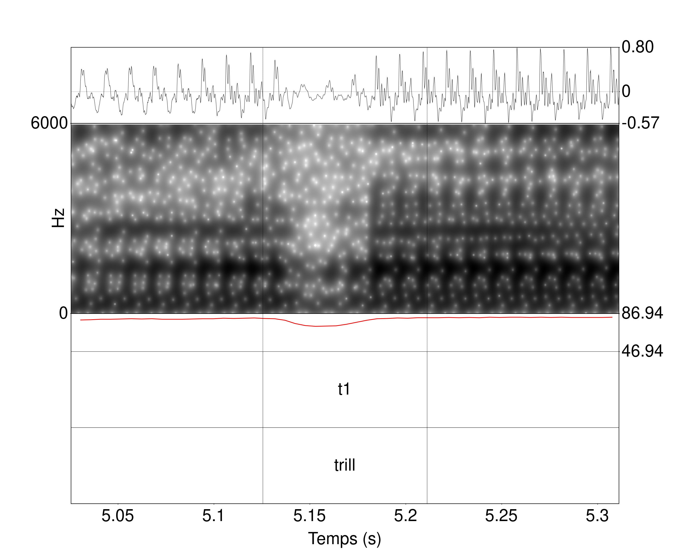
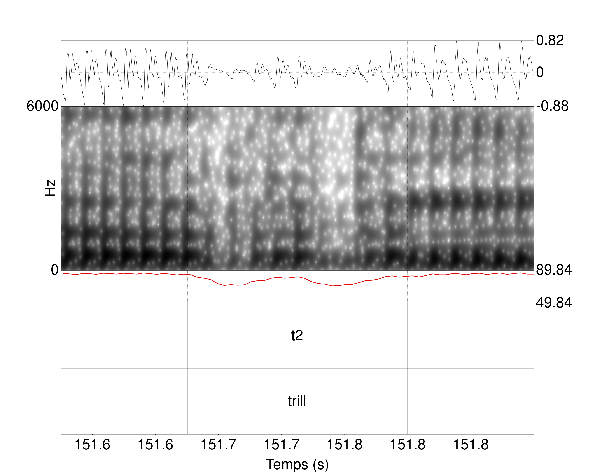
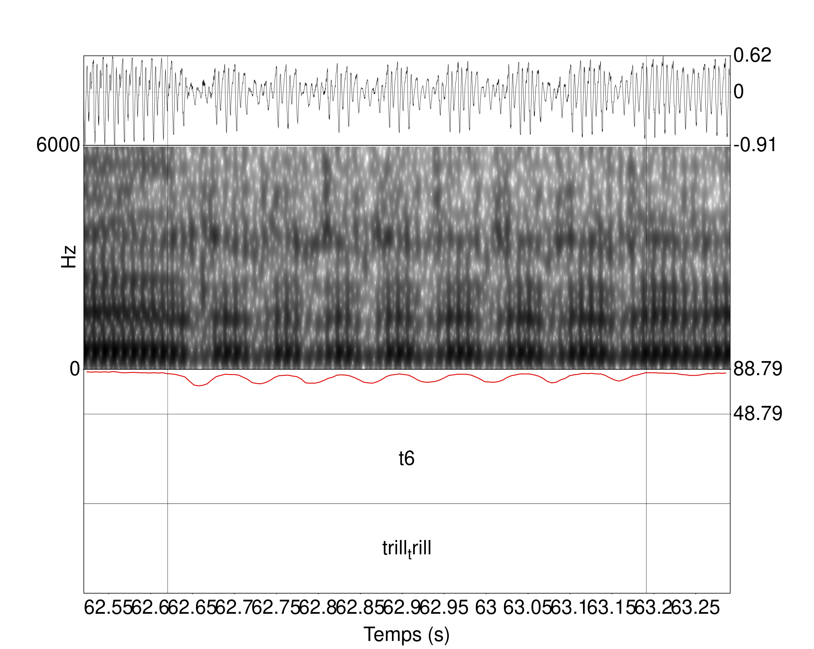
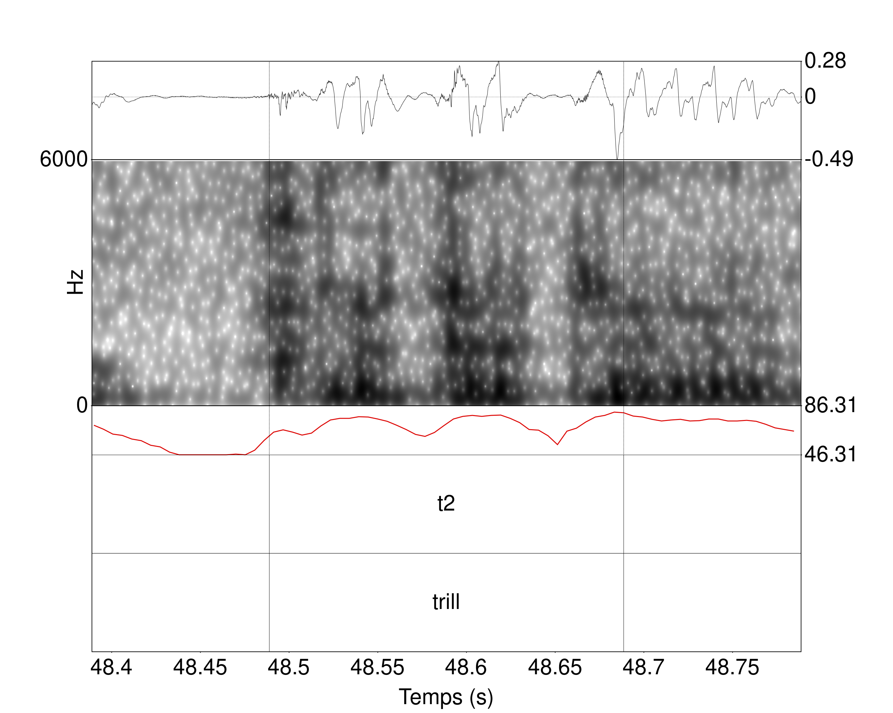
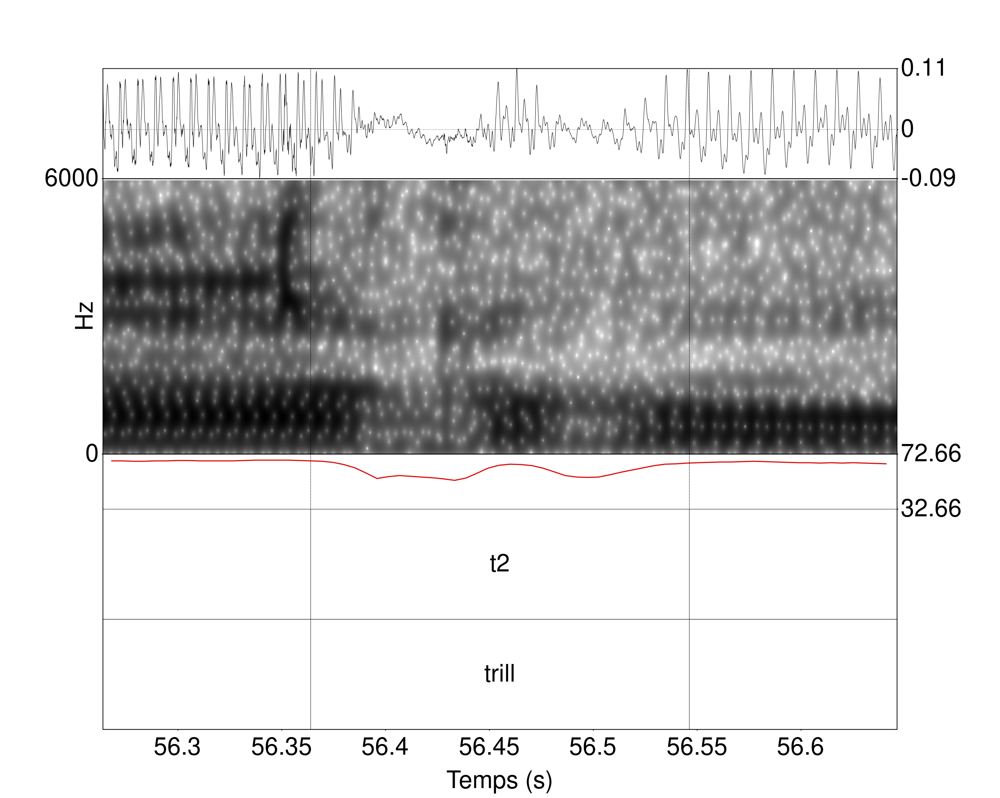
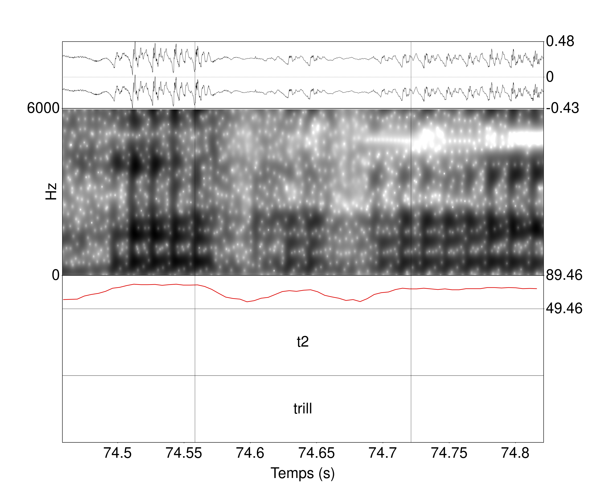
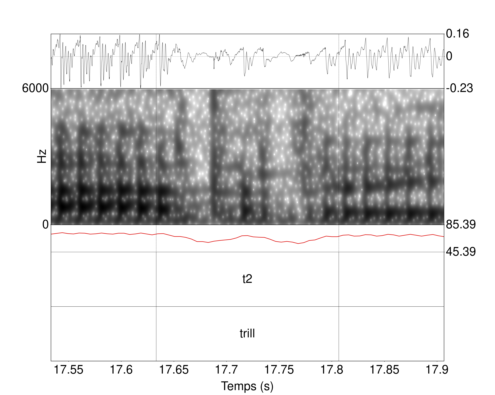

Ressources complémentaires - Chapitre 3
================
Rémi Anselme
2022-11-29 22:01:25

  - [Chapitre 3](#chapitre-3)
      - [3.2 Première étude : classification des trills et taps dans des
        macro-classes](#32-première-étude--classification-des-trills-et-taps-dans-des-macro-classes)
          - [3.2.1 Quatre catégories
            différentes](#321-quatre-catégories-différentes)
          - [3.2.2 Résultats de la segmentation en
            catégories](#322-résultats-de-la-segmentation-en-catégories)
      - [3.3 Deuxième étude : étude des composants des trills et
        taps](#33-deuxième-étude--étude-des-composants-des-trills-et-taps)
          - [3.3.1 Le « o » : élément
            d’occlusion](#331-le--o---élément-docclusion)
          - [3.3.2 Le « b » : élément de relâchement
            (burst)](#332-le--b---élément-de-relâchement-burst)

# Chapitre 3

On importe les différentes données relatives aux illustrations (il
s’agit du même tableau qui est disponible dans les Ressources
Supplémentaires de l’article dont est issue le chapitre 2). Les
glottocodes nous permettrons de suivre les enregistrements dans les
différentes analyses.

``` r
table_map <- readr::read_csv("systematic_review_IPA.csv") %>% 
    dplyr::filter(Year >= 1990) %>% 
  #Nous avons filtré le tableau pour les dates ultérieures à 1990 car nous savions que nous n'aurions pas d'enregistrements antérieurs à cette date.
  dplyr::select(Title,latitude,longitude,glottocode) %>% 
  dplyr::rename(Language = Title)
```

    ## Rows: 213 Columns: 22
    ## ── Column specification ────────────────────────────────────────────────────────
    ## Delimiter: ","
    ## chr (18): Version, Title, glottocode, ISO_6393, Macroarea, Country, region_s...
    ## dbl  (2): Year, nb_speakers
    ## 
    ## ℹ Use `spec()` to retrieve the full column specification for this data.
    ## ℹ Specify the column types or set `show_col_types = FALSE` to quiet this message.

## 3.2 Première étude : classification des trills et taps dans des macro-classes

A partir du package `phonfieldwork` et de la fonction `textgrid_to_df`
nous avons transformé les différents TextGrids en un tableau. Nous avons
calculé la durée des différents intervalles. Le glottocode est
directement obtenu à partir des noms des fichiers.

``` r
dataFiles <- lapply(Sys.glob("textgrids/*.TextGrid"), phonfieldwork::textgrid_to_df)
```

``` r
data_table <- NULL
for(i in 1:length(dataFiles)){
  data_table <- dplyr::bind_rows(data_table,dataFiles[i])
}

df_1 <- data_table %>%
  dplyr::group_by(source) %>% 
  dplyr::mutate(total_time = max(time_end)) %>% 
  dplyr::ungroup() %>% 
  dplyr::filter(content != "") %>%
  dplyr::mutate(durat = time_end - time_start) %>%
  dplyr::group_by(source) %>% 
  tidyr::spread(tier,content) %>% 
  dplyr::ungroup() %>% 
  dplyr::mutate(glottocode = stringr::str_extract(source,"[:alpha:]{4}[:digit:]{4}")) %>% 
  dplyr::filter(is.na(`3`)) %>% dplyr::select(-`3`)
```

Nous avons segmenté 75 langues pour un total de 81 enregistrements. Nous
avons une colonne qui reprend les labels descriptifs utilisés par les
auteurs, et une colonne qui reprend nos annotations.

``` r
df_segALab <- df_1 %>% 
  dplyr::filter(tier_name == "label") %>% dplyr::select(-`1`,-tier_name) %>% 
  dplyr::rename(label = `2`)

df_segElm <- df_1 %>% 
  dplyr::filter(tier_name == "rhotic") %>% dplyr::select(-`2`,-tier_name) %>% 
  dplyr::rename(element = `1`)

df_segFull <- dplyr::left_join(df_segALab,df_segElm) %>% 
  dplyr::mutate(id_elements = dplyr::row_number())
```

    ## Joining, by = c("id", "time_start", "time_end", "source", "total_time",
    ## "durat", "glottocode")

On donne un échantillon aléatoire de 10 lignes du tableau à partir
duquel nous avons travaillé.

``` r
knitr::kable(df_segFull %>% 
               dplyr::sample_n(10),
             caption = "Échantillon de dix lignes du tableau utilisé pour la première analyse.")
```

| id | time\_start | time\_end | source                 | total\_time |     durat | label      | glottocode | element | id\_elements |
| -: | ----------: | --------: | :--------------------- | ----------: | --------: | :--------- | :--------- | :------ | -----------: |
| 64 |    28.13159 |  28.18871 | astu1246.TextGrid      |    30.02732 | 0.0571145 | tap        | astu1246   | t1      |          214 |
| 66 |    29.57559 |  29.65836 | astu1246.TextGrid      |    30.02732 | 0.0827716 | tap        | astu1246   | t3      |          215 |
| 10 |    26.89951 |  27.00818 | maka1311.TextGrid      |   111.24000 | 0.1086711 | trill      | maka1311   | t4      |         1103 |
| 48 |    20.28207 |  20.33157 | astu1246.TextGrid      |    30.02732 | 0.0494965 | tap        | astu1246   | t1      |          206 |
| 26 |    45.61090 |  45.66739 | basa1284.TextGrid      |    52.36272 | 0.0564957 | tap        | basa1284   | t1      |          228 |
| 16 |    20.68593 |  20.73020 | poli1260.TextGrid      |    40.90056 | 0.0442649 | trill      | poli1260   | t1      |         1481 |
| 28 |    34.38063 |  34.42347 | indo1316.TextGrid      |    85.09497 | 0.0428370 | trill\_tap | indo1316   | t1      |          855 |
| 12 |    12.69974 |  12.76257 | pont1253\_SP1.TextGrid |    65.13581 | 0.0628275 | tap        | pont1253   | t4      |         1492 |
| 26 |    27.01328 |  27.10410 | malo1243.TextGrid      |    45.59855 | 0.0908144 | trill      | malo1243   | t2      |         1131 |
| 10 |    22.54986 |  22.61240 | anuu1241.TextGrid      |    77.43048 | 0.0625420 | trill      | anuu1241   | t1      |          123 |

Échantillon de dix lignes du tableau utilisé pour la première analyse.

Dans notre chapitre, nous n’avons pas pris en compte tous les labels
descriptifs ni toutes les catégories.

``` r
df_segFull %>% 
dplyr::filter((label %in% c("trill","tap","trill_tap","trill_flap","tap_flap","flap"))) %>% 
  dplyr::filter(element %in% c("t1","t2","t3","t4")) -> new_df_segFull 
```

Au total, on a un échantillon de 73 langues, ce qui correspond à 79
fichiers Textgrids.

``` r
gte_fam <- new_df_segFull$glottocode %>% unique()

#Nous avons travaillé avec les données de PHOIBLE (au dim. 31 juil. 2022) à partir des données issues de https://phoible.org/
load("phoible.RData")

#Nous avons aussi travaillé avec les données de Languoid (au ven. 28 juin 2019) à partir des données issues de https://glottolog.org/meta/downloads (Version 4.0)
languoid <- readr::read_csv("languoid.csv") %>% 
            dplyr::select(id,family_id,
                          parent_id,name,
                          level,latitude,
                          longitude,
                          iso639P3code)
```

    ## Rows: 24438 Columns: 15
    ## ── Column specification ────────────────────────────────────────────────────────
    ## Delimiter: ","
    ## chr (7): id, family_id, parent_id, name, level, iso639P3code, country_ids
    ## dbl (5): latitude, longitude, child_family_count, child_language_count, chil...
    ## lgl (3): bookkeeping, description, markup_description
    ## 
    ## ℹ Use `spec()` to retrieve the full column specification for this data.
    ## ℹ Specify the column types or set `show_col_types = FALSE` to quiet this message.

``` r
languoid <- languoid %>% 
               dplyr::rename(Glottocode = id)

phoible <- phoible %>% 
               dplyr::full_join(languoid,
                                by="Glottocode")

fam_ling <- phoible %>% dplyr::filter(Glottocode %in% gte_fam) %>% 
  dplyr::select(family_id,Glottocode) %>% dplyr::distinct() %>% 
  dplyr::mutate(family_id = ifelse(Glottocode=="basq1248","basq1248",
                                   ifelse(Glottocode=="kuna1268","kuna1268",family_id)))%>% dplyr::select(family_id) 
```

Nous donnons les différentes familles suivantes (au nombre de 16) :

``` r
knitr::kable(table(fam_ling),
             caption = "Familles de langues incluses dans la première étude acoustique, ainsi que le nombre de langues incluses par famille.")
```

| fam\_ling | Freq |
| :-------- | ---: |
| afro1255  |   10 |
| atla1278  |    4 |
| aust1307  |   13 |
| basq1248  |    1 |
| coch1271  |    1 |
| drav1251  |    1 |
| indo1319  |   28 |
| kuna1268  |    1 |
| more1255  |    1 |
| otom1299  |    2 |
| pama1250  |    4 |
| sino1245  |    2 |
| taik1256  |    1 |
| timo1261  |    1 |
| turk1311  |    1 |
| ural1272  |    2 |

Familles de langues incluses dans la première étude acoustique, ainsi
que le nombre de langues incluses par famille.

### 3.2.1 Quatre catégories différentes

On a crée une fonction qui nous permet de générer automatiquement les
spectrogrammes grâce au package `speakr` et la fonction `praat_plot`. On
a modifié le script Praat (`plot.praat`) originellement présent dans le
package que nous mettons partageons (les modifications par rapport à la
version initiale sont explicitées dans le script). POur l’utiliser dans
le package, il suffit de remplacer le fichier dans le package
`speakr/extdata` par celui que nous proposons. Nous ne diffusons pas les
audios qui sont disponibles sur la page :
<https://richardbeare.github.io/marijatabain/ipa_illustrations_all.html>.
Nous avons systématiquement renommer les enregistrements sonores des
narratives avec les glottocodes. Il est important pour la génération des
spectrogrammes que les TextGrids et les enregistrements soient dans le
même dossier.

``` r
draw_plot_praat <- function(table=df_segFull,ID_ELEMENTS,F0=TRUE,time=0.05,path_out="spectro/"){
  #Cette fonction est optimisée pour travailler avec le tableau que nous avons précédemment créé.
  
  path_in <- "full_audio/"
  FILE <- paste0(path_out,table[table$id_elements==ID_ELEMENTS,]$glottocode,
                 "_",ID_ELEMENTS,"_",table[table$id_elements==ID_ELEMENTS,]$id,".png")
  WAV <- paste0(path_in,table[table$id_elements==ID_ELEMENTS,]$glottocode,".wav")
  START <- table[table$id_elements==ID_ELEMENTS,]$time_start
  END <- table[table$id_elements==ID_ELEMENTS,]$time_end
    
  speakr::praat_plot(file=FILE,wav=WAV,start=START-time,end=END+time,spec_max = 6000,f0=F0)
    
}
```

Nous avons diminué la qualité des différents spectrogrammes obtenus.

``` r
#draw_plot_praat(ID_ELEMENTS = 768) 

```

<div class="figure">


<p class="caption">

Illustration de la catégorie « t1 » dans le contexte \[wɘtɘ raːnaː\] en
hausa (Glotto : haus1257). De haut en bas, nous avons l’oscillogramme,
le spectrogramme, la courbe d’intensité, un palier intervallique avec la
catégorie segmentée, et un palier intervallique comprenant le label
descriptif du segment d’intérêt.

</p>

</div>

``` r
#draw_plot_praat(ID_ELEMENTS = 1312) 

```

<div class="figure">


<p class="caption">

Illustration de la catégorie « t2 » dans le contexte \[ˈkesær
ˈombtebas\] en nen (Glotto : nenn1238). De haut en bas, nous avons
l’oscillogramme, le spectrogramme, la courbe d’intensité, un palier
intervallique avec la catégorie segmentée, et un palier intervallique
comprenant le label descriptif du segment d’intérêt.

</p>

</div>

``` r
#draw_plot_praat(ID_ELEMENTS = 449) 
knitr::include_graphics("spectro/fars1255_449_2.png")
```

<div class="figure">


<p class="caption">

Illustration de la catégorie « t3 » dans le contexte \[ˈjet ˈruzi\] en
farsi (Glotto : fars1255). De haut en bas, nous avons l’oscillogramme,
le spectrogramme, la courbe d’intensité, un palier intervallique avec la
catégorie segmentée, et un palier intervallique comprenant le label
descriptif du segment d’intérêt.

</p>

</div>

``` r
#draw_plot_praat(ID_ELEMENTS = 944) 
knitr::include_graphics("spectro/japh1234_944_70.png")
```

<div class="figure">


<p class="caption">

Illustration de la catégorie « t4 » dans le contexte /tɕendɤre/ en
japhug (Glotto : japh1234). De haut en bas, nous avons l’oscillogramme,
le spectrogramme, la courbe d’intensité, un palier intervallique avec la
catégorie segmentée, et un palier intervallique comprenant le label
descriptif du segment d’intérêt.

</p>

</div>

``` r
#draw_plot_praat(ID_ELEMENTS = 1657) 
knitr::include_graphics("spectro/taus1251_1657_10.png")
```

<div class="figure">


<p class="caption">

Illustration de la catégorie « t5 » dans le contexte \[haˈɾuwa\] en
tausug. De haut en bas pour chacune des illustrations, nous avons
l’oscillogramme, le spectrogramme, la courbe d’intensité, un palier
intervallique avec la catégorie segmentée, et un palier intervallique
comprenant le label descriptif du segment d’intérêt.

</p>

</div>

``` r
#draw_plot_praat(ID_ELEMENTS = 1188) 

```

<div class="figure">


<p class="caption">

Illustration de la catégorie « t6 » dans le contexte \[ə́ rːjìgú\]
<Œrrrœ yigu> en mono. De haut en bas pour chacune des illustrations,
nous avons l’oscillogramme, le spectrogramme, la courbe d’intensité, un
palier intervallique avec la catégorie segmentée, et un palier
intervallique comprenant le label descriptif du segment d’intérêt.

</p>

</div>

### 3.2.2 Résultats de la segmentation en catégories

``` r
df_segFull$label %>% table %>% as.data.frame() %>% 
  dplyr::arrange(desc(Freq)) %>% 
    dplyr::mutate(descriptive_label = stringr::str_length(`.`)) %>% 
  knitr::kable(caption = "Tableau des comptes des différents labels descriptifs.")
```

| .                | Freq | descriptive\_label |
| :--------------- | ---: | -----------------: |
| trill            | 1117 |                  5 |
| tap              |  434 |                  3 |
| trill\_tap       |   54 |                  9 |
| trill\_flap      |   28 |                 10 |
| stop             |   22 |                  4 |
| tap\_flap        |   22 |                  8 |
| flap             |   20 |                  4 |
| app\_retro       |   19 |                  9 |
| trill\_pal       |   13 |                  9 |
| stop\_vl         |    8 |                  7 |
| tap\_flap\_retro |    8 |                 14 |
| trill\_trill     |    8 |                 11 |
| r\_tap           |    6 |                  5 |
| uvu\_trill       |    6 |                  9 |
| trill\_vl        |    4 |                  8 |
| tap\_vl          |    3 |                  6 |
| trill\_fric      |    3 |                 10 |
| trill\_retro     |    2 |                 11 |
| trill\_syll      |    2 |                 10 |
| app              |    1 |                  3 |
| lat\_liq         |    1 |                  7 |
| trill\_glo       |    1 |                  9 |
| trilltrill       |    1 |                 10 |

Tableau des comptes des différents labels descriptifs.

Nous avons 1783 segments qui ont été segmentés et annotés pour 23 labels
descriptifs. Dans notre échantillon final, nous avons 73 langues, pour
79 locuteurs/rices, et 1672

``` r
new_df_segFull$label %>% table %>% as.data.frame() %>% 
  dplyr::arrange(desc(Freq)) %>% 
  dplyr::mutate(n_tot = sum(Freq),
                Freq_pc = Freq/n_tot) -> table2labelfreq
```

Les trills représentent 67% de toutes les rhotiques segmentées. Les taps
représentent 26% de toutes les rhotiques segmentées. Les trills/taps,
trills/flaps, taps/flaps et flaps représentent 7% de toutes les
rhotiques segmentées.

``` r
new_df_segFull %>% 
  dplyr::select(label,element) %>% table() %>% 
  dplyr::as_tibble() %>% 
  dplyr::group_by(label) %>% 
  dplyr::mutate(freq = n/sum(n)) %>% 
  dplyr::ungroup() %>% 
  ggplot2::ggplot(ggplot2::aes(y=label,x=element,fill=freq)) +
  ggplot2::geom_tile() +
  ggplot2::theme_bw(base_size=20) +
  ggplot2::labs(y  = "Labels descriptifs", x = "Catégories" ) +
  ggplot2::scale_fill_viridis_c(name = "Fréquence")
```


Fréquences relatives des différentes catégories en fonction des labels
descriptifs. Les fréquences sont calculées par ligne. Plus une case est
jaune, plus la catégorie associée à un label descriptif est fréquente.
Plus une case est violette, moins la catégorie associée à un label
descriptif est fréquente.

``` r
new_df_segFull %>% 
  dplyr::select(label,element) %>% table() %>% 
  dplyr::as_tibble() %>% 
  dplyr::group_by(label) %>% 
  dplyr::mutate(freq = n) %>% 
  dplyr::ungroup() %>% 
  ggplot2::ggplot(ggplot2::aes(y=label,x=element,fill=freq)) +
  ggplot2::geom_tile() +
  ggplot2::theme_bw(base_size=20) +
  ggplot2::labs(y  = "Labels descriptifs", x = "Catégories" ) +
  ggplot2::scale_fill_viridis_c(name = "Fréquence")
```


Fréquences absolues des différentes catégories en fonction des labels
descriptifs. Les fréquences sont calculées par ligne. Plus une case est
jaune, plus la catégorie associée à un label descriptif est fréquente.
Plus une case est violette, moins la catégorie associée à un label
descriptif est fréquente.

``` r
new_df_segFull %>%
  dplyr::mutate(source = stringr::str_extract(source,".*(?=\\.TextGrid)")) %>% 
  dplyr::filter(label == "trill") %>% 
  dplyr::select(source,element) %>% 
  table() %>% as.data.frame() %>% 
  dplyr::group_by(source) %>% 
  dplyr::mutate(n_tot = sum(Freq),
                Freq_pc = Freq/n_tot) %>% 
  dplyr::ungroup() %>% 
  ggplot2::ggplot(ggplot2::aes(y=source,x=element,fill=Freq_pc)) +
  ggplot2::geom_tile() +
  ggplot2::theme_bw(base_size=20) +
  ggplot2::labs(y  = "Locuteurs/trices", x = "Catégories" ) +
  ggplot2::scale_fill_viridis_c(name = "Fréquence")
```


Fréquences relatives des différentes catégories illustrant la variation
pour les segments ayant été catégorisés par les auteurs des
illustrations comme des « trill ». Les fréquences sont calculées par
ligne. Une case jaune est associée à une haute fréquence, cela veut dire
que le/la locuteur/trice tend à produire une seule catégorie. Une case
violette est associée à une catégorie non produite par le/la
locuteur/trice.

``` r
new_df_segFull %>%
  dplyr::mutate(source = stringr::str_extract(source,".*(?=\\.TextGrid)")) %>% 
  dplyr::filter(label == "trill") %>% 
  dplyr::select(source,element) %>% 
  table() %>% as.data.frame() %>% 
  dplyr::group_by(source) %>% 
  dplyr::mutate(n_tot = sum(Freq),
                Freq_pc = Freq) %>% 
  dplyr::ungroup() %>% 
  ggplot2::ggplot(ggplot2::aes(y=source,x=element,fill=Freq_pc)) +
  ggplot2::geom_tile() +
  ggplot2::theme_bw(base_size=20) +
  ggplot2::labs(y  = "Locuteurs/trices", x = "Catégories" ) +
  ggplot2::scale_fill_viridis_c(name = "Fréquence")
```


Fréquences absolues des différentes catégories illustrant la variation
pour les segments ayant été catégorisés par les auteurs des
illustrations comme des « trill ». Les fréquences sont calculées par
ligne. Une case jaune est associée à une haute fréquence, cela veut dire
que le/la locuteur/trice tend à produire une seule catégorie. Une case
violette est associée à une catégorie non produite par le/la
locuteur/trice.

``` r
#draw_plot_praat(ID_ELEMENTS = 718) 

```

<div class="figure">


<p class="caption">

Illustrations avec oscillogrammes et spectrogrammes d’un « t2 » du
galicien (Glotto : gali1258) (1 occurrence sur 1 de t2 soit 100% des
trills).

</p>

</div>

``` r
#draw_plot_praat(ID_ELEMENTS = 354) 
knitr::include_graphics("spectro/cast1244_354_66.png")
```

<div class="figure">


<p class="caption">

Illustrations avec oscillogrammes et spectrogrammes d’un « t2 » de
l’espagnol castillan (Glotto : cast1244) (2 occurrences sur 2 de t2
soit 100% des trills).

</p>

</div>

``` r
#draw_plot_praat(ID_ELEMENTS = 1132) 

```

<div class="figure">


<p class="caption">

Illustrations avec oscillogrammes et spectrogrammes d’un « t2 » du
tamambo (Glotto : malo1243) (15 occurrences sur 19 de t2 soit 78,9% des
trills).

</p>

</div>

``` r
#draw_plot_praat(ID_ELEMENTS = 67) 

```

<div class="figure">


<p class="caption">

Illustrations avec oscillogrammes et spectrogrammes d’un « t2 » de
l’espagnol argentin (Glotto : amer1254) (2 occurrences sur 3 de t2
soit 66,7% des trills).

</p>

</div>

``` r
#draw_plot_praat(ID_ELEMENTS = 1338) 
knitr::include_graphics("spectro/nucl1460_1338_16.png")
```

<div class="figure">


<p class="caption">

Illustrations avec oscillogrammes et spectrogrammes d’un « t2 » du
madurais (Glotto : nucl1460) (6 occurrences sur 8 de t2 soit 75% des
trills)

</p>

</div>

``` r
#draw_plot_praat(ID_ELEMENTS = 1703) 

```

<div class="figure">


<p class="caption">

Illustrations avec oscillogrammes et spectrogrammes d’un « t2 » du
tswana (Glotto : tswa1253) (3 occurrences sur 7 de t2 soit 42,9% des
trills).

</p>

</div>

``` r
new_df_segFull %>%
  dplyr::mutate(source = stringr::str_extract(source,".*(?=\\.TextGrid)")) %>% 
  dplyr::filter(label %in% c("tap","flap","tap_flap")) %>% 
  dplyr::select(source,element) %>% 
  table() %>% as.data.frame() %>% 
  dplyr::group_by(source) %>% 
  dplyr::mutate(n_tot = sum(Freq),
                Freq_pc = Freq/n_tot) %>% 
  dplyr::ungroup() %>% 
  ggplot2::ggplot(ggplot2::aes(y=source,x=element,fill=Freq_pc)) +
  ggplot2::geom_tile() +
  ggplot2::labs(y  = "Locuteurs/trices", x = "Catégories" ) +
  ggplot2::scale_fill_viridis_c(name = "Fréquence")
```


Fréquences relatives des différentes catégories illustrant la variation
pour les segments ayant été catégorisés par les auteurs des
illustrations comme des « taps, flaps et taps/flaps ». Les fréquences
sont calculées par ligne. Une case jaune est associée à une haute
fréquence, cela veut dire que le/la locuteur/trice tend à produire une
seule catégorie. Une case violette est associé à une catégorie non
produite par le/la locuteur/trice.

``` r
new_df_segFull %>%
  dplyr::mutate(source = stringr::str_extract(source,".*(?=\\.TextGrid)")) %>% 
  dplyr::filter(label %in% c("tap","flap","tap_flap")) %>% 
  dplyr::select(source,element) %>% 
  table() %>% as.data.frame() %>% 
  dplyr::group_by(source) %>% 
  dplyr::mutate(n_tot = sum(Freq),
                Freq_pc = Freq) %>% 
  dplyr::ungroup() %>% 
  ggplot2::ggplot(ggplot2::aes(y=source,x=element,fill=Freq_pc)) +
  ggplot2::geom_tile() +
  ggplot2::labs(y  = "Locuteurs/trices", x = "Catégories" ) +
  ggplot2::scale_fill_viridis_c(name = "Fréquence")
```


Fréquences absolues des différentes catégories illustrant la variation
pour les segments ayant été catégorisés par les auteurs des
illustrations comme des « taps, flaps et taps/flaps ». Les fréquences
sont calculées par ligne. Une case jaune est associée à une haute
fréquence, cela veut dire que le/la locuteur/trice tend à produire une
seule catégorie. Une case violette est associé à une catégorie non
produite par le/la locuteur/trice.

``` r
#draw_plot_praat(ID_ELEMENTS = 1400) 
knitr::include_graphics("spectro/pash1270_1400_28.png")
```

<div class="figure">


<p class="caption">

Illustrations avec oscillogrammes et spectrogrammes d’un « t2 » du
pashai du sud est (Glotto : pash1270) (2 occurrences sur 22 de t2 soit
9,1% des trills).

</p>

</div>

``` r
#draw_plot_praat(ID_ELEMENTS = 1558) 
knitr::include_graphics("spectro/sanm1298_1558_6.png")
```

<div class="figure">


<p class="caption">

Illustrations avec oscillogrammes et spectrogrammes d’un « t2 » du
trique de San Martín Itunyoso (Glotto : sanm1298) (2 occurrences sur 10
de t2 soit 100% des trills).

</p>

</div>

``` r
new_df_segFull %>%
  dplyr::mutate(source = stringr::str_extract(source,".*(?=\\.TextGrid)")) %>% 
  dplyr::filter(label %in% c("trill_tap","trill_flap")) %>% 
  dplyr::select(source,element) %>% 
  table() %>% as.data.frame() %>% 
  dplyr::group_by(source) %>% 
  dplyr::mutate(n_tot = sum(Freq),
                Freq_pc = Freq/n_tot) %>% 
  dplyr::ungroup() %>% 
  ggplot2::ggplot(ggplot2::aes(y=source,x=element,fill=Freq_pc)) +
  ggplot2::geom_tile() +
  ggplot2::labs(y  = "Locuteurs/trices", x = "Catégories" ) +
  ggplot2::scale_fill_viridis_c(name = "Fréquence")
```


``` r
new_df_segFull %>%
  dplyr::mutate(source = stringr::str_extract(source,".*(?=\\.TextGrid)")) %>% 
  dplyr::filter(label %in% c("trill_tap","trill_flap")) %>% 
  dplyr::select(source,element) %>% 
  table() %>% as.data.frame() %>% 
  dplyr::group_by(source) %>% 
  dplyr::mutate(n_tot = sum(Freq),
                Freq_pc = Freq) %>% 
  dplyr::ungroup() %>% 
  ggplot2::ggplot(ggplot2::aes(y=source,x=element,fill=Freq_pc)) +
  ggplot2::geom_tile() +
  ggplot2::labs(y  = "Locuteurs/trices", x = "Catégories" ) +
  ggplot2::scale_fill_viridis_c(name = "Fréquence")
```


``` r
#draw_plot_praat(ID_ELEMENTS = 858) 
knitr::include_graphics("spectro/indo1316_858_34.png")
```

<div class="figure">


<p class="caption">

Illustrations avec oscillogrammes et spectrogrammes d’un « t2 » de
l’indonésien (Glotto : indo1316) (7 occurrences sur 31 de t2 soit
22,6% des trills).

</p>

</div>

``` r
#draw_plot_praat(ID_ELEMENTS = 1457) 
knitr::include_graphics("spectro/plat1254_1457_34.png")
```

<div class="figure">


<p class="caption">

Illustrations avec oscillogrammes et spectrogrammes d’un « t2 » du
malgache central (Glotto : plat1254) (5 occurrences sur 28 de t2 soit
17,9% des trills).

</p>

</div>

## 3.3 Deuxième étude : étude des composants des trills et taps

Dans la deuxième étude, nous travaillons sur moins d’enregistrements.

``` r
dataFiles <- lapply(Sys.glob("textgrids_2etude/*.TextGrid"), phonfieldwork::textgrid_to_df)
```

Ces enregistrements sont au nombre de 18.

``` r
data_table_burst <- NULL
for(i in 1:length(dataFiles)){
  data_table_burst <- dplyr::bind_rows(data_table_burst,dataFiles[i])
}

df_b <- data_table_burst %>%
  dplyr::group_by(source) %>% 
  dplyr::mutate(total_time = max(time_end)) %>% 
  dplyr::ungroup() %>% 
  dplyr::filter(content != "") %>%
  dplyr::mutate(durat = time_end - time_start) %>%
  dplyr::group_by(source) %>% 
  tidyr::spread(tier,content) %>% 
  dplyr::ungroup() %>% 
  dplyr::mutate(glottocode = stringr::str_extract(source,"[:alpha:]{4}[:digit:]{4}")) %>% 
  dplyr::mutate(id_elements = ifelse(!is.na(`1`),dplyr::row_number(),NA)) %>% 
  tidyr::fill(id_elements,.direction = "down") 


df_b <- df_b %>% 
  dplyr::filter(is.na(`1`)) %>% 
  dplyr::select(glottocode,`2`,id_elements) %>% 
  dplyr::group_by(id_elements) %>%
  dplyr::mutate(elements_full = paste0(`2`, collapse="")) %>% 
  dplyr::ungroup() %>% 
  dplyr::select(-`2`) %>%  dplyr::distinct() %>% 
  dplyr::right_join(df_b)
```

    ## Joining, by = c("glottocode", "id_elements")

``` r
df_segALab_b <- df_b %>% 
  dplyr::filter(tier_name == "label") %>% dplyr::select(-`2`,-tier_name) %>% 
  dplyr::rename(label = `1`) %>% 
  dplyr::group_by(glottocode) %>% 
  dplyr::mutate(id_sound = dplyr::row_number()) %>% 
  dplyr::ungroup()

df_segElm_b <- df_b %>% 
  dplyr::filter(tier_name == "blecua") %>% dplyr::select(-`1`,-tier_name) %>% 
  dplyr::rename(element = `2`) %>% 
  dplyr::group_by(id_elements) %>% 
  dplyr::mutate(id_in_element = dplyr::row_number(),
                id_lenght = stringr::str_count(elements_full,".")) %>% 
  dplyr::ungroup() %>% 
  dplyr::rename(id_full_elements = id_elements) %>% 
  dplyr::mutate(id_elements = dplyr::row_number())
```

Nous avons ajouter au tableau des informations sur les mots contenants
les rhotiques. Pour cela nous avions dans un tableau pris en compte ces
différents mots, et les motifs qu’ils contiennent. Il s’agit cependant
d’une ancienne analyse en composants où ne prenions pas encore en
compte le « b ».

``` r
table_acoustics_blecua <- readr::read_csv("table_acoustics_blecua.csv") %>% 
  dplyr::rename(elements_old = element) %>% 
  dplyr::group_by(glottocode) %>% 
  dplyr::select(-word_id) %>% 
  dplyr::mutate(id_sound = dplyr::row_number()) 
```

    ## Rows: 400 Columns: 4
    ## ── Column specification ────────────────────────────────────────────────────────
    ## Delimiter: ","
    ## chr (3): word, element, glottocode
    ## lgl (1): word_id
    ## 
    ## ℹ Use `spec()` to retrieve the full column specification for this data.
    ## ℹ Specify the column types or set `show_col_types = FALSE` to quiet this message.

``` r
vowels <- c("ə","æ","ø","e","a","o","i","j","u","ɨ","ɛ","ɪ","ɐ","ʊ","ɔ","ɯ","ɑ","y","ʏ","ṵ")
consonants <- c("d","v","k","f","b","t","ɦ","l","s","ð","n","ʂ","p","m","g","q","ʔ","ʲ","ʋ","β","ɣ","ɡ","ʒ")
boundaries <- c("$")
```

Nous avons établi des listes des différentes segments qui pouvaient
précéder et suivre les rhotiques à partir de nos données.

``` r
df_lab_b <- df_segALab_b %>% 
  dplyr::group_by(glottocode) %>% 
  dplyr::mutate(word_id = paste0(glottocode,"_",dplyr::row_number())) %>% 
  dplyr::left_join(table_acoustics_blecua) %>%
  dplyr::mutate(word_2 = stringr::str_replace_all(word,"(\\d|\\W|ˈ|ˌ|ː|ˑ|̃|̴|̊|̆|̈|̽|̚|̋|́|̄|̀|̏|̌|̂|̥|̤|̪|̬|̰|̺|̼|̻|̹|̜|̟|̠|̝|̩|̞|̯|̘)","")) %>% 
  dplyr::mutate(con_left = stringr::str_extract(word_2,".{1}(?=r|ɾ|ɽ| 
                                                ɻ|ɹ|R)"),
               con_right = stringr::str_extract(word_2,"(?<=r|ɾ|ɽ|
                                                 ɻ|ɹ|R).{1}")) %>% 
  dplyr::mutate(con_left = ifelse(is.na(con_left),"$",con_left),
                con_right = ifelse(is.na(con_right),"$",con_right)) %>% 
  dplyr::mutate(conCV_left = dplyr::case_when(con_left %in% consonants ~ "C",
                                              con_left %in% vowels ~ "V",
                                              con_left %in% boundaries ~ "B"),
                conCV_right = dplyr::case_when(con_right %in% consonants ~ "C",
                                              con_right %in% vowels ~ "V",
                                              con_right %in% boundaries ~ "B")) %>% 
  dplyr::mutate(Left = paste0(conCV_left,stringr::str_extract(elements_full,"^.")),
                Right = paste0(stringr::str_extract(elements_full,".$"),conCV_right))
```

    ## Joining, by = c("glottocode", "id_sound")

``` r
table_burst <- dplyr::left_join(df_lab_b,table_acoustics_blecua) %>% 
  dplyr::ungroup() %>% 
  dplyr::mutate(context = paste0(conCV_left,'r',conCV_right)) %>% 
  dplyr::mutate(context_full = paste0(con_left,'r',con_right)) 
```

    ## Joining, by = c("glottocode", "id_sound", "word", "elements_old")

On donne un échantillon aléatoire de 10 lignes du tableau à partir
duquel nous avons travaillé.

``` r
knitr::kable(table_burst %>% 
               dplyr::sample_n(10),
             caption = "Échantillon de dix lignes du tableau utilisé pour la deuxième analyse.")
```

| glottocode | id\_elements | elements\_full | id | time\_start | time\_end | source            | total\_time |     durat | label | id\_sound | word\_id     | word          | elements\_old | word\_2   | con\_left | con\_right | conCV\_left | conCV\_right | Left | Right | context | context\_full |
| :--------- | -----------: | :------------- | -: | ----------: | --------: | :---------------- | ----------: | --------: | :---- | --------: | :----------- | :------------ | :------------ | :-------- | :-------- | :--------- | :---------- | :----------- | :--- | :---- | :------ | :------------ |
| indo1317   |          794 | obc            | 72 |   88.624195 | 88.669236 | indo1317.TextGrid |    99.33229 | 0.0450410 | tap   |        36 | indo1317\_36 | iɾu           | oco           | iɾu       | i         | u          | V           | V            | Vo   | cV    | VrV     | iru           |
| cast1244   |          406 | o              | 16 |    7.527818 |  7.550409 | cast1244.TextGrid |    38.90385 | 0.0225908 | tap   |         8 | cast1244\_8  | bjaˈxeɾo̯     | o             | bjaxeɾo   | e         | o          | V           | V            | Vo   | oV    | VrV     | ero           |
| amer1254   |          151 | o              | 12 |    8.089299 |  8.109894 | amer1254.TextGrid |    39.96016 | 0.0205950 | tap   |         6 | amer1254\_6  | ’xeɾo̯em      | o             | xeɾoem    | e         | o          | V           | V            | Vo   | oV    | VrV     | ero           |
| malo1243   |         1033 | obca           | 10 |   11.721409 | 11.807483 | malo1243.TextGrid |    45.59855 | 0.0860738 | trill |         5 | malo1243\_5  | nãˈsorˌa     | oca           | nasora    | o         | a          | V           | V            | Vo   | aV    | VrV     | ora           |
| sout2604   |         1312 | a              | 40 |   35.703855 | 35.734450 | sout2604.TextGrid |    44.47490 | 0.0305951 | trill |        20 | sout2604\_20 | ˈt͡ʃɛrɛz      | a             | t͡ʃɛrɛz   | ɛ         | ɛ          | V           | V            | Va   | aV    | VrV     | ɛrɛ           |
| mafe1237   |          995 | a              | 58 |   60.697280 | 60.775017 | mafe1237.TextGrid |    76.14404 | 0.0777361 | trill |        29 | mafe1237\_29 | || rm̩p̩m̩    | a             | rmpm      | $         | m          | B           | C            | Ba   | aC    | BrC     | $rm           |
| sout2604   |         1267 | obc            |  6 |    3.128666 |  3.207905 | sout2604.TextGrid |    44.47490 | 0.0792394 | trill |         3 | sout2604\_3  | tɛr ˈs        | oc            | tɛrs      | ɛ         | s          | V           | C            | Vo   | cC    | VrC     | ɛrs           |
| amer1254   |          175 | oca            | 28 |   17.575986 | 17.641115 | amer1254.TextGrid |    39.96016 | 0.0651288 | tap   |        14 | amer1254\_14 | ðe’ɾa         | oca           | ðeɾa      | e         | a          | V           | V            | Vo   | aV    | VrV     | era           |
| amer1254   |          186 | co             | 34 |   21.180259 | 21.219571 | amer1254.TextGrid |    39.96016 | 0.0393115 | trill |        17 | amer1254\_17 | ɡram          | co            | ɡram      | ɡ         | a          | C           | V            | Cc   | oV    | CrV     | ɡra           |
| basq1248   |          306 | obco           | 36 |   31.811833 | 31.867654 | basq1248.TextGrid |    50.93000 | 0.0558207 | trill |        18 | basq1248\_18 | ipàr ais̻ék | oco           | iparaisek | a         | a          | V           | V            | Vo   | oV    | VrV     | ara           |

Échantillon de dix lignes du tableau utilisé pour la deuxième analyse.

Et nous avons adapté notre fonction pour l’obtention de spectrogramme
sur la base du nouveau tableau.

``` r
draw_plot_praat <- function(table=table_burst,ID_ELEMENTS,F0=TRUE,time=0.05,path_out="spectro/"){
  
  path_in <- "full_audio_2etude/"
  FILE <- paste0(path_out,table[table$id_elements==ID_ELEMENTS,]$glottocode,
                 "_",ID_ELEMENTS,"_",table[table$id_elements==ID_ELEMENTS,]$context_full,".png")
  WAV <- paste0(path_in,table[table$id_elements==ID_ELEMENTS,]$glottocode,".wav")
  START <- table[table$id_elements==ID_ELEMENTS,]$time_start
  END <- table[table$id_elements==ID_ELEMENTS,]$time_end
    
  speakr::praat_plot(file=FILE,wav=WAV,start=START-time,end=END+time,spec_max = 6000,f0=F0)
    
}
```

### 3.3.1 Le « o » : élément d’occlusion

``` r
#draw_plot_praat(ID_ELEMENTS = 584) 
knitr::include_graphics("spectro/east2379_584_ɛrə.png")
```

<div class="figure">


<p class="caption">

Illustration de l’élément « o » dans le contexte \[ɛɾə\] en arrernte
central. De haut en bas, nous avons l’oscillogramme, le spectrogramme,
la courbe d’intensité, un palier intervallique avec la catégorie
segmentée, et un palier intervallique comprenant le label descriptif du
segment d’intérêt.

</p>

</div>

``` r
dplyr::filter(df_segElm_b,element=="o") %>%
  dplyr::summarise(moy = mean(durat),
                   med = median(durat),
                   min = min(durat),
                   max = max(durat),
                   IQR = IQR(durat)) -> stats_o
```

La durée moyenne tous contextes confondus de l’élément « o » est de
21.3ms, sa médiane de 20.88ms (minimum de 8.59ms, maximum de 42.3ms, IQR
\[écart interquartile\] de 7.38msms).

### 3.3.2 Le « b » : élément de relâchement (burst)

``` r
#draw_plot_praat(ID_ELEMENTS = 695)
knitr::include_graphics("spectro/indo1317_695_ari.png")
```

<div class="figure">


<p class="caption">

Illustration de l’élément « b » dans le contexte \[ɯɾi\] en indonésien
des Bajau (Lombok de l’est). De haut en bas, nous avons l’oscillogramme,
le spectrogramme, la courbe d’intensité, un palier intervallique avec la
catégorie segmentée, et un palier intervallique comprenant le label
descriptif du segment d’intérêt.

</p>

</div>

``` r
dplyr::filter(df_segElm_b,element=="b") %>%
  dplyr::summarise(moy = mean(durat),
                   med = median(durat),
                   min = min(durat),
                   max = max(durat),
                   IQR = IQR(durat)) -> stats_b
```

La durée moyenne tous contextes confondus de l’élément « b » est de
14.46ms, sa médiane de 12.54ms (minimum de 4.85ms, maximum de 55.33ms,
IQR \[écart interquartile\] de 6.81ms).
