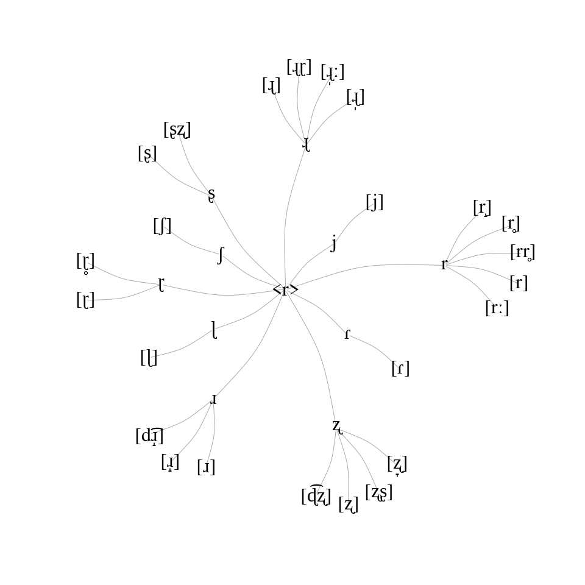

Ressources complémentaires - Chapitre 4
================
Rémi Anselme
2022-12-08 23:46:56

  - [Chapitre 4](#chapitre-4)
      - [Préparation des données](#préparation-des-données)
      - [Étude de cas : Le cas de “3” en
        Europe](#étude-de-cas--le-cas-de-3-en-europe)
      - [Étude de cas 2 : Le cas des langues slaves et
        romanes](#étude-de-cas-2--le-cas-des-langues-slaves-et-romanes)
          - [Résultats des caractérisations de la rhotique dans les
            langues romanes et
            slaves](#résultats-des-caractérisations-de-la-rhotique-dans-les-langues-romanes-et-slaves)
              - [Les langues romanes](#les-langues-romanes)
                  - [Deuxième position d’attaque
                    branchante](#deuxième-position-dattaque-branchante)
                  - [Position initiale](#position-initiale)
                  - [Position intervocalique](#position-intervocalique)
                  - [Graphe pour les langues
                    romanes](#graphe-pour-les-langues-romanes)
                  - [Cartes pour les langues
                    romanes](#cartes-pour-les-langues-romanes)
              - [Les langues slaves](#les-langues-slaves)
                  - [Position initiale](#position-initiale-1)
                  - [Second position cluster](#second-position-cluster)
                  - [Graphe pour les langues
                    slaves](#graphe-pour-les-langues-slaves)
                  - [Cartes pour les langues
                    slaves](#cartes-pour-les-langues-slaves)
              - [Cas du latin classique](#cas-du-latin-classique)
      - [Étude de cas 3 : Le cas des langues
        germaniques](#étude-de-cas-3--le-cas-des-langues-germaniques)
          - [Position initiale](#position-initiale-2)
          - [Attaque branchante](#attaque-branchante)
          - [Graphe pour les langues
            germaniques](#graphe-pour-les-langues-germaniques)
          - [Cartes pour les langues
            germaniques](#cartes-pour-les-langues-germaniques)
      - [Étude de cas 4 : Le cas du
        mapudungun](#étude-de-cas-4--le-cas-du-mapudungun)
          - [Position initiale avec le cognat
            “maison”](#position-initiale-avec-le-cognat-maison)
          - [Position initiale avec le cognat
            “7”](#position-initiale-avec-le-cognat-7)
          - [Nouvelles données pour le
            mapudungun](#nouvelles-données-pour-le-mapudungun)
          - [Graphe pour le mapudungun](#graphe-pour-le-mapudungun)
          - [Cartes pour le mapudungun](#cartes-pour-le-mapudungun)
  - [Références](#références)
      - [Packages utilisés](#packages-utilisés)
      - [Version de RStudio](#version-de-rstudio)

# Chapitre 4

## Préparation des données

Les données ont été préparés dans le fichier `data_processing.R` (*pas
totalement mis au propre*). Nous avons récupéré des fichiers `.csv`
(présent dans le dossier `Data_SoundComparison`). De cette préparation
des données, nous obtenons systématiquement des données en `.RData`
prête à être importées sur R.

Nous avons les `.csv` suivants (utiles dans le script
`data_processing.R`) :

  - `Customexport_2020-04-04 18_47.csv` (Pour le cognat 3 dans les
    langues d’Europe)
  - `Customexport_2020-04-09 19_59.csv` (Pour les langues romanes)
  - `Customexport_2020-04-09 19_48.csv` (Pour les rhotiques initiales
    dans les langues romanes)
  - `Customexport_2020-04-10 10_51.csv` (Pour les rhotiques
    intervocaliques dans les langues romanes)
  - `Customexport_2020-04-11 16_29.csv` (Pour les autres rhotiques
    initiales dans les langues romanes)
  - `languages_R20.csv` (Data de romance pour \~20 cognats)
  - `Customexport_2020-04-27 21_13.csv` (Data de romance pour \~30
    cognats)
  - `Customexport_2020-04-09 22_18.csv` (Data pour le mapudungun)
  - `Customexport_2020-07-08 12 00.csv` (Pour les rhotiques dans le
    cognat 7 en mapudungun)
  - `Customexport_2020-07-08 14 26.csv` (Data pour le mapudungun v1)
  - `Customexport_2020-07-08 14 39.csv` (Data pour le mapudungun v2)
  - `Customexport_2021-08-11_12_32.csv` (Data pour les langues slaves)
  - `Customexport_2021-08-16_17_47.csv` (Data pour les langues
    germaniques)
  - `Customexport_2022-08-10 22 00.csv` (Data pour le Mapudungun avec
    une préparation des données différentes)

Je rajoute aussi les données pour le Vanuatu Malakula North avant
qu’elles soient déplacées sur `https://vanuatuvoices.clld.org/` dans
le dossier `Vanuatu_Malakula_North` :

  - `Customexport_2020-07-09 10 06.csv`
  - `Customexport_2020-07-09 10 08.csv`
  - `Customexport_2020-07-09 10 10.csv`
  - `Customexport_2020-07-09 10 11.csv`
  - `Customexport_2020-07-09 10 12.csv`
  - `Customexport_2020-07-09 10 12(1).csv`
  - `Customexport_2020-07-09 10 14.csv`
  - `Customexport_2020-07-09 10 14(1).csv`
  - `Customexport_2020-07-09 10 15.csv`
  - `Customexport_2020-07-09 10 15(1).csv`
  - `Customexport_2020-07-09 10 16.csv`
  - `Customexport_2020-07-09 10 18.csv`
  - `Customexport_2020-07-09 10 19.csv`

Avec une mini étude cas avec une étude préliminaire sur Praat (nous
joignons des `.TextGrid` dans le dossier `Ambae_TG`) que nous n’aurons
pas continuer pour manque de temps :

  - `East_Lolovoli.TextGrid`
  - `East_SanaSolokave.TextGrid`
  - `East_Vuindondo.TextGrid`
  - `Nth_HavaiLombaha.TextGrid`
  - `Nth_Leonda.TextGrid`
  - `Nth_LeoVandue.TextGrid`
  - `Sth_Biribiri.TextGrid`
  - `Sth_Lolovele.TextGrid`
  - `Sth_Sakao.TextGrid`
  - `West_Walaha.TextGrid`

De même pour les langues de Papouasie-Nouvelle-Guinée (avant qu’elles
soient déplacées sur `https://papuanvoices.clld.org/` dans le dossier
`West_papua`) :

  - `Customexport_2020-07-09 11 18.csv`
  - `Customexport_2020-07-09 11 18(1).csv`
  - `Customexport_2020-07-09 11 19.csv`
  - `Customexport_2020-07-09 11 19(1).csv`
  - `Customexport_2020-07-09 11 19(2).csv`
  - `Customexport_2020-07-09 11 19(3).csv`
  - `Customexport_2020-07-09 11 19(4).csv`
  - `Customexport_2020-07-09 11 21.csv`
  - `Customexport_2020-07-09 11 21(1).csv`
  - `Customexport_2020-07-09 11 21(2).csv`
  - `Customexport_2020-07-09 11 21(3).csv`
  - `Customexport_2020-07-09 11 22.csv`

Ansi que des données pour les langues quechua :

  - `Customexport_2020-04-09 22_14.csv` (Data pour le quechua pour les
    rhotiques initiales)
  - `Customexport_2020-07-08 17 54.csv` (Data pour le quechua)

Qui nous permet d’obtenir les fichiers à analyser suivants :

  - `df3EuAnal.RData`
  - `df3RoAnal.RData`
  - `dfroueRoAnal.RData`
  - `dfWaitRoAnal.RData`
  - `dffastRoAnal.RData`
  - `dfR25Anal.RData`
  - `dfR50Anal.RData`
  - `dfHouseMaAnal.RData`
  - `df7MaAnal.RData`
  - `dfMa23RAnal.RData`
  - `dfSlavicAnal.RData`
  - `dfSlavicAll1.RData`
  - `dfGermanicAnal.RData`
  - `dfMaNewRAnal.RData`

Et pour les langues non incluses dans la thèse les fichiers suivants :

  - `dfMaNoRAnal.RData`
  - `dfWPRAnal.RData`
  - `dfAmRAnal.RData`
  - `dfPersonQcAnal.RData`
  - `dfQc14RAnal.RData`

## Étude de cas : Le cas de “3” en Europe

``` r
load("Data_2_anal/df3EuAnal.RData")
```

Carte fixe des langues incluses :

``` r
base_world + ggplot2::geom_point(data=df3EuAnal,
                             ggplot2::aes(x=Longitude,
                                          y=Latitude),
                                          pch=20,
                                          size=2,
                             color="#440154") -> carte_europe_3

plot(carte_europe_3)
```

<!-- -->

Carte dynamique des langues incluses (indisponible avec un GitDocument):

``` r
#leaflet::leaflet(data = df3EuAnal) %>% 
#  leaflet::addTiles() %>%
#  leaflet::addCircleMarkers(~Longitude, ~Latitude,
#                            popup = ~htmltools::htmlEscape(LanguageName),
#                            stroke = FALSE,
#                            fillOpacity = 0.8,
#                             color="#440154")
```

``` r
df3EuAnal%>%
  dplyr::select(-Latitude,-Longitude) %>% 
  head() %>% 
  knitr::kable()
```

|  LanguageId | LanguageName   | Phonetic | Phonemes          | Lenght | Phonemes2        | Lenght2 | phoneme\_1 | phoneme\_2 | phoneme\_3 | phoneme\_4 | phoneme\_5 | phoneme\_6 | phoneme\_7 |
| ----------: | :------------- | :------- | :---------------- | -----: | :--------------- | ------: | :--------- | :--------- | :--------- | :--------- | :--------- | :--------- | :--------- |
| 11002000000 | Proto-Germanic | θrejez   | θ, r, e, j, e, z  |      6 | θ, r, e, j, e, z |       6 | θ          | r          | e          | j          | e          | z          | NA         |
| 11111110102 | RP             | θɹɪiˑ    | θ, ɹ, ɪ, i, ˑ     |      5 | θ, ɹ, ɪ, i       |       4 | θ          | ɹ          | ɪ          | i          | NA         | NA         | NA         |
| 11111120201 | Lindisfarne    | θχɛ̈iˑ   | θ, χ, ɛ, ̈ , i, ˑ |      6 | θ, χ, ɛ, i       |       4 | θ          | χ          | ɛ          | i          | NA         | NA         | NA         |
| 11111120401 | Tyneside       | θɾɪiˑ    | θ, ɾ, ɪ, i, ˑ     |      5 | θ, ɾ, ɪ, i       |       4 | θ          | ɾ          | ɪ          | i          | NA         | NA         | NA         |
| 11111121502 | Liverpool      | θɾiː     | θ, ɾ, i, ː        |      4 | θ, ɾ, i          |       3 | θ          | ɾ          | i          | NA         | NA         | NA         | NA         |
| 11111121802 | Rossendale     | θɾɪiˑ    | θ, ɾ, ɪ, i, ˑ     |      5 | θ, ɾ, ɪ, i       |       4 | θ          | ɾ          | ɪ          | i          | NA         | NA         | NA         |

Liste des diacritiques utilisés :

On a tout d’abord regardé le deuxième segment des mots :

  - r \[66 mot(s)\]: 5 segments différents : r, r̴, rˠ, r̝ and r̥ʲ
  - ɹ \[16 mot(s)\]: 3 segments différents : ɹ, ɹ̥ and ɹ̥ʲ
  - χ \[13 mot(s)\]: 1 segment: χ
  - ɾ \[134 mot(s)\]: 6 segments différents : ɾ, ɾˠ, ɾ̥, ɾʲ, ɾ̝̥ and ɾ̝
  - ʁ \[56 mot(s)\]: 3 segments différents : ʁ, ʁ̞ and ʁ̥
  - ɻ \[1 mot(s)\]: 1 segment: ɻ
  - x \[3 mot(s)\]: 2 segments différents : x and x̠
  - ɽ \[1 mot(s)\]: 1 segment : ɽ
  - s \[2 mot(s)\]: 1 segment : ts
  - ʂ \[20 mot(s)\]: 1/2 segments(s) ʈʂ, parfois suivi d’un ɻ (5/16), en
    Polish, Kashubian mpeut-être deux segments car syllabic separation
    “.” dans la transcription) (6/16, + 1/16: tʂ.ʂ \[perso, je ne
    perçois pas de différence dans les audios\])
  - ɕ \[6 mot(s)\]: voiceless alveopalatal fricative: ɕ and ɕ̝

Et aussi 6 \[j\] and 1 \[w\].

On a aussi regardé le troisième segment des mots :

  - r \[1 mot(s)\] : on a ɘ avant
  - ɾ \[9 mot(s)\] : on a ɘ ou ɵ avant
  - ɻ \[5 mot(s)\] : toujours après ʈʂ
  - ʂ \[1 mot(s)\] : après after tʂ

On a manuellement compté 28 segments différents en Europe qui peuvent
être considéré comme des sons simil-r pour le cognat “3”.

On donne le graphe suivant (à partir d’un tableau `.csv` fait sur
LibreOffice Calc) :

``` r
europe_three <- readr::read_csv("Data_graphes/europe_three.csv") %>% 
  dplyr::mutate(target = ifelse((source!=target & source != "<r>") | (source==target & source != "<r>"),
                            paste0("[",target,"]"),target)) %>% 
  dplyr::mutate(nb = ifelse(is.na(nb),1,nb))
```

    ## Rows: 42 Columns: 3
    ## ── Column specification ────────────────────────────────────────────────────────
    ## Delimiter: ","
    ## chr (2): source, target
    ## dbl (1): nb
    ## 
    ## ℹ Use `spec()` to retrieve the full column specification for this data.
    ## ℹ Specify the column types or set `show_col_types = FALSE` to quiet this message.

``` r
GRAPH <- igraph::graph.data.frame(europe_three,directed = FALSE)
GRAPH <- igraph::simplify(GRAPH, remove.loops = TRUE)
```

``` r
plot(GRAPH,
       vertex.shape="none",
       vertex.label.color="black",
       vertex.label.cex=2,
       vertex.size = 2,
       edge.arrow.size=0.20,
       edge.curved = 0.2)
```


Graphe des différentes réalisations de la rhotique dans les variétés
d’Europe à partir des données de Sound Comparisons. Au centre du
graphe on retrouve le graphème <r> rattaché à différents segments « nus
» sans diacritiques, utilisés comme niveau intermédiaire pour
l’analyse. À ces segments sont rattachées les transcriptions étroites
des rhotiques. Le graphe est obtenu avec le package igraph (Csardi et
Nepusz 2006).

``` r
df_1_europe <- df3EuAnal %>% dplyr::mutate(phoneR = ifelse(phoneme_2 %in% c("r","ɹ","χ","ɾ","ʀ",
                                                             "ʁ","ɻ","x","ɽ",
                                                             "s","ʂ","ɕ","w","j"),phoneme_2,
                                    ifelse(phoneme_3 %in% c("r","ɹ","χ","ɾ","ʀ",
                                                             "ʁ","ɻ","x","ɽ",
                                                             "s","ʂ","ɕ","w","j"),phoneme_3,
                                           as.character(NA))))

df_2_europe <- (df_1_europe %>%  dplyr::filter(
  phoneme_1 == "ʈ"
))$LanguageId

df_1_europe %>%  dplyr::select(phoneR) %>%
  dplyr::group_by(phoneR) %>% dplyr::count() %>% 
  dplyr::ungroup() %>%  dplyr::mutate(sum = sum(n),
                                      prop = round(n/sum*100)) -> table_stats_europe

colourCount = 15
getPalette =  colorRampPalette(RColorBrewer::brewer.pal(15, "Set1"))
```

    ## Warning in RColorBrewer::brewer.pal(15, "Set1"): n too large, allowed maximum for palette Set1 is 9
    ## Returning the palette you asked for with that many colors

``` r
df_1_europe %>% 
  ggplot2::ggplot(ggplot2::aes(x=phoneR,fill=phoneR)) +
  ggplot2::geom_bar(show.legend = FALSE) +
  ggplot2::scale_fill_viridis_d() +
  ggplot2::labs(y = "Comptes", x="Segments") +
  ggplot2::theme_bw(base_size=20) 
```


Comptes des différents segments pour le cognat « 3 » dans les langues
d’Europe.

on observe que ɾ est le plus fréquent (n = 143 soit 42% des
productions), suivi par r (n = 67 soit 20% des productions) et ʁ (n= 56
soit 17% des productions).

Les réalisations antérieures sont plus fréquentes que les réalisations
postérieures (n = 251 soit
`round(sum(table_stats_europe$n[table_stats_europe$phoneR%in%c("r","ɹ","ɻ","ɽ","ɾ","s","ʂ","w")])/unique(table_stats_europe$sum)*100)`%
contre n = 88 soit 26% des productions). Cependant, il faut prendre en
compte que la taille de l’échantillon dont nous disposons peut
influencer les résultats en favorisant certaines variétés.

## Étude de cas 2 : Le cas des langues slaves et romanes

### Résultats des caractérisations de la rhotique dans les langues romanes et slaves

Pour obtenir les segments étant des sons simil-r dans les langues
romanes, nous avons regardé les segments en deuxième position d’une
attaque branchante, en position initiale, et en position

#### Les langues romanes

##### Deuxième position d’attaque branchante

``` r
load("Data_2_anal/df3RoAnal.RData")
```

La carte des langues incluses :

``` r
base_world + ggplot2::geom_point(data=df3RoAnal,
                             ggplot2::aes(x=Longitude,
                                          y=Latitude),
                                          pch=20,
                                          size=2,
                             color="#440154")
```

<!-- -->

Et en version interactive :

``` r
#leaflet::leaflet(data = df3RoAnal) %>% 
#  leaflet::addTiles() %>%
#  leaflet::addCircleMarkers(~Longitude, ~Latitude,
#                            popup = ~htmltools::htmlEscape(LanguageName),
#                            stroke = FALSE,
#                            fillOpacity = 0.8,
#                             color="#440154")
```

Pour cette position nous avons pour le deuxième segment du mot :

  - r \[6 mot(s)\] : 3 segments différents : r, r̴ and rˠ
  - ɹ \[1 mot(s)\]: 1 segment : ɹ
  - χ \[8 mot(s)\] : 1 segment : χ
  - ɾ \[60 mot(s)\] : 3 segments différents: ɾ, ɾˠ and ɾ̥
  - ʁ \[8 mot(s)\] : 2 segments différents : ʁ and ʁ̞
  - x \[2 mot(s)\] : 2 segments différents : x and x̠
  - ɽ \[1 mot(s)\] : 1 segment : ɽ
  - ʂ \[9 mot(s)\] : à considerer comme une affriquée ʈʂ, parfois suivie
    d’un ɻ (5/9)

Et pour le troisième segment du mot nous avons :

  - ɾ \[8 mot(s)\] : avant voyelle épenthétique ɘ et ɵ
  - ɻ \[5 mot(s)\] : toujours après ʈʂ

##### Position initiale

On regarde dans un premier temps le cognat “roue”.

``` r
load("Data_2_anal/dfroueRoAnal.RData")
```

Pour le premier segment du mot nous avons :

  - r \[39 mot(s)\] : 4 segments différents : r, rˠ, r̝ˠ and r̥
  - ɹ \[10 mot(s)\] : 3 segments différents : ɹ, ɹ̝ and ɹ̝ˑ
  - χ \[5 mot(s)\] : 1 segment : χ
  - ɾ \[19 mot(s)\] : 5 segments différents : ɾ, ɾˠ , ɾ̝ , ɾ̥ and ʰɾ
  - ʁ \[10 mot(s)\] : 2 segments : ʁ and ʁ̞
  - ʀ \[3 mot(s)\] : 1 segment : ʀ
  - h \[7 mot(s)\] : 1 segment : h
  - z \[1 mot(s)\] : 1 segment : z̺
  - ħ \[1 mot(s)\] : 1 segment : ħ
  - ɦ \[1 mot(s)\] : 1 segment : ɦ

Et pour le deuxième segment du mot, nous avons :

  - ɹ \[1 mot(s)\]: ɹ̝
  - r \[5 mot(s)\]: r̝, rˠ

Le segment en Sardinian est : rˈrˠ

Au total, nous comptons 21 sons simil-r.

On regarde dans un second temps le cognat “rapide”.

``` r
load("Data_2_anal/dffastRoAnal.RData")
```

  - r \[18 mot(s)\]: 3 segments différents : r, r̝ ,rˠ
  - ʁ \[7 mot(s)\]: 2 segments différents : ʁ, ʁ̞
  - χ \[8 mot(s)\]: 1 segment : χ
  - ɦ \[1 mot(s)\]: 1 segment : ɦ
  - h \[4 mot(s)\]: 1 segment : h
  - ɹ \[9 mot(s)\]: 5 segments : ɹ, ɹ̥, ɹ̝̥ , ɹ̝ ,ɹ̰
  - z \[1 mot(s)\]: 1 segment : z̺
  - ɾ \[10 mot(s)\]: 3 segments : ɾ, ʰɾ, ɾˠ
  - ʕ \[2 mot(s)\]: 1 segment : ʕ
  - l \[1 mot(s)\]: 1 segment : l
  - ʀ \[1 mot(s)\]: 1 segment : ʀ

On retrouve aussi dans les transcriptions : rɹ que nous n’avons pas pris
en compte \[1 mot(s)\]:

Au total, nous comptons 19 sons simil-r.

##### Position intervocalique

``` r
load("Data_2_anal/dfWaitRoAnal.RData")
```

Pour le troisième segment du mot, on a :

  - ɾ \[3 mot(s)\] : 1 segment : ɾ (toujours en attaque complexe, le
    plus proche du noyau)
  - ʁ \[3 mot(s)\] : 1 segment : ʁ̞ (position intervocalique)

Pour le quatrième segment du mot, on a :

  - r \[1 mot(s)\] : 1 segment : r (position intervocalique)
  - ɾ \[1 mot(s)\] : 3 segments : ɾ, ɾ̠ and ɾˠ (position intervocalique
    ou directement suivi d’un consonne palatale approximante j ou
    labivelaire w)
  - ʀ \[1 mot(s)\] : 1 segment : ʀ (position intervocalique)
  - ɹ \[7 mot(s)\] : 3 segments : ɹ, ɹ̠ and ɹ̝ (intervocalique ou
    directement suivi d’une approximante palatale j)
  - ɣ \[1 mot(s)\] : 1 segment : ɣ (position intervocalique)

Pour le cinquième segment du mot, on a :

  - ɾ \[26 mot(s)\] : 1 segment : ɾ (intervocalique ou directement suivi
    d’une approximante palatale j)
  - ʁ \[4 mot(s)\] : 2 segments : ʁ̃ and ʁ (position intervocalique)
  - χ \[1 mot(s)\] : 1 segment : χ (position intervocalique)
  - ɦ \[1 mot(s)\] : 1 segment : ɦ (position intervocalique)
  - ɽ \[1 mot(s)\] : 1 segment : ɽ (position intervocalique)

Pour le sixième segment du mot, on a :

  - ɾ \[7 mot(s)\] : 1 segment : ɾ (position intervocalique)
  - ʁ \[6 mot(s)\] : 2 segments : ʁ and ʁ̞ position intervocalique)
  - ɰ \[1 mot(s)\] : 1 segment : ɰ (position intervocalique)

Pour le septième segment du mot, on a :

  - ɾ \[1 mot(s)\] : 1 segment : ɾ (position intervocalique)

Nous avons compté 16 segments simil-r différents.

##### Graphe pour les langues romanes

Le graphe se base sur les observations de seulement quelques cognats
(présentées ci-dessus).

``` r
romance_rhotics <- readr::read_csv("Data_graphes/romance_rhotics.csv", col_names = FALSE) %>% 
  dplyr::mutate(X2 = ifelse((X1!=X2 & X1 != "<r>") | (X1==X2 & X1 != "<r>"),
                            paste0("[",X2,"]"),X2))
```

    ## Rows: 51 Columns: 2
    ## ── Column specification ────────────────────────────────────────────────────────
    ## Delimiter: ","
    ## chr (2): X1, X2
    ## 
    ## ℹ Use `spec()` to retrieve the full column specification for this data.
    ## ℹ Specify the column types or set `show_col_types = FALSE` to quiet this message.

``` r
GRAPH2 <- igraph::graph.data.frame(romance_rhotics,directed = FALSE)
GRAPH2 <- igraph::simplify(GRAPH2, remove.loops = TRUE)
```

``` r
plot(GRAPH2,
       vertex.shape="none",
       vertex.label.color="black",
       vertex.label.cex=2,
       vertex.size = 2,
       edge.arrow.size=0.20,
       edge.curved = 0.2)
```

<!-- -->

Graphe des différentes réalisations de la rhotique dans les variétés
romanes à partir des données de Sound Comparisons. Nous représentons
uniquement les réalisations de la rhotique dans les positions
mentionnées ci-dessus. Le graphe est obtenu avec le package igraph
(v1.2.6 ; Casardi & Nepusz, 2006).

##### Cartes pour les langues romanes

Les cartes ont été réalisés avec tous les cognats contenant un son
simil-r dans Sound Comparisons.

``` r
load("Data_2_anal/dfR50Anal.RData")

dfR50Anal_2_bis <- dfR50Anal %>% 
  dplyr::group_by(LanguageId,LanguageName,Latitude,Longitude) %>%
  dplyr::count(phoneR) %>%
  dplyr::mutate(Nrow = sum(n)) %>% 
  dplyr::ungroup() %>% 
  tidyr::spread(key=phoneR,value=n,fill=0)
```

``` r
data_romance_1 <- dfR50Anal_2_bis %>% 
  dplyr::select(LanguageId,LanguageName,Latitude,Longitude,Nrow,
                `0`,`ɦ`,`ʕ`,`ʀ`,`ʁ`,`ɣ`,
                `ɰ`,`ɽ`,`ʂ`,`ɻ`,
                `r`,`ɾ`,`ɹ`,`z̺`)
```

``` r
base_world +
       scatterpie::geom_scatterpie(ggplot2::aes(x=Longitude,
                                                y=Latitude,
                                                group=LanguageName,
                                                r=0.4),
                                   data=data_romance_1,
                                   cols=names(data_romance_1[6:19])) +
  ggplot2::coord_cartesian(xlim= c(-12,30) ,ylim= c(36, 52)) +
  ggplot2::scale_fill_viridis_d(name = "Réalisations") +
  ggplot2::theme(legend.title = ggplot2::element_text(size = 26),
                 legend.text = ggplot2::element_text(size = 22))
```

    ## Coordinate system already present. Adding new coordinate system, which will
    ## replace the existing one.

    ## Warning: Using the `size` aesthetic in this geom was deprecated in ggplot2 3.4.0.
    ## ℹ Please use `linewidth` in the `default_aes` field and elsewhere instead.


Distribution des différentes réalisations dans les variétés romanes
étudiées. La carte montre seulement les variétés parlées en Europe
continentale.

``` r
dfR50Anal_2_merged <- dfR50Anal_2_bis %>% 
  dplyr::group_by(LanguageId,LanguageName,Latitude,Longitude,Nrow) %>% 
  dplyr::transmute(Antérieur = sum(r,ɹ,ɻ,ɽ,ɾ,ʂ,`z̺`),
                 Postérieur = sum(ɣ,ɦ,ʀ,ʁ,ɰ,ʕ),
                 Absence = `0`) %>% 
  dplyr::select(LanguageId,LanguageName,Latitude,Longitude,Nrow,Absence,Antérieur,Postérieur)
```

``` r
base_world +
       scatterpie::geom_scatterpie(ggplot2::aes(x=Longitude,
                                                y=Latitude,
                                                group=LanguageName,
                                                r=0.4),
                                   data=dfR50Anal_2_merged,
                                   cols=names(dfR50Anal_2_merged[6:8])) +
  ggplot2::coord_cartesian(xlim= c(-12,30) ,ylim= c(36, 52)) +
  ggplot2::scale_fill_viridis_d(name = "Réalisations") +
  ggplot2::theme(legend.title = ggplot2::element_text(size = 26),
                 legend.text = ggplot2::element_text(size = 22))
```

    ## Coordinate system already present. Adding new coordinate system, which will
    ## replace the existing one.


Distribution des différentes réalisations dans les variétés romanes
étudiées en ne s’intéressant qu’à la dichotomie entre les productions
antérieures et celles postérieures (et l’absence de segment).

``` r
dfR50Anal_2_trill_tap <- dfR50Anal_2_bis %>% 
  dplyr::group_by(LanguageId,LanguageName,Latitude,Longitude,Nrow) %>% 
  dplyr::transmute(Trill = r,
                   Tap = ɾ,
                 Autre = sum(`0`,ɣ,ɦ,ʀ,ʁ,ɰ,ʕ,ɹ,ɻ,ɽ,ʂ,`z̺`))  %>% 
  dplyr::select(LanguageId,LanguageName,Latitude,Longitude,Nrow,Autre,Tap,Trill)
```

``` r
base_world +
       scatterpie::geom_scatterpie(ggplot2::aes(x=Longitude,
                                                y=Latitude,
                                                group=LanguageName,
                                                r=0.4),
                                   data=dfR50Anal_2_trill_tap,
                                   cols=names(dfR50Anal_2_trill_tap[6:8])) +
  ggplot2::coord_cartesian(xlim= c(-12,30) ,ylim= c(36, 52)) +
  ggplot2::scale_fill_viridis_d(name = "Réalisations") +
  ggplot2::theme(legend.title = ggplot2::element_text(size = 26),
                 legend.text = ggplot2::element_text(size = 22))
```

    ## Coordinate system already present. Adding new coordinate system, which will
    ## replace the existing one.


Distribution des différentes réalisations dans les variétés romanes
étudiées en ne s’intéressant qu’à la dichotomie entre trill et tap (et
les autres segments).

``` r
data_romance_4 <- dfR50Anal_2_bis %>% 
  dplyr::group_by(LanguageId,LanguageName,Latitude,Longitude,Nrow) %>% 
  dplyr::transmute(Trill = r,
                   Tap = ɾ,
                 Autre = sum(`0`,ɣ,ɦ,ʀ,ʁ,ɰ,ʕ,ɹ,ɻ,ɽ,ʂ,`z̺`))  %>% 
  dplyr::filter(Nrow > max(dfR50Anal_2_bis$Nrow)/3) %>% 
  dplyr::select(LanguageId,LanguageName,Latitude,Longitude,Nrow,Autre,Trill,Tap) %>% 
  dplyr::mutate(Autre = Autre/Nrow,
                Trill = Trill/Nrow,
                Tap = Tap/Nrow,
                LanguageId = format(LanguageId, scientific = FALSE)) %>% 
  dplyr::mutate(Family = stringr::str_extract(LanguageId,"(?<=\\d{0})\\d{2}"),
                Language = stringr::str_extract(LanguageId,"(?<=\\d{2})\\d{2}"),
                Variety = stringr::str_extract(LanguageId,"(?<=\\d{4})\\d{2}"),
                Accent = stringr::str_extract(LanguageId,"(?<=\\d{6})\\d{2}"),
                LangVar = stringr::str_extract(LanguageId,"(?<=\\d{2})\\d{4}"),
                Proto = stringr::str_detect(LanguageId,"(?<=\\d{6})0{4}1")) %>% 
  dplyr::filter(Proto == FALSE)
```

``` r
data_romance_4 %>% 
  dplyr::mutate(Trill1 = Trill) %>% 
  tidyr::gather(key='phoneme',value='freq',Trill,Tap) %>% 
  ggplot2::ggplot(ggplot2::aes(x = reorder(LanguageName,-Trill1), y = freq, fill=phoneme)) +
  ggplot2::geom_bar(stat='identity', position="dodge") +
  ggplot2::theme_bw(base_size=20) +
  ggplot2::theme(axis.text.x = ggplot2::element_text(angle = 90, hjust=1))  +
  ggplot2::labs(y  = "Fréquences du r et du ɾ", x = "Variétés" ) +
  ggplot2::scale_fill_viridis_d(name = "Réalisations")  +
  ggplot2::theme(legend.title = ggplot2::element_text(size = 26),
                 legend.text = ggplot2::element_text(size = 22))
```


Fréquences du trill et du tap dans les variétés romanes. Seuls les
variétés où au moins 1/3 des transcriptions ont été faites sont
incluses.

La fréquence maximum pour le trill est de 0.74 pour Lombardy: Bregaglia.
Sur la simple base de l’écoute des audios, on peut se demander si le
locuteur enregistré n’hyper-articule pas. En supprimant les variétés
sans aucun trill, la moyenne de la fréquence du trill est à 0.17, sa
médiane à 0.13 et son écart inter-quartile (l’écart entre le premier
quartile et le troisième) de 0.18. Pour le tap, dans ces mêmes variétés
où on a des trills, sa fréquence moyenne est à 0.62, sa fréquence
médiane est à 0.64 et son écart inter-quartile est de 0.25.

#### Les langues slaves

Pour les langues slaves, nous avons procédé légérement différement des
langues romanes, nous avons utilisé la recontruction pour chercher les
sons simil-r, puis nous avons regardé à différentes positions des mots.

``` r
load("Data_2_anal/dfSlavicAnal.RData")
```

Il y a 31 variétés langagières.

##### Position initiale

``` r
dfSlavicRinitial <- dfSlavicAnal %>% 
  dplyr::filter(stringr::str_detect(WordProtoName1,"^r"))
```

Les mots sont données avec leur traduction en anglais dans le tableau
suivant :

``` r
dfSlavicRinitial %>% 
  dplyr::select(WordModernName1,WordProtoName1) %>% dplyr::distinct() %>% 
  knitr::kable()
```

| WordModernName1 | WordProtoName1 |
| :-------------- | :------------- |
| hands           | ruki           |
| fish\_pl        | ryby           |
| horn            | rog            |
| rivers          | reki           |

  - r \[20 mot(s)\] : 2 segments différents : r, rʲ
  - ɾ \[78 mot(s)\] : 5 segments différents : ɾ,ɾʲ,ɾ̞,ɾ̝̬̥ , ɾ̝̥
  - ɹ \[1 mot(s)\] : 1 segment : ɹ̞
  - ʁ \[5 mot(s)\] : 3 segments : ʁ, ʁ̞ ,ʁ̞̥
  - ʀ \[3 mot(s)\] : 1 segment : ʀ
  - ʐ \[12 mot(s)\] : 2 segments : ʐ, ʐ͡ɣ

Parmi les 124 mots, nous en avons considéré seulement 119 mots.

##### Second position cluster

``` r
dfSlavicRsecond <- dfSlavicAnal %>% 
  dplyr::filter(stringr::str_detect(WordProtoName1,"^.r")) 
```

Les mots sont données avec leur traduction en anglais dans le tableau
suivant :

``` r
dfSlavicRsecond %>% 
  dplyr::select(WordModernName1,WordProtoName1) %>% dplyr::distinct() %>% 
  knitr::kable()
```

| WordModernName1 | WordProtoName1 |
| :-------------- | :------------- |
| three           | tri            |
| blood           | krov\_         |
| brother         | brat           |
| brothers        | brat\_ya       |
| wing            | krylo          |
| grass           | trava          |
| thunder         | grom           |

Pour le premier segment :

  - ʁ \[1 mot(s)\] : 1 segment : ʁ̞
  - ʀ \[1 mot(s)\] : 1 segment : ʀ

Pour le deuxième segment :

  - ɾ \[143 mot(s)\] : 4 segments : ɾ,ɾʲ,ɾ̥
  - r \[13 mot(s)\] : 1 segment : r
  - s \[2 mot(s)\] : 2 segments : sʲ , s
  - ʂ \[13 mot(s)\] : 1 segment : ʂ
  - χ \[1 mot(s)\] : 1 segment : χ̟
  - ʁ \[7 mot(s)\] : 4 segments : ʁ, ʁ̥, ʁ̞, ʁ̞̥
  - ɕ \[2 mot(s)\] : 1 segment : ɕ
  - ɹ \[3 mot(s)\] : 2 segments : ɹ, ɹʲ
  - ʃ \[2 mot(s)\] : 1 segment : ʃ

Pour le troisième segment :

  - ɾ \[4 mot(s)\] : 1 segment : ɾ
  - ʂ \[4 mot(s)\] : 1 segment : ʂ

##### Graphe pour les langues slaves

Le graphe se base sur les observations de seulement quelques cognats
(présentées ci-dessus).

``` r
slavic_rhotics <- readr::read_csv("Data_graphes/slavic_rhotics.csv", col_names = FALSE) %>% 
  dplyr::mutate(X2 = ifelse((X1!=X2 & X1 != "<r>") | (X1==X2 & X1 != "<r>"),
                            paste0("[",X2,"]"),X2))
```

    ## Rows: 36 Columns: 2
    ## ── Column specification ────────────────────────────────────────────────────────
    ## Delimiter: ","
    ## chr (2): X1, X2
    ## 
    ## ℹ Use `spec()` to retrieve the full column specification for this data.
    ## ℹ Specify the column types or set `show_col_types = FALSE` to quiet this message.

``` r
GRAPHslavic<- igraph::graph.data.frame(slavic_rhotics,directed = FALSE)
GRAPHslavic <- igraph::simplify(GRAPHslavic, remove.loops = TRUE)
```

``` r
plot(GRAPHslavic,
       vertex.shape="none",
       vertex.label.color="black",
       vertex.label.cex=2,
       vertex.size = 2,
       edge.arrow.size=0.20,
       edge.curved = 0.2)
```

<!-- -->

Graphe des différentes réalisations de la rhotique dans les variétés
slaves à partir des données de Sound Comparisons. Nous représentons
uniquement les réalisations de la rhotique quand elle est en position
initiale ou en deuxième position d’attaque branchante. Le graphe est
obtenu avec le package igraph (v1.2.6 ; Casardi & Nepusz, 2006).

##### Cartes pour les langues slaves

``` r
load("Data_2_anal/dfSlavicAll1.RData")

dfSlavicAll1 <- dfSlavicAll1 %>% 
  dplyr::filter(!(LanguageName %in% c("Latvian: Std","Latvian: Std (Cēsis)","Lithuanian: Std")))


dfSlavicAll1_bis <- dfSlavicAll1 %>% 
  dplyr::group_by(LanguageId,LanguageName,Latitude,Longitude) %>%
  dplyr::count(phoneR) %>%
  dplyr::mutate(Nrow = sum(n)) %>% 
  dplyr::ungroup() %>% 
  tidyr::spread(key=phoneR,value=n,fill=0) 
```

``` r
data_slavic_1 <- dfSlavicAll1_bis %>% 
  dplyr::select(LanguageId,LanguageName,Latitude,Longitude,Nrow,
                `ʀ`,`ʁ`,`ɕ`,
                `ʐ`,`ʂ`,`ʃ`,
                `r`,`ɾ`,`s`,`ɹ`)    
```

``` r
base_world +
       scatterpie::geom_scatterpie(ggplot2::aes(x=Longitude,
                                                y=Latitude,
                                                group=LanguageName,
                                                r=0.4),
                                   data=data_slavic_1,
                                   cols=names(data_slavic_1[6:15])) +
   ggplot2::coord_cartesian(ylim= c(41.5,60) ,xlim= c(12.5,45)) +
  ggplot2::scale_fill_viridis_d(name = "Réalisations") +
  ggplot2::theme(legend.title = ggplot2::element_text(size = 26),
                 legend.text = ggplot2::element_text(size = 22))
```

    ## Coordinate system already present. Adding new coordinate system, which will
    ## replace the existing one.


Distribution des différentes réalisations dans les variétés slaves
étudiées.

``` r
data_slavic_2 <- dfSlavicAll1_bis %>% 
  dplyr::group_by(LanguageId,LanguageName,Latitude,Longitude,Nrow) %>% 
  dplyr::transmute(Antérieur = sum(`ɕ`,`ʐ`,`ʂ`,`ʃ`,`r`,`ɾ`,`s`,`ɹ`),
                   Postérieur = sum( `ʀ`,`ʁ`)) %>% 
  dplyr::select(LanguageId,LanguageName,Latitude,Longitude,Nrow,Antérieur,Postérieur)
```

``` r
base_world +
       scatterpie::geom_scatterpie(ggplot2::aes(x=Longitude,
                                                y=Latitude,
                                                group=LanguageName,
                                                r=0.4),
                                   data=data_slavic_2,
                                   cols=names(data_slavic_2[6:7])) +
   ggplot2::coord_cartesian(ylim= c(41.5,60) ,xlim= c(12.5,45)) +
  ggplot2::scale_fill_viridis_d(name = "Réalisations") +
  ggplot2::theme(legend.title = ggplot2::element_text(size = 26),
                 legend.text = ggplot2::element_text(size = 22))
```

    ## Coordinate system already present. Adding new coordinate system, which will
    ## replace the existing one.


Distribution des différentes réalisations dans les variétés slaves
étudiées en ne s’intéressant qu’à la dichotomie entre les productions
antérieures et postérieures.

``` r
data_slavic_3 <- dfSlavicAll1_bis %>% 
  dplyr::group_by(LanguageId,LanguageName,Latitude,Longitude,Nrow) %>% 
  dplyr::transmute(Trill = r,
                   Tap = ɾ,
                   Autre = sum(`ɕ`,`ʐ`,`ʂ`,`ʃ`,`s`,`ɹ`, `ʀ`,`ʁ`))  %>% 
  dplyr::select(LanguageId,LanguageName,Latitude,Longitude,Nrow,Autre,Tap,Trill)
```

``` r
base_world +
       scatterpie::geom_scatterpie(ggplot2::aes(x=Longitude,
                                                y=Latitude,
                                                group=LanguageName,
                                                r=0.4),
                                   data=data_slavic_3,
                                   cols=names(data_slavic_3[6:8]))  +
   ggplot2::coord_cartesian(ylim= c(41.5,60) ,xlim= c(12.5,45)) +
  ggplot2::scale_fill_viridis_d(name = "Réalisations")  +
  ggplot2::theme(legend.title = ggplot2::element_text(size = 26),
                 legend.text = ggplot2::element_text(size = 22))
```

    ## Coordinate system already present. Adding new coordinate system, which will
    ## replace the existing one.


Distribution des différentes réalisations dans les variétés slaves
étudiées en ne s’intéressant qu’à la dichotomie entre trill et tap (et
les autres segments).

``` r
data_slavic_4 <- dfSlavicAll1_bis %>% 
  dplyr::group_by(LanguageId,LanguageName,Latitude,Longitude,Nrow)  %>% 
  dplyr::transmute(Trill = r,
                   Tap = ɾ,
                   Autre = sum(`ɕ`,`ʐ`,`ʂ`,`ʃ`,`s`,`ɹ`, `ʀ`,`ʁ`))  %>% 
  dplyr::filter(Nrow > max(dfSlavicAll1_bis$Nrow)/3)%>% 
  dplyr::select(LanguageId,LanguageName,Latitude,Longitude,Nrow,Autre,Trill,Tap) %>% 
  dplyr::mutate(Autre = Autre/Nrow,
                Trill = Trill/Nrow,
                Tap = Tap/Nrow,
                LanguageId = format(LanguageId, scientific = FALSE)) %>% 
  dplyr::mutate(Family = stringr::str_extract(LanguageId,"(?<=\\d{0})\\d{2}"),
                Language = stringr::str_extract(LanguageId,"(?<=\\d{2})\\d{2}"),
                Variety = stringr::str_extract(LanguageId,"(?<=\\d{4})\\d{2}"),
                Accent = stringr::str_extract(LanguageId,"(?<=\\d{6})\\d{2}"),
                LangVar = stringr::str_extract(LanguageId,"(?<=\\d{2})\\d{4}"),
                Proto = stringr::str_detect(LanguageId,"(?<=\\d{6})0{4}1")) %>% 
  dplyr::filter(Proto == FALSE)
```

``` r
data_slavic_4 %>% 
  dplyr::mutate(Trill1 = Trill) %>% 
  tidyr::gather(key='phoneme',value='freq',Trill,Tap) %>% 
  ggplot2::ggplot(ggplot2::aes(x = reorder(LanguageName,-Trill1), y = freq, fill=phoneme)) +
  ggplot2::geom_bar(stat='identity', position="dodge") +
  ggplot2::theme_bw(base_size=20) +
  ggplot2::theme(axis.text.x = ggplot2::element_text(angle = 90, hjust=1))  +
  ggplot2::labs(y  = "Fréquences du r et du ɾ", x = "Variétés" ) +
  ggplot2::scale_fill_viridis_d(name = "Réalisations") 
```


Fréquences du trill et du tap dans les variétés slaves. Seules les
variétés où au moins 1/3 des transcriptions ont été faites sont
incluses.

C’est dans la variété de Russian: Penza qu’on retrouve le plus de trills
(0.49). En supprimant les variétés sans aucun trill, la moyenne de la
fréquence du trill est à 0.1, sa médiane à 0.06 et son écart
inter-quartile de 0.06. Pour le tap, dans ces mêmes variétés où on a des
trills, sa fréquence moyenne est à 0.78, sa fréquence médiane est à 0.77
et son écart inter-quartile est de 0.22.

#### Cas du latin classique

``` r
readr::read_csv("table/production_classical_latin.csv") %>% knitr::kable()
```

    ## Rows: 11 Columns: 4
    ## ── Column specification ────────────────────────────────────────────────────────
    ## Delimiter: ","
    ## chr (4): Sound Comparisons, Canepari (2008), Transcription orthographique, G...
    ## 
    ## ℹ Use `spec()` to retrieve the full column specification for this data.
    ## ℹ Specify the column types or set `show_col_types = FALSE` to quiet this message.

| Sound Comparisons | Canepari (2008) | Transcription orthographique | Glose   |
| :---------------- | :-------------- | :--------------------------- | :------ |
| \[aʊˈɾɪkʊlã\]    | \[aʊˈrɪkʊlã\]  | auriculam                    | oreille |
| \[ˈfʊrnʊ̃\]       | \[ˈfʊrnʊ̃\]     | furnum                       | four    |
| \[kaˈloːrɛ̃\]     | \[kaˈloːɾɛ̃\]   | calorem                      | chaleur |
| \[ˈkaprã\]       | \[ˈkapɾã\]     | capram                       | chèvre  |
| \[ˈkɔrnuː\]       | \[ˈkɔrnuː\]     | cornu                        | corne   |
| \[ˈmaɾɛ\]         | \[ˈmaɾɛ\]       | mare                         | mer     |
| \[ˈmaːtɛ̞r\]      | \[ˈmaːtɛ̞ɾ\]    | mater                        | mère    |
| \[ˈpɔrtã\]       | \[ˈpɔrtã\]     | portam                       | porte   |
| \[ˈrapɪdʊ̃\]      | \[ˈrapɪdʊ̃\]    | rapidum                      | rapide  |
| \[ˈtɛ̞rã\]       | \[ˈtɛ̞rã\]     | terram                       | terre   |
| \[ˈvɪrɪdɛ̃\]      | \[ˈvɪrɪdɛ̃\]    | viridem                      | vert    |

## Étude de cas 3 : Le cas des langues germaniques

On adapte une méthodologie similaire aux langues slaves à partir de
formes reconstruites.

``` r
load("Data_2_anal/dfGermanicAnal.RData")
```

#### Position initiale

``` r
dfGermanicRinitial <- dfGermanicAnal %>% 
  dplyr::filter(stringr::str_detect(WordProtoName1,"^r"))
```

Les mots inclus et leur traduction :

``` r
dfGermanicRinitial %>% 
  dplyr::select(WordModernName1,WordProtoName1) %>% dplyr::distinct() %>% 
  knitr::kable()
```

| WordModernName1 | WordProtoName1 |
| :-------------- | :------------- |
| red             | raudaz         |
| right           | rextaz         |
| rain            | regnan         |

``` r
dfGermanicRinitial %>%  dplyr::filter(phoneme_1 == "ɾ")
```

    ## # A tibble: 16 × 23
    ##     LanguageId Language…¹ Latit…² Longi…³ WordId WordM…⁴ WordP…⁵ Phone…⁶ Spell…⁷
    ##          <dbl> <chr>        <dbl>   <dbl>  <dbl> <chr>   <chr>   <chr>   <chr>  
    ##  1 11221000008 Faroese       62.0   -6.80   5810 rain    regnan  ˈɾɛ̝kn̩   regn   
    ##  2 11131220209 ‘Flemish’…    51.2    2.92   5810 rain    regnan  ˈɾe̝ːhə̃  <NA>   
    ##  3 11151167609 Franc. E.…    49.5   11.1    7030 red     raudaz  ɾo̞ʊṯʰ   <NA>   
    ##  4 11151167609 Franc. E.…    49.5   11.1     810 right   rextaz  ɾɛ̝çtʰ   <NA>   
    ##  5 11151167609 Franc. E.…    49.5   11.1    5810 rain    regnan  ɾeːn    <NA>   
    ##  6 11161010807 German St…    47.1    9.53   7030 red     raudaz  ɾoˑət   <NA>   
    ##  7 11161010807 German St…    47.1    9.53   5810 rain    regnan  ˈɾeːɡən <NA>   
    ##  8 11161160309 Switz.: B…    47.2    7.24    810 right   rextaz  ɾa̠ˑχt   <NA>   
    ##  9 11161180509 Switz.: G…    46.7    9.45    810 right   rextaz  ɾe̞ˑχt   <NA>   
    ## 10 11151640239 Translv.:…    46.2   24.8    7030 red     raudaz  ɾiːtʰ   <NA>   
    ## 11 11171412609 Wisc. Pom…    45.1  -89.8     810 right   rextaz  ɾɛxt    <NA>   
    ## 12 11171413609 Wisc. Pom…    44.9  -89.8     810 right   rextaz  ɾɛçtʰ   <NA>   
    ## 13 11171413609 Wisc. Pom…    44.9  -89.8    5810 rain    regnan  ɾɛːɡən  <NA>   
    ## 14 11171414809 Wisc. Pom…    44.4  -88.0    7030 red     raudaz  ɾöˑəɻ   <NA>   
    ## 15 11171414809 Wisc. Pom…    44.4  -88.0     810 right   rextaz  ɾɛçt    <NA>   
    ## 16 11171414809 Wisc. Pom…    44.4  -88.0    5810 rain    regnan  ɾɛɪ̆ç̬ə   <NA>   
    ## # … with 14 more variables: Phonemes <list>, Lenght <int>, Phonemes2 <list>,
    ## #   Lenght2 <int>, phoneme_1 <chr>, phoneme_2 <chr>, phoneme_3 <chr>,
    ## #   phoneme_4 <chr>, phoneme_5 <chr>, phoneme_6 <chr>, phoneme_7 <chr>,
    ## #   phoneme_8 <chr>, phoneme_9 <chr>, phoneme_10 <chr>, and abbreviated
    ## #   variable names ¹​LanguageName, ²​Latitude, ³​Longitude, ⁴​WordModernName1,
    ## #   ⁵​WordProtoName1, ⁶​Phonetic, ⁷​SpellingAltv1

En première position :

  - r \[160 mot(s)\] : 4 segments différents : r,r̞ , r̠ , rʱ
  - ɾ \[16 mot(s)\] : 1 segment : ɾ
  - ɹ \[38 mot(s)\] : 3 segments : ɹ , ɹ̝ , ɹ̝̥
  - ʁ \[138 mot(s)\] : 3 segments : ʁ, ʁ̞, ʁ̥
  - ʀ \[16 mot(s)\] : 1 segment : ʀ
  - ɻ \[3 mot(s)\] : 1 segment : ɻ

On a exclu : \[s\], \[t\], \[z\], \[g\], \[ə\], \[ʔ\] (pour les trois
dernier segments, le son simil-r attendu était en deuxième ou troième
position).

En deuxième position :

  - r \[1 mot(s)\]: 1 segment: r
  - ʁ \[1 mot(s)\]: 1 segment: ʁ
  - ɾ \[1 mot(s)\]: 1 segment: ɾ

En troisième position :

  - ɾ \[2 mot(s)\]: 1 segment: ɾ
  - r \[2 mot(s)\]: 1 segment: r

Parmi les 381 mots, nous avons pris en considération 378 mots.

#### Attaque branchante

``` r
dfGermanicRsecond <- dfGermanicAnal %>% 
  dplyr::filter(stringr::str_detect(WordProtoName1,"^.r")) 
```

Les mots inclus et leur traduction :

``` r
dfGermanicRsecond %>% 
  dplyr::select(WordModernName1,WordProtoName1) %>% dplyr::distinct() %>% 
  knitr::kable()
```

| WordModernName1 | WordProtoName1 |
| :-------------- | :------------- |
| green           | groniz         |
| brother         | brother        |
| earth           | ertho          |
| ring            | xrengaz        |
| drink           | drenkanan      |

En première position :

  - r \[47 row(s)\] : 3 segments : r, r̥ , r̞
  - ʁ \[46 row(s)\] : 3 segments : ʁ,ʁ̞ ,ʁ̥
  - ʀ \[6 row(s)\] : 1 segment : ʀ
  - ɹ \[14 row(s)\] : 2 segments : ɹ, ɹ̝
  - ɾ \[6 row(s)\] : 1 segment : ɾ
  - ɻ \[1 row(s)\] : 1 segment : ɻ

En deuxième position :

  - ɾ \[56 row(s)\] : 2 segments : ɾ,ɾ̥
  - r \[139 row(s)\] : 3 segments : r, r̥ ,rʲ
  - χ \[1 row(s)\] : 1 segment : χ
  - ʀ \[11 row(s)\] : 2 segments : ʀ, ʀ̥
  - ɣ \[1 row(s)\] : 1 segment : ɣ̞
  - ʁ \[140 row(s)\] : 3 segments : ʁ, ʁ̥, ʁ̞
  - ɻ \[4 row(s)\] : 1 segment : ɻ
  - ɹ \[36 row(s)\] : 2 segments : ɹ,ɹ̝

En troisième position :

  - ɾ \[6 row(s)\] : 1 segment : ɾ
  - ɻ \[4 row(s)\] : 1 segment : ɻ
  - r \[8 row(s)\] : 1 segment : r
  - ɹ \[3 row(s)\] : 1 segment : ɹ̝
  - χ \[2 row(s)\] : 1 segment : χ
  - ʁ \[11 row(s)\] : 3 segments : ʁ, ʁ̥, ʁ̞
  - ʀ \[1 row(s)\] : 1 segment : ʀ

En quatrième position :

  - ɾ \[2 row(s)\] : 1 segment : ɾ
  - ɹ \[1 row(s)\] : 1 segment : ɹ̝
  - ʁ \[2 row(s)\] : 2 segments : ʁ, ʁ̞

### Graphe pour les langues germaniques

``` r
germanic_rhotics <- readr::read_csv("Data_graphes/germanic_rhotics.csv", col_names = FALSE) %>% 
  dplyr::mutate(X2 = ifelse((X1!=X2 & X1 != "<r>") | (X1==X2 & X1 != "<r>"),
                            paste0("[",X2,"]"),X2))
```

    ## Rows: 26 Columns: 2
    ## ── Column specification ────────────────────────────────────────────────────────
    ## Delimiter: ","
    ## chr (2): X1, X2
    ## 
    ## ℹ Use `spec()` to retrieve the full column specification for this data.
    ## ℹ Specify the column types or set `show_col_types = FALSE` to quiet this message.

``` r
GRAPHgermanic <- igraph::graph.data.frame(germanic_rhotics,directed = FALSE)
GRAPHgermanic <- igraph::simplify(GRAPHgermanic, remove.loops = TRUE)
```

``` r
plot(GRAPHgermanic,
       vertex.shape="none",
       vertex.label.color="black",
       vertex.label.cex=2,
       vertex.size = 2,
       edge.arrow.size=0.20,
       edge.curved = 0.2)
```

<!-- -->

Graphe des différentes réalisations de la rhotique dans les variétés
germaniques à partir des données de Sound Comparisons. Nous représentons
uniquement les réalisations de la rhotique quand elle est en position
initiale ou en deuxième position d’attaque branchante. Le graphe est
obtenu avec le package igraph (Csardi et Nepusz 2006).

### Cartes pour les langues germaniques

``` r
load("Data_2_anal/dfGermanicAll1.RData")
```

``` r
dfGermanicAll1_bis <- dfGermanicAll1 %>% 
  dplyr::group_by(LanguageId,LanguageName,Latitude,Longitude) %>%
  dplyr::count(phoneR) %>%
  dplyr::mutate(Nrow = sum(n)) %>% 
  dplyr::ungroup() %>% 
  tidyr::spread(key=phoneR,value=n,fill=0) 
```

``` r
data_germanic_1 <- dfGermanicAll1_bis %>% 
  dplyr::select(LanguageId,LanguageName,Latitude,Longitude,Nrow,
                `ʀ`,`ʁ`,`ɣ`,
                `ɽ`,`ɻ`,
                `r`,`ɾ`,`ɹ`) %>% 
 dplyr::mutate(LanguageId = format(LanguageId, scientific = FALSE)) 
```

``` r
base_world +
       scatterpie::geom_scatterpie(ggplot2::aes(x=Longitude,
                                                y=Latitude,
                                                group=LanguageName,
                                                r=0.4),
                                   data=data_germanic_1,
                                   cols=names(data_germanic_1[6:13])) +
  ggplot2::coord_cartesian(ylim= c(45,60) ,xlim= c(-10,45)) +
  ggplot2::scale_fill_viridis_d(name = "Réalisations")  +
  ggplot2::theme(legend.title = ggplot2::element_text(size = 26),
                 legend.text = ggplot2::element_text(size = 22))
```

    ## Coordinate system already present. Adding new coordinate system, which will
    ## replace the existing one.


Distribution des différentes réalisations dans les variétés germaniques
étudiées. La carte montre seulement les variétés parlés en Europe
continentale.

``` r
data_germanic_2 <- dfGermanicAll1_bis %>% 
  dplyr::group_by(LanguageId,LanguageName,Latitude,Longitude,Nrow) %>% 
  dplyr::transmute(Antérieur = sum( `ɽ`,`ɻ`,`r`,`ɾ`,`ɹ`),
                   Postérieur = sum( `ʀ`,`ʁ`,`ɣ`)) %>% 
  dplyr::select(LanguageId,LanguageName,Latitude,Longitude,Nrow,Antérieur,Postérieur) %>% 
 dplyr::mutate(LanguageId = format(LanguageId, scientific = FALSE)) 
```

``` r
base_world +
       scatterpie::geom_scatterpie(ggplot2::aes(x=Longitude,
                                                y=Latitude,
                                                group=LanguageName,
                                                r=0.4),
                                   data=data_germanic_2,
                                   cols=names(data_germanic_2[6:7])) +
  ggplot2::coord_cartesian(ylim= c(45,60) ,xlim= c(-10,45)) +
  ggplot2::scale_fill_viridis_d(name = "Réalisations") +
  ggplot2::theme(legend.title = ggplot2::element_text(size = 26),
                 legend.text = ggplot2::element_text(size = 22))
```

    ## Coordinate system already present. Adding new coordinate system, which will
    ## replace the existing one.


Distribution des différentes réalisations dans les variétés germaniques
étudiées en ne s’intéressant qu’à la dichotomie entre les productions
antérieures et celles postérieures (et l’absence de segment).

``` r
 data_germanic_3 <- dfGermanicAll1_bis %>% 
  dplyr::group_by(LanguageId,LanguageName,Latitude,Longitude,Nrow) %>% 
  dplyr::transmute(Trill = r,
                   Tap = ɾ,
                   Autre = sum(`ʀ`,`ʁ`,`ɣ`,`ɽ`,`ɻ`,`ɹ`) ) %>% 
  dplyr::select(LanguageId,LanguageName,Latitude,Longitude,Nrow,Autre,Tap,Trill) %>% 
 dplyr::mutate(LanguageId = format(LanguageId, scientific = FALSE))
```

``` r
base_world +
       scatterpie::geom_scatterpie(ggplot2::aes(x=Longitude,
                                                y=Latitude,
                                                group=LanguageName,
                                                r=0.4),
                                   data=data_germanic_3,
                                   cols=names(data_germanic_3[6:8]))  +
  ggplot2::coord_cartesian(ylim= c(45,60) ,xlim= c(-10,45)) +
  ggplot2::scale_fill_viridis_d(name = "Réalisations") +
  ggplot2::theme(legend.title = ggplot2::element_text(size = 26),
                 legend.text = ggplot2::element_text(size = 22))
```

    ## Coordinate system already present. Adding new coordinate system, which will
    ## replace the existing one.


Distribution des différentes réalisations dans les variétés germaniques
étudiées en ne s’intéressant qu’à la dichotomie entre trill et tap (et
les autres segments).

``` r
data_germanic_4 <- dfGermanicAll1_bis %>% 
  dplyr::group_by(LanguageId,LanguageName,Latitude,Longitude,Nrow) %>% 
  dplyr::transmute(Trill = r,
                   Tap = ɾ,
                   Autre = sum(`ɾ`,`ʀ`,`ʁ`,`ɣ`,`ɽ`,`ɻ`,`ɹ`) ) %>% 
  dplyr::filter(Nrow > max(dfGermanicAll1_bis$Nrow)/3) %>% 
  dplyr::select(LanguageId,LanguageName,Latitude,Longitude,Nrow,Autre,Trill,Tap) %>% 
  dplyr::mutate(Autre = Autre/Nrow,
                Trill = Trill/Nrow,
                Tap = Tap/Nrow,
                LanguageId = format(LanguageId, scientific = FALSE)) %>% 
  dplyr::mutate(Family = stringr::str_extract(LanguageId,"(?<=\\d{0})\\d{2}"),
                Language = stringr::str_extract(LanguageId,"(?<=\\d{2})\\d{2}"),
                Variety = stringr::str_extract(LanguageId,"(?<=\\d{4})\\d{2}"),
                Accent = stringr::str_extract(LanguageId,"(?<=\\d{6})\\d{2}"),
                LangVar = stringr::str_extract(LanguageId,"(?<=\\d{2})\\d{4}"),
                Proto = stringr::str_detect(LanguageId,"(?<=\\d{6})0{5}")) %>% 
  dplyr::filter(Proto == FALSE)
```

``` r
data_germanic_4 %>% 
  dplyr::mutate(Trill1 = Trill) %>% 
  tidyr::gather(key='phoneme',value='freq',Trill,Tap) %>% 
  ggplot2::ggplot(ggplot2::aes(x = reorder(LanguageName,-Trill1), y = freq, fill=phoneme)) +
  ggplot2::geom_bar(stat='identity', position="dodge") +
  ggplot2::theme_bw(base_size=20) +
  ggplot2::theme(axis.text.x = ggplot2::element_text(angle = 90, hjust=1))  +
  ggplot2::labs(y  = "Fréquences du r et du ɾ", x = "Variétés" ) +
  ggplot2::scale_fill_viridis_d(name = "Réalisations") 
```


Fréquences du trill et du tap dans les variétés germaniques. Seules les
variétés où au moins un tiers des transcriptions ont été faites sont
incluses. Les langues reconstruites ont été exclues.

la fréquence maximum pour le trill est de 1 pour le haut allemand parlé
à Lechrain: Heinrichshofen. En supprimant les variétés sans aucun
trill, la moyenne de la fréquence du trill est à 0.48, sa médiane à 0.46
et son écart inter-quartile (entre le premier quartile et le troisième)
de 0.35. Pour le tap, dans ces mêmes variétés avec des trills, sa
fréquence moyenne est à 0.24, sa fréquence médiane est à 0.24 et son
écart inter-quartile est de 0.4.

## Étude de cas 4 : Le cas du mapudungun

Nous avons adopté une méthodologie similaire pour le mapudungun.

### Position initiale avec le cognat “maison”

``` r
load("Data_2_anal/dfHouseMaAnal.RData")
```

Carte fixe des variétés incluses :

``` r
base_world + ggplot2::geom_point(data=dfHouseMaAnal,
                             ggplot2::aes(x=Longitude,
                                          y=Latitude),
                                          pch=20,
                                          size=2,
                             color="#440154") -> dfHouseMaAnal_house

plot(dfHouseMaAnal_house)
```

<!-- -->

Carte dynamique des variétés incluses (indisponible avec un
GitDocument):

``` r
# leaflet::leaflet(data = dfHouseMaAnal) %>% 
#   leaflet::addTiles() %>%
#   leaflet::addCircleMarkers(~Longitude, ~Latitude,
#                             popup = ~htmltools::htmlEscape(LanguageName),
#                             stroke = FALSE,
#                             fillOpacity = 0.8)
```

  - ʐ \[6 mot(s)\]: 2 segments : ʐ and ʐ̞
  - ɻ \[23 mot(s)\] : 1 segment : ɻ
  - ɾ \[1 mot(s)\] : 1 segment : ɾ
  - ʂ \[4 mot(s)\] : 1 segment : ʂ

Le mot peut commencer avec un ɳ dans 2 cas. Il est suivi par ce qui
pourrait être considéré comme un son simil-r : soit ʐ ou l’affriquée ɖʐ.

Lorsque le mot commmence par ʊ: le son simil-r est élidé, cela
correspond à 2 cas.

### Position initiale avec le cognat “7”

``` r
load("Data_2_anal/df7MaAnal.RData")
```

En première position :

  - ʐ \[11 mot(s)\] : 1 segment : ʐ
  - ɻ \[16 mot(s)\] : 1 segment: ɻ
  - ʂ \[2 mot(s)\] : 2 segments : ʂ and ʂʐ
  - ɽ \[3 mot(s)\] : 1 segment : ɽ
  - r \[1 mot(s)\] : 1 segment : r
  - ɭ \[1 mot(s)\] : 1 segment : ɭ
  - ɖ \[1 mot(s)\] : 1 segment : ɖʐ

En deuxième position après une voyelle :

  - l \[0 mot(s)\]: 1 segment : l
  - ɻ \[16 mot(s)\]: 1 segment : ɻ
  - ʐ \[11 mot(s)\]: 1 segment : ʂʐ

Comme attendu, on retrouve \[ʐ\] et \[ɻ\] comme allophones d’une
possible rhotique sous-jacente. On retrouve aussi \[ʂ\] et \[ɭ\].
L’affriquée retroflexe \[ɖʐ\] était aussi présente dans les données,
de même qie le flap retroflexe \[ɽ\].

### Nouvelles données pour le mapudungun

On a décidé de rajouter plus de données pour avoir un meilleur aperçu
des possibilité des sons simil-r en mapudungun.

``` r
load("Data_2_anal/dfMaNewRAnal.RData") 

dfMaNewRAnal <- dfMaNewRAnal %>% 
  dplyr::filter(LanguageName != "Lonquimay" & Phonetic != "fëj",
                LanguageName != "Lago Rosario" & Phonetic != "θö.ˈmö.t͡ʃë") %>% 
  dplyr::mutate(phoneR = ifelse(LanguageId == 28131009809 & WordId == 70 & phoneR == "l","0",phoneR))
```

On va regarde les productions pour les segments suivants :

0 j ɭ r ɹ ɻ ɽ ɾ ʃ ʐ

  - j \[13 mot(s)\]: 1 segment : j
  - ɭ \[4 mot(s)\]: 1 segment : ɭ
  - r \[21 mot(s)\]: 3 segments : r r̝ r̥ (on’n a pas pris en compte r
    r̥)
  - ɹ \[5 mot(s)\]: 3 segments : ɹ d͡ɹ̝ ɹ̝
  - ɻ \[545 mot(s)\]: 2/3 segments : ɻ ɻ̩ː (ɻ̩)
  - ɽ \[8 mot(s)\]: 2/3 segment : ɻɽ ɽ ɽ̥
  - ɾ \[5 mot(s)\]: 1 segment : ɾ
  - ʃ \[3 mot(s)\]: 1 segment : ʃ
  - ʐ \[222 mot(s)\]: 4 segments : ʐ ɖ͡ʐ ʐ̞ ʐʂ
  - ʂ \[222 mot(s)\]: 1 segment : ʂ ʂʐ

### Graphe pour le mapudungun

``` r
mapu_rhotics <- readr::read_csv("Data_graphes/mapu_rhotics.csv", col_names = FALSE) %>% 
  dplyr::mutate(X2 = ifelse((X1!=X2 & X1 != "<r>") | (X1==X2 & X1 != "<r>"),
                            paste0("[",X2,"]"),X2))
```

    ## Rows: 34 Columns: 2
    ## ── Column specification ────────────────────────────────────────────────────────
    ## Delimiter: ","
    ## chr (2): X1, X2
    ## 
    ## ℹ Use `spec()` to retrieve the full column specification for this data.
    ## ℹ Specify the column types or set `show_col_types = FALSE` to quiet this message.

``` r
GRAPH3<- igraph::graph.data.frame(mapu_rhotics,directed = FALSE)
GRAPH3 <- igraph::simplify(GRAPH3, remove.loops = TRUE)
```

``` r
plot(GRAPH3,
       vertex.shape="none",
       vertex.label.color="black",
       vertex.label.cex=2,
       vertex.size = 2,
       edge.arrow.size=0.20,
       edge.curved = 0.2)
```

<!-- -->

Graphe des différentes réalisations de la rhotique dans les variétés
mapudungun à partir des données de Sound Comparisons. Le graphe est
obtenu avec le package igraph (Csardi et Nepusz 2006).

### Cartes pour le mapudungun

``` r
load("Data_2_anal/dfMa23RAnal.RData")
```

``` r
dfMa23RAnal_2_bis <- dfMa23RAnal %>%
  dplyr::group_by(LanguageId,LanguageName,Latitude,Longitude) %>%
  dplyr::count(phoneR) %>%
  dplyr::mutate(Nrow = sum(n)) %>% 
  dplyr::ungroup() %>% 
  tidyr::spread(key=phoneR,value=n,fill=0) 
```

``` r
data_mapudungun_1 <- dfMa23RAnal_2_bis %>% 
  dplyr::select(LanguageId,LanguageName,Latitude,Longitude,Nrow,
                `0`, `j`, `ɽ`, `ʐ`, `ɻ`,`ɭ`,`ʃ`, `r`, `ɾ`, `ɹ`,`l`)  
```

``` r
base_world +
       scatterpie::geom_scatterpie(ggplot2::aes(x=Longitude,
                                                y=Latitude,
                                                group=LanguageName,
                                                r=0.2),
                                    data=data_mapudungun_1,
                                   cols=names(data_mapudungun_1[6:16])) +
  ggplot2::coord_cartesian(ylim= c(-45,-35) ,xlim= c(-80,-60)) +
  ggplot2::scale_fill_viridis_d(name = "Réalisations") +
  ggplot2::theme(legend.title = ggplot2::element_text(size = 26),
                 legend.text = ggplot2::element_text(size = 22))
```

    ## Coordinate system already present. Adding new coordinate system, which will
    ## replace the existing one.


Distribution des différentes réalisations dans les variétés mapudungun
étudiées.

``` r
data_mapudungun_3 <- dfMa23RAnal_2_bis %>% 
  dplyr::group_by(LanguageId,LanguageName,Latitude,Longitude,Nrow) %>% 
  dplyr::transmute(Trill = r,
                   Tap = ɾ,
                   Autre = sum(`0`, `j`, `ɽ`, `ʐ`, `ɻ`,`ɭ`,`ʃ`, `ɹ`,`l`)   ) %>% 
  dplyr::select(LanguageId,LanguageName,Latitude,Longitude,Nrow,Autre,Tap,Trill)
```

``` r
base_world +
       scatterpie::geom_scatterpie(ggplot2::aes(x=Longitude,
                                                y=Latitude,
                                                group=LanguageName,
                                                r=0.2),
                                    data=data_mapudungun_3,
                                   cols=names(data_mapudungun_3[6:8])) +
  ggplot2::coord_cartesian(ylim= c(-45,-35) ,xlim= c(-80,-60)) +
  ggplot2::scale_fill_viridis_d(name = "Réalisations") +
  ggplot2::theme(legend.title = ggplot2::element_text(size = 26),
                 legend.text = ggplot2::element_text(size = 22))
```

    ## Coordinate system already present. Adding new coordinate system, which will
    ## replace the existing one.


Distribution des différentes réalisations dans les variétés mapudungun
étudiées en ne s’intéressant qu’à la dichotomie entre trill et tap (et
les autres segments).

``` r
data_mapudungun_4 <- dfMa23RAnal_2_bis %>% 
  dplyr::group_by(LanguageId,LanguageName,Latitude,Longitude,Nrow) %>% 
  dplyr::transmute(Trill = r,
                   Tap = ɾ,
                   Autre = sum(`0`, `j`, `l`, `ɭ`, `ɹ`, `ɻ`, `ɽ`, `ʃ`, `ʐ`))  %>% 
  dplyr::filter(Nrow > max(dfMa23RAnal_2_bis$Nrow)/3) %>% 
  dplyr::select(LanguageId,LanguageName,Latitude,Longitude,Nrow,Autre,Trill,Tap) %>% 
  dplyr::mutate(Autre = Autre/Nrow,
                Trill = Trill/Nrow,
                Tap = Tap/Nrow,
                LanguageId = format(LanguageId, scientific = FALSE)) %>% 
  dplyr::mutate(Family = stringr::str_extract(LanguageId,"(?<=\\d{0})\\d{2}"),
                Language = stringr::str_extract(LanguageId,"(?<=\\d{2})\\d{2}"),
                Variety = stringr::str_extract(LanguageId,"(?<=\\d{4})\\d{2}"),
                Accent = stringr::str_extract(LanguageId,"(?<=\\d{6})\\d{2}"),
                LangVar = stringr::str_extract(LanguageId,"(?<=\\d{2})\\d{4}"),
                Proto = stringr::str_detect(LanguageId,"(?<=\\d{6})0{4}1")) %>% 
  dplyr::filter(Proto == FALSE)
```

``` r
data_mapudungun_4 %>% 
  dplyr::mutate(Trill1 = Trill) %>% 
  tidyr::gather(key='phoneme',value='freq',Trill,Tap) %>% 
  ggplot2::ggplot(ggplot2::aes(x = reorder(LanguageName,-Trill1), y = freq, fill=phoneme)) +
  ggplot2::geom_bar(stat='identity', position="dodge") +
  ggplot2::theme_bw(base_size=20) +
  ggplot2::theme(axis.text.x = ggplot2::element_text(angle = 90, hjust=1))  +
  ggplot2::labs(y  = "Fréquences du r et du ɾ", x = "Variétés" ) +
  ggplot2::scale_fill_viridis_d(name = "Réalisations") 
```


Fréquences du trill et du tap dans les variétés mapudungun. Seuls les
variétés où au moins 1/3 des transcriptions ont été faites sont
incluses. Les langues reconstruites ont aussi été exclues.

La fréquence maximum pour le trill est de 0.61 pour le Truf Truf. En
supprimant les variétés sans aucun trill, la moyenne de la fréquence du
trill est à 0.18, sa médiane à 0.09 et son écart inter-quartile (entre
le premier quartile et le troisième) de 0.06. Pour le tap, dans les
variétés où on a des trills, sa fréquence moyenne est à 0.01, sa
fréquence médiane est à 0 et son écart inter-quartile est de 0.

``` r
readr::read_csv("table/productions_trill_mapudungun.csv") %>% knitr::kable()
```

    ## Rows: 17 Columns: 6
    ## ── Column specification ────────────────────────────────────────────────────────
    ## Delimiter: ","
    ## chr (6): Mapudungun, Truf Truf, San Pablo, Zapala, Cunco, Mariquina
    ## 
    ## ℹ Use `spec()` to retrieve the full column specification for this data.
    ## ℹ Specify the column types or set `show_col_types = FALSE` to quiet this message.

| Mapudungun | Truf Truf         | San Pablo    | Zapala         | Cunco                | Mariquina      |
| :--------- | :---------------- | :----------- | :------------- | :------------------- | :------------- |
| are        | \[ɐ̝.rë.ˈlëj\]  | NA           | NA             | NA                   | NA             |
| foro       | \[fö.ˈrö\]      | \[fö.rr̥ʊ\] | NA             | NA                   | NA             |
| karü       | \[kɐ̝rː\]         | NA           | NA             | NA                   | NA             |
| kura       | \[kʊ.ˈrɐ̝\]       | NA           | NA             | NA                   | NA             |
| kuram      | \[kʊ.ˈrɐ̝m\]      | NA           | NA             | NA                   | NA             |
| kure       | \[kʊ.ˈr̝ë\]      | NA           | NA             | NA                   | NA             |
| kurü       | \[kʊ.ˈr̝ɘ\]       | NA           | NA             | NA                   | NA             |
| mara       | \[ˈmɐ̝.rɐ̝\]      | NA           | \[mɐ̝.ˈrɐ̝\]   | NA                   | NA             |
| mari       | \[ˈmɐ̝.r̝ɪ\]      | NA           | NA             | NA                   | NA             |
| narki      | NA                | NA           | NA             | NA                   | \[ˈnɐ̝r.cʰɪ̥\] |
| ngen ruka  | \[ˌɲën ˈrʊ.kɐ̝\] | NA           | NA             | NA                   | NA             |
| ngürü      | NA                | \[ˈŋɘ.rɘ\]   | NA             | NA                   | NA             |
| pura       | \[ˈpʊ.rɐ̝\]       | NA           | NA             | NA                   | NA             |
| regle      | \[ˈrë.lë\]      | NA           | NA             | NA                   | NA             |
| rüpü       | \[ˈr̝ɘ.pɘ\]       | NA           | NA             | NA                   | NA             |
| warangka   | NA                | NA           | NA             | \[ᵑɡwɐ̝.r̥ɐ̝ŋ.kʰɐ̝\] | NA             |
| waria      | \[wɐ̝.ˈrɪ.ɐ̝\]    | NA           | \[ˈwɐ̝.rɪ.ɐ̝\] | NA                   | NA             |

# Références

## Packages utilisés

``` r
ins.pack <- installed.packages()[names(sessionInfo()$otherPkgs), "Version"] %>% 
  as.data.frame() %>% tibble::rownames_to_column()
names(ins.pack)[1] <- "Packages"
names(ins.pack)[2] <- "Version"

ins.pack %>% knitr::kable()
```

| Packages   | Version |
| :--------- | :------ |
| scatterpie | 0.1.7   |
| leaflet    | 2.1.1   |
| stringr    | 1.4.1   |
| readr      | 2.1.2   |
| ggplot2    | 3.4.0   |
| dplyr      | 1.0.10  |
| knitr      | 1.41    |

## Version de RStudio

``` r
rstudioapi::versionInfo()
```

    ## $citation
    ## 
    ## To cite RStudio in publications use:
    ## 
    ##   RStudio Team (2020). RStudio: Integrated Development Environment for
    ##   R. RStudio, PBC, Boston, MA URL http://www.rstudio.com/.
    ## 
    ## A BibTeX entry for LaTeX users is
    ## 
    ##   @Manual{,
    ##     title = {RStudio: Integrated Development Environment for R},
    ##     author = {{RStudio Team}},
    ##     organization = {RStudio, PBC},
    ##     address = {Boston, MA},
    ##     year = {2020},
    ##     url = {http://www.rstudio.com/},
    ##   }
    ## 
    ## 
    ## $mode
    ## [1] "desktop"
    ## 
    ## $version
    ## [1] '1.3.1073'
    ## 
    ## $release_name
    ## [1] "Giant Goldenrod"
